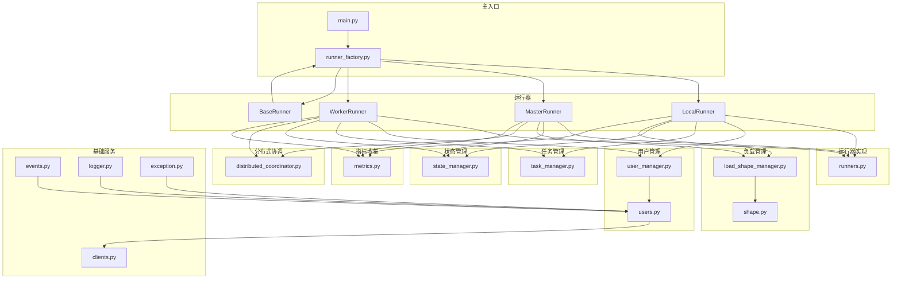
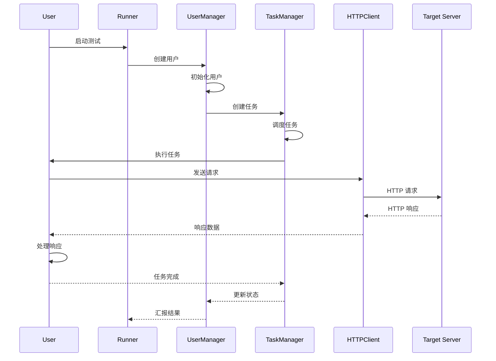
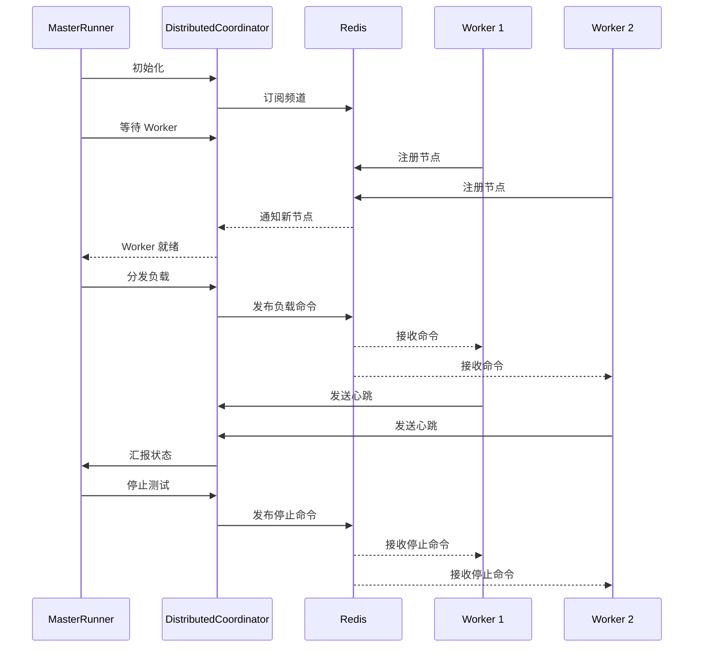
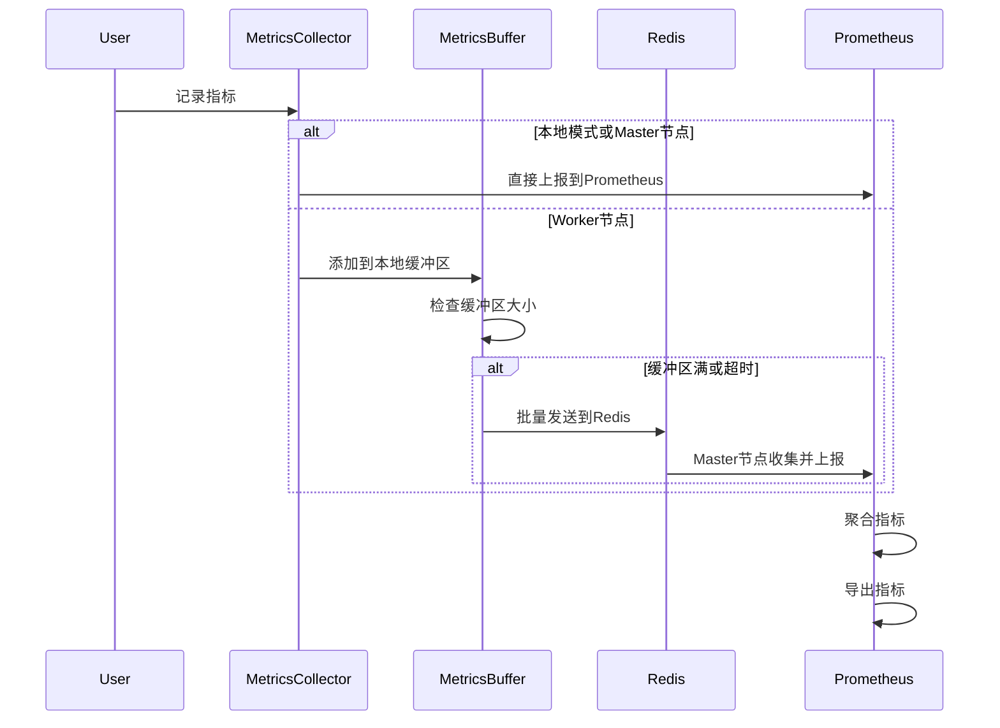

# AioTest 架构设计文档

## 目录

- [架构概览](#架构概览)
- [整体架构](#整体架构)
- [模块关系图](#模块关系图)
- [数据流](#数据流)
- [分布式设计](#分布式设计)
- [核心组件](#核心组件)
- [设计模式](#设计模式)
- [扩展点](#扩展点)

## 架构概览

AioTest 是一个基于 asyncio 的高性能负载测试框架，采用模块化设计，支持单机和分布式两种运行模式。

### 设计原则

1. **异步优先**：基于 asyncio 实现真正的异步并发
2. **模块化**：各模块职责清晰，低耦合高内聚
3. **可扩展**：提供丰富的扩展点，支持自定义
4. **高性能**：优化资源使用，最大化测试性能
5. **可观测**：完善的监控和日志系统

### 技术栈

| 技术 | 用途 | 版本 |
|------|------|------|
| Python | 开发语言 | 3.8+ |
| asyncio | 异步编程 | 内置 |
| aiohttp | HTTP 客户端 | 3.8+ |
| redis | 分布式协调 | 5.0+ |
| prometheus_client | 指标收集 | 0.15+ |
| psutil | 系统资源监控 | 5.9+ |

## 整体架构

### 架构层次

```
┌─────────────────────────────────────────────────────────────┐
│                         用户层                              │
│  (User Classes, Load Shapes, Test Scripts)                  │
└─────────────────────────────────────────────────────────────┘
                              │
                              ▼
┌─────────────────────────────────────────────────────────────┐
│                         运行器层                            │
│  (LocalRunner, MasterRunner, WorkerRunner)                  │
└─────────────────────────────────────────────────────────────┘
                              │
                              ▼
┌─────────────────────────────────────────────────────────────┐
│                         协调层                              │
│  (DistributedCoordinator, LoadShapeManager)                 │
└─────────────────────────────────────────────────────────────┘
                              │
                              ▼
┌─────────────────────────────────────────────────────────────┐
│                         服务层                              │
│  (UserManager, TaskManager, StateManager, MetricsCollector) │
└─────────────────────────────────────────────────────────────┘
                              │
                              ▼
┌─────────────────────────────────────────────────────────────┐
│                         基础层                              │
│  (HTTPClient, RedisConnection, Events, Logger)             │
└─────────────────────────────────────────────────────────────┘
```

### 运行模式

#### 单机模式（Local Mode）

```
┌─────────────────────────────────────────┐
│         LocalRunner                    │
│  ┌─────────────────────────────────┐  │
│  │  UserManager                    │  │
│  │  TaskManager                    │  │
│  │  StateManager                   │  │
│  │  MetricsCollector               │  │
│  └─────────────────────────────────┘  │
│  ┌─────────────────────────────────┐  │
│  │  LoadShapeManager               │  │
│  └─────────────────────────────────┘  │
│  ┌─────────────────────────────────┐  │
│  │  HTTPClient                     │  │
│  └─────────────────────────────────┘  │
└─────────────────────────────────────────┘
```

#### 分布式模式（Distributed Mode）

```
┌─────────────────────────────────────────┐
│         MasterRunner                    │
│  ┌─────────────────────────────────┐  │
│  │  DistributedCoordinator       │  │
│  │  LoadShapeManager              │  │
│  │  MetricsCollector              │  │
│  └─────────────────────────────────┘  │
│  ┌─────────────────────────────────┐  │
│  │  WorkerNode Registry            │  │
│  └─────────────────────────────────┘  │
└─────────────────────────────────────────┘
                  │
                  │ Redis Pub/Sub
                  │
        ┌─────────┼─────────┐
        │         │         │
        ▼         ▼         ▼
┌──────────┐ ┌──────────┐ ┌──────────┐
│ Worker 1 │ │ Worker 2 │ │ Worker N │
│  ┌────┐  │ │  ┌────┐  │ │  ┌────┐  │
│  │User│  │ │  │User│  │ │  │User│  │
│  │Mgr │  │ │  │Mgr │  │ │  │Mgr │  │
│  └────┘  │ │  └────┘  │ │  └────┘  │
│  ┌────┐  │ │  ┌────┐  │ │  ┌────┐  │
│  │Task│  │ │  │Task│  │ │  │Task│  │
│  │Mgr │  │ │  │Mgr │  │ │  │Mgr │  │
│  └────┘  │ │  └────┘  │ │  └────┘  │
│  ┌────┐  │ │  ┌────┐  │ │  ┌────┐  │
│  │HTTP│  │ │  │HTTP│  │ │  │HTTP│  │
│  │Clnt│  │ │  │Clnt│  │ │  │Clnt│  │
│  └────┘  │ │  └────┘  │ │  └────┘  │
└──────────┘ └──────────┘ └──────────┘
```

## 模块关系图

### 核心模块依赖关系



### 模块职责

| 模块 | 职责 | 依赖 | 源码文件 |
|------|------|------|----------|
| main.py | 主入口，命令行解析 | runner_factory | [main.py](aiotest/main.py) |
| runner_factory.py | 运行器工厂，事件处理器注册，BaseRunner实现 | state_manager, user_manager, task_manager, load_shape_manager | [runner_factory.py](aiotest/runner_factory.py) |
| runners.py | 运行器实现（LocalRunner, MasterRunner, WorkerRunner） | 所有服务模块 | [runners.py](aiotest/runners.py) |
| user_manager.py | 用户生命周期管理 | users, clients | [user_manager.py](aiotest/user_manager.py) |
| task_manager.py | 任务调度和管理 | asyncio | [task_manager.py](aiotest/task_manager.py) |
| state_manager.py | 状态机管理 | enum | [state_manager.py](aiotest/state_manager.py) |
| load_shape_manager.py | 负载形状管理 | shape | [load_shape_manager.py](aiotest/load_shape_manager.py) |
| distributed_coordinator.py | 分布式协调 | redis | [distributed_coordinator.py](aiotest/distributed_coordinator.py) |
| metrics.py | 指标收集和导出 | prometheus_client | [metrics.py](aiotest/metrics.py) |
| clients.py | HTTP 客户端 | aiohttp | [clients.py](aiotest/clients.py) |
| events.py | 事件系统 | asyncio | [events.py](aiotest/events.py) |
| logger.py | 日志系统 | logging | [logger.py](aiotest/logger.py) |
| exception.py | 异常定义 | 无 | [exception.py](aiotest/exception.py) |

## 数据流

### 请求处理流程



### 分布式协调流程



### 指标收集流程



## 分布式设计

### 分布式架构

AioTest 采用 Master-Worker 架构，支持水平扩展。

#### Master 节点职责

1. **负载分配**：根据 Worker 能力分配负载
2. **状态协调**：通过 Redis 协调 Worker 状态
3. **结果汇总**：收集和汇总测试结果
4. **负载控制**：控制整体负载形状
5. **Worker 管理**：自动发现和管理 Worker 节点

#### Worker 节点职责

1. **执行测试**：在本地执行用户任务
2. **状态上报**：定期向 Master 上报状态
3. **指标收集**：收集本地测试指标
4. **命令响应**：响应 Master 的控制命令

### 分布式协调机制

#### Redis 数据结构

- **节点注册**：`aiotest:workers:{node_id}` (Hash) - 存储节点状态、CPU 使用率、活跃用户数、最后更新时间
- **心跳更新**：`aiotest:heartbeat:{node_id}` (String) - 存储时间戳
- **命令发布**：`aiotest:commands:{node_id}` (Channel) - 发布 JSON 格式的命令
- **状态同步**：`aiotest:state` (Channel) - 发布 JSON 格式的状态更新

#### 分布式锁

分布式锁用于确保在分布式环境中对共享资源的安全访问，实现方式见 [distributed_coordinator.py](aiotest/distributed_coordinator.py)。

#### 心跳机制

心跳机制用于检测 Worker 节点的健康状态，实现方式见 [distributed_coordinator.py](aiotest/distributed_coordinator.py)。

## 核心组件

### 1. 运行器（Runner）

运行器是 AioTest 的核心组件，负责测试的生命周期管理。

#### BaseRunner

基础运行器，提供组合式架构的核心组件，包括用户管理、状态管理、任务管理和负载形状管理。

**主要功能**：
- 延迟初始化组件（避免循环导入）
- 提供统一的启动、停止和退出接口
- 管理用户生命周期
- 监控系统资源使用情况

**源码文件**：[runners.py](aiotest/runners.py)

#### LocalRunner

本地负载测试运行器，负责在单机模式下执行测试。

**主要功能**：
- 本地用户管理和负载执行
- Prometheus HTTP 指标服务启动
- 系统资源监控（CPU、用户数）
- 测试生命周期管理

**源码文件**：[runners.py](aiotest/runners.py)

#### MasterRunner

主节点运行器，负责在分布式模式下协调 Worker 节点。

**主要功能**：
- 分布式节点管理
- 负载分配策略
- 全局状态协调
- Worker 节点监控

**源码文件**：[runners.py](aiotest/runners.py)

#### WorkerRunner

工作节点运行器，负责在分布式模式下执行实际的测试任务。

**主要功能**：
- 执行测试任务
- 状态上报
- 指标收集
- 命令响应

**源码文件**：[runners.py](aiotest/runners.py)

### 2. 用户管理（UserManager）

负责用户的生命周期管理，包括创建、启动、停止和清理用户。

**主要功能**：
- 用户创建和初始化
- 用户启动和停止
- 用户状态管理
- 资源清理

**源码文件**：[user_manager.py](aiotest/user_manager.py)

### 3. 任务管理（TaskManager）

负责任务的调度和管理，确保测试任务的高效执行。

**主要功能**：
- 任务创建和调度
- 任务状态管理
- 任务取消和清理
- 并发控制

**源码文件**：[task_manager.py](aiotest/task_manager.py)

### 4. 状态管理（StateManager）

负责运行器的状态管理，确保测试过程的正确执行。

**主要功能**：
- 状态转换管理
- 状态验证
- 状态查询
- 状态事件触发

**源码文件**：[state_manager.py](aiotest/state_manager.py)

### 5. 负载形状管理（LoadShapeManager）

负责根据负载形状配置管理用户数量和请求速率。

**主要功能**：
- 负载形状解析
- 用户数量控制
- 请求速率控制
- 负载调整

**源码文件**：[load_shape_manager.py](aiotest/load_shape_manager.py)

### 6. 分布式协调（DistributedCoordinator）

负责分布式环境下的节点协调和通信。

**主要功能**：
- 节点注册和发现
- 心跳检测
- 命令发布和订阅
- 状态同步

**源码文件**：[distributed_coordinator.py](aiotest/distributed_coordinator.py)

### 7. 指标收集（MetricsCollector）

负责收集和导出测试指标，支持 Prometheus 集成。

**主要功能**：
- 请求指标收集
- 系统指标收集
- 指标导出
- 指标聚合

**源码文件**：[metrics.py](aiotest/metrics.py)

### 8. HTTP 客户端（HTTPClient）

负责发送 HTTP 请求，支持异步操作。

**主要功能**：
- 异步 HTTP 请求
- 请求重试
- 连接池管理
- 响应处理

**源码文件**：[clients.py](aiotest/clients.py)

### 9. 事件系统（Events）

负责事件的发布和订阅，支持测试生命周期中的各种事件。

**主要功能**：
- 事件注册和触发
- 事件处理器管理
- 优先级执行
- 异步事件处理

**源码文件**：[events.py](aiotest/events.py)

## 设计模式

### 1. 工厂模式

用于创建不同类型的运行器实例。

**应用场景**：
- 运行器创建
- 组件初始化
- 依赖注入

**实现**：[runner_factory.py](aiotest/runner_factory.py)

### 2. 观察者模式

用于事件系统的实现，支持事件的发布和订阅。

**应用场景**：
- 测试生命周期事件
- 指标收集事件
- 状态变更事件

**实现**：[events.py](aiotest/events.py)

### 3. 策略模式

用于负载形状的实现，支持不同的负载策略。

**应用场景**：
- 恒定负载
- 阶梯负载
- 自定义负载

**实现**：[shape.py](aiotest/shape.py)

### 4. 状态模式

用于运行器状态的管理，确保状态转换的正确性。

**应用场景**：
- 运行器状态管理
- 测试生命周期控制
- 错误处理

**实现**：[state_manager.py](aiotest/state_manager.py)

### 5. 组合模式

用于构建复杂的组件结构，如运行器的组件组合。

**应用场景**：
- 运行器组件管理
- 负载形状组合
- 用户任务组合

**实现**：[runners.py](aiotest/runners.py)

## 扩展点

### 1. 自定义用户类

通过继承 `User` 类，可以自定义用户行为和请求逻辑。

**示例**：
```python
from aiotest.users import HttpUser

class CustomUser(HttpUser):
    """自定义用户类"""
    host = "https://example.com"
    wait_time = (1, 2)
    
    async def test_custom_request(self):
        """自定义请求方法"""
        async with self.client.get("/api/test") as resp:
            assert resp.status == 200
```

**源码文件**：[users.py](aiotest/users.py)

### 2. 自定义负载形状

通过继承 `LoadShape` 类，可以自定义负载形状。

**示例**：
```python
from aiotest.shape import LoadShape

class CustomShape(LoadShape):
    """自定义负载形状"""
    def __init__(self, stages):
        self.stages = stages
    
    def get_users(self, current_time):
        """根据当前时间获取用户数"""
        for stage in self.stages:
            if current_time < stage["duration"]:
                return stage["user_count"]
        return 0
```

**源码文件**：[shape.py](aiotest/shape.py)

### 3. 自定义事件钩子

通过注册事件处理器，可以自定义测试过程中的行为。

**示例**：
```python
from aiotest import test_start, test_stop

# 注册事件钩子
@test_start.handler()
async def on_test_start(**kwargs):
    """测试开始时调用"""
    print("Test started!")


@test_stop.handler()
async def on_test_stop(**kwargs):
    """测试停止时调用"""
    print("Test stopped!")


# 对于自定义事件
from aiotest.events import events

# 注册自定义事件
user_start = events.register("user_start")
user_stop = events.register("user_stop")

@user_start.handler()
async def on_user_start(user, **kwargs):
    """用户启动时调用"""
    print(f"User {user.name} started!")


@user_stop.handler()
async def on_user_stop(user, **kwargs):
    """用户停止时调用"""
    print(f"User {user.name} stopped!")
```

**源码文件**：[events.py](aiotest/events.py)

## 总结

AioTest 采用模块化、可扩展的架构设计，支持单机和分布式两种运行模式。通过清晰的模块划分和合理的设计模式，实现了高性能、高可用的负载测试框架。

关键设计特点：
- 异步优先：基于 asyncio 实现真正的异步并发
- 模块化：各模块职责清晰，低耦合高内聚
- 可扩展：提供丰富的扩展点，支持自定义
- 高性能：优化资源使用，最大化测试性能
- 可观测：完善的监控和日志系统

通过以上设计，AioTest 能够满足各种负载测试场景的需求，从简单的单机测试到复杂的分布式测试都能高效处理。