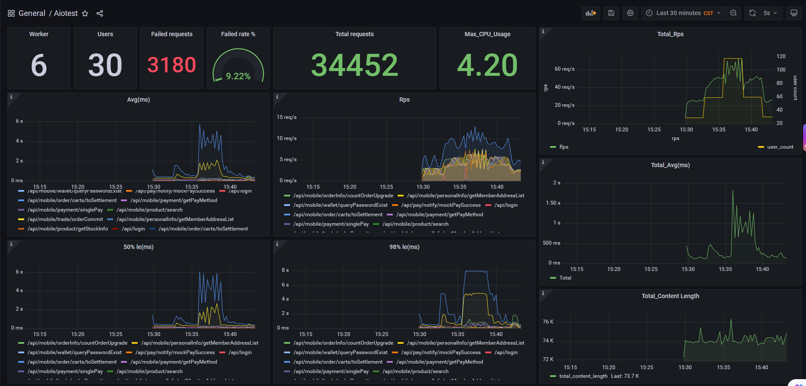

# What is Aiotest?
Aiotest is an easy to use, scriptable and scalable performance testing tool.

You define the behaviour of your users in Python asyncio code, instead of being stuck in a UI or restrictive domain specific language.

This makes Aiotest infinitely expandable and very developer friendly.

To start using Aiotest, go to [Installation](installation.md)

### Install the package

```console
pip install aiotest
```
Run aiotest
```console
aiotest -f aiotestfile.py
``` 

```python
from aiotest import AsyncHttpUser, LoadUserShape, logger

class TestUser(AsyncHttpUser):
    host = "https://uat.taobao.com"
    token = None

    async def on_start(self):
        url = "/login"
        data = {"username": "admin", "password": "123456"}
        async with self.session.post(url=url, data=data) as resp:
            data = await resp.json()
            self.token = data["token"]

    async def test_search(self):
        url = "/search"
        hearders = {"Authorization": self.token}
        data = {"keyword": "F22"}
        async with self.session.post(url=url, hearders=hearders, json=data) as resp:
            data = await resp.json()      

    async def test_personal_info(self):
        url = "/personalInfo"
        async with self.session.get(url=url, hearders=hearders) as resp:
            data = await resp.json()

```
### Features
* **Write test scenarios in [python asyncio](https://docs.python.org/zh-cn/3/library/asyncio.html)**
  
    If you want your users to loop, perform some conditional behaviour or do some calculations, you just use the asyncio programming constructs provided by Python.
    Aiotest runs every user inside its task (a asyncio task). This enables you to write your tests like normal (async) Python code instead of having to use callbacks or some other mechanism.
    Because your scenarios are "just python" you can use your regular IDE, and version control your tests as regular code

* **Distributed and scalable - supports hundreds of thousands of concurrent users**
  
    Aiotest makes it easy to run load tests distributed over multiple machines.
    It is asyncio-based (using [python asyncio](https://docs.python.org/zh-cn/3/library/asyncio.html), which makes it possible for a single process to handle many thousands concurrent users.
    While there may be other tools that are capable of doing more requests per second on a given hardware, the low overhead of each Aiotest user makes it very suitable for testing highly concurrent workloads.

* **Command-based UI**
  
    It can also be run without the UI, making it easy to use for CI/CD testing.

* **Can test any system**
  
    Even though Aiotest primarily works with web sites/services, it can be used to test almost any system or protocol. Just [write a client for what you want to test](testing-other-systems.md)

* **Prometheus-Grafana-based Data collection and presentation**
  
    Use Prometheus to collect test data and Grafana to present it
    
    

* **Automatic collection of test cases(Reference pytest)**
    
    An automatic collection of use cases similar to pytest, subclasses of User and LoadUserShape must start or end with Test(eg: TestUser,TestShape...), and api coroutines to be tested must also start or end with test(eg: test_search, test_personal_info...)
  
* **Multiple user classes, flexible setting of test scenarios**
  
    A aiotestfile can have multiple user classes at the same time, set different execution weights through the user class attribute weight, and flexibly set various test scenarios, example, shopping mall ordering scene, a user class simulating direct placing an order, and a user class simulating shopping cart placing an order.

* **Custom load shapes**
  
    Sometimes a completely custom shaped load test is required that cannot be achieved by simply setting or changing the user count and spawn rate. For example, you might want to generate a load spike or ramp up and down at custom times. By using a LoadUserShape class you have full control over the user count and spawn rate at all times.

* **Serial, parallel execution of api coroutines**
  
    Each user (a user class instance) acquiesce executes the test api coroutine serial from top to bottom(eg: when placing an order in the mall, the rear interface must wait for the return data from the front interface before it can be executed);You can override the self.start() method of the user class to execute the api coroutine to be tested in parallel(eg: api do not need to wait for the return data of other apis, and can be executed in parallel)

### Authors 

* [Hewei github](https://github.com/hewei198711) mail: hewei1987@163.com
  
### License

Open source licensed under the MIT license (see LICENSE file for details).

### Express one's thanks

Aiotest is a rewrite of locust (based on python asyncio) that drops the TaskSet class, sets the API to be tested only through the User class, drops the Stats class, collects test data through Prometheus, drops the Web class, and presents test data through Grafana
* [locust.io](https://locust.io)
