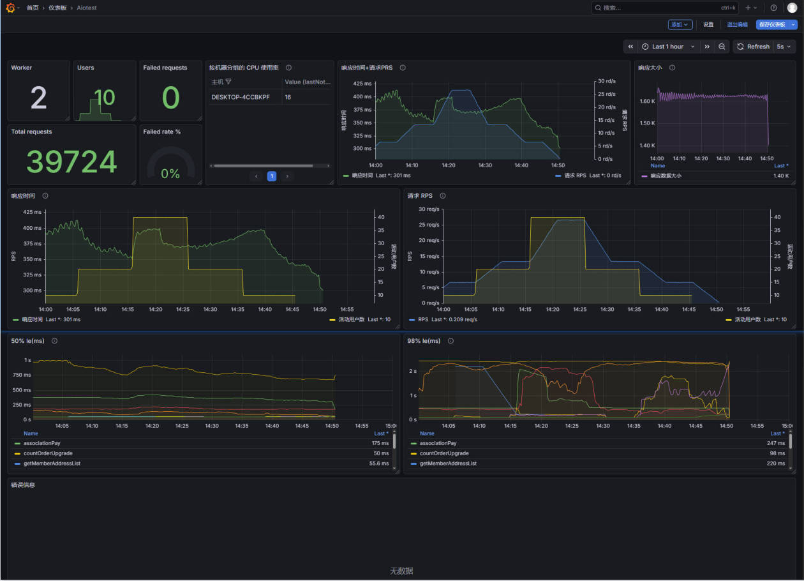
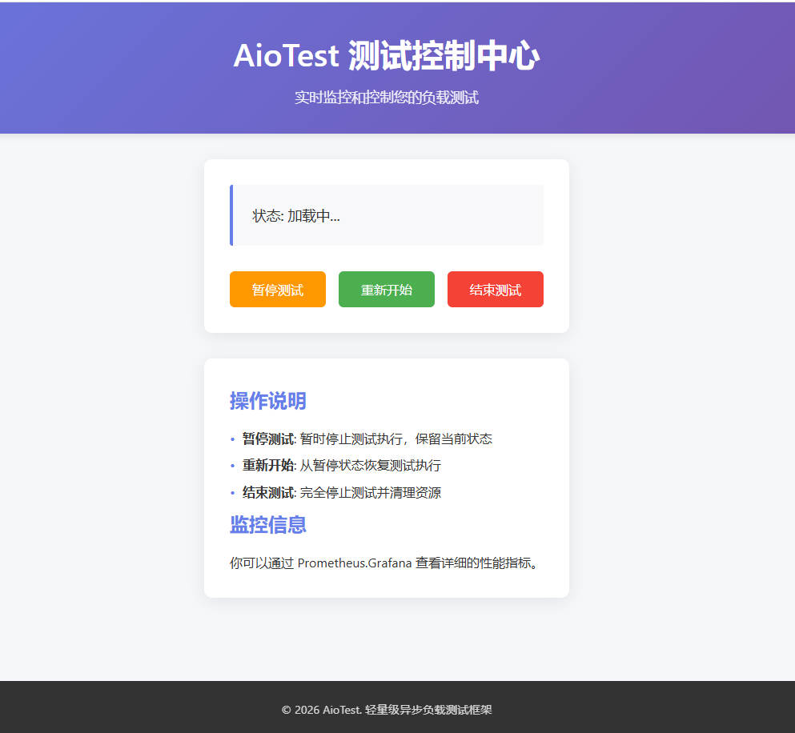

# AioTest - 异步负载测试框架

[](https://python.org)
[](LICENSE)
[](docs/)

AioTest是一个基于asyncio的高性能负载测试框架，专为大规模并发测试而设计。它提供了丰富的功能集，包括分布式测试、实时监控、灵活的用户行为模拟和完善的指标收集系统。

### 项目参考

AioTest 参考了 [Locust](https://locust.io) 项目的设计理念，并在此基础上进行了重构和改进。我们对 Locust 项目团队表示衷心的感谢，感谢他们为开源社区做出的贡献，为负载测试领域提供了如此优秀的工具。

站在巨人的肩膀上，我们希望通过 AioTest 为大家提供更好的负载测试工具：
- 采用 Python 原生的 asyncio 实现异步并发，提供更高的性能和更低的资源消耗
- 简化了测试结构，移除了 TaskSet 类，直接通过 User 类定义测试任务
- 优化了分布式架构，使用 Redis 作为协调和数据共享的媒介
- 集成了 Prometheus 指标收集，提供更丰富的监控指标
- 支持顺序执行和并发执行两种模式，满足不同测试场景的需求

### 与 Locust 的区别

| 特性 | AioTest | Locust |
|------|---------|--------|
| 并发模型 | 基于 asyncio 的异步并发 | 基于 gevent 的协程并发 |
| 测试结构 | 直接在 User 类中定义测试方法 | 需要 TaskSet 类来定义测试任务 |
| 执行模式 | 支持顺序执行和并发执行两种模式 | 主要支持顺序执行 |
| 分布式协调 | 使用 Redis | 使用内置的网络协议 |
| 指标收集 | 集成 Prometheus | 内置 Stats 模块 |
| 监控界面 | 依赖 Grafana + Prometheus | 内置 Web UI |
| 性能 | 更高的并发能力，更低的资源消耗 | 相对较低的并发能力 |

## ✨ 核心特性

- 🚀 **高性能**: 基于 asyncio 实现真正的异步并发
- 🌐 **分布式**: 原生支持 Master-Worker 分布式架构
- 📊 **监控完善**: 集成 Prometheus 指标和详细日志
- 🔧 **易用性**: 简洁直观的 API 设计，学习成本低
- 🎯 **灵活控制**: 可自定义负载形状和测试策略
- 🔒 **生产就绪**: 完善的错误处理和资源管理
- 📝 **丰富示例**: 涵盖各种实际应用场景

## 🚀 快速开始

### 安装方式

#### 从 PyPI 安装（推荐）

```bash
pip install aiotest
```

#### 从源代码安装（开发者）

```bash
# 克隆仓库
git clone https://github.com/hewei198711/Aiotest.git
cd aiotest

# 安装依赖
pip install -r requirements.txt

```

### 基础示例

使用项目提供的示例文件 `examples/basic.py`：

```bash
# 运行基础示例
py -m aiotest -f examples/basic.py

# 运行带 DEBUG 日志级别的示例
py -m aiotest -f examples/basic.py --loglevel DEBUG

# 启动 Prometheus 指标服务器（端口 8089）
# http://localhost:8089
```

基础示例包含：
- 7 个不同场景的 HTTP 请求测试
- 支持顺序执行和并发执行两种模式
- 自定义负载形状，模拟不同的用户增长模式
- 实时监控和指标收集

基础示例代码：

```python
from aiotest import HttpUser, LoadUserShape, ExecutionMode

class TestUser(HttpUser):
    host = "https://httpbin.org"  # 目标服务器地址
    wait_time = (1, 3)  # 请求间隔时间（1-3秒之间随机）
    execution_mode = ExecutionMode.SEQUENTIAL  # 执行模式

    async def on_start(self):
        """用户启动时的初始化方法"""
        await super().on_start()
        # 初始化逻辑，如获取 token
        async with self.client.post(endpoint="/post", name="Login & Get Token") as resp:
            data = await resp.json()
            self.auth_token = f"Bearer token_{data.get('data', 'mock-token')}"

    async def test_authenticated_request(self):
        """使用 Token 进行认证请求"""
        headers = {"Authorization": self.auth_token}
        async with self.client.get(endpoint="/headers", headers=headers, name="Authenticated Request") as resp:
            data = await resp.json()
            assert resp.status == 200

class TestLoadShape(LoadUserShape):
    """自定义负载形状"""
    stages = [
        {"duration": 30, "user_count": 1, "rate": 1},  # 30秒内1个用户
    ]

    def tick(self):
        """根据运行时间返回当前的用户数和生成速率"""
        run_time = self.get_run_time()
        for stage in self.stages:
            if run_time < stage["duration"]:
                return (stage["user_count"], stage["rate"])
        return None
```

## 📚 核心概念

### 1. 用户类 (User)

用户类定义了测试中模拟的用户行为：

```python
class MyUser(HttpUser):
    wait_time = 1.0          # 请求间隔时间
    weight = 1              # 用户权重
    execution_mode = ExecutionMode.SEQUENTIAL  # 执行模式
    
    async def on_start(self):
        """用户启动时的初始化方法"""
        pass
        
    async def on_stop(self):
        """用户停止时的清理方法"""
        pass
    
    async def test_task(self):
        """测试任务，定义用户行为"""
        async with self.client.get("/api") as resp:
            data = await resp.json()
```

### 2. 负载形状 (LoadUserShape)

负载形状控制测试过程中的用户数量和生成速率：

```python
class MyShape(LoadUserShape):
    def tick(self):
        """返回当前的用户数和生成速率"""
        run_time = self.get_run_time()
        
        if run_time < 60:
            return (10, 2)   # 前60秒10个用户，每秒生成2个
        elif run_time < 120:
            return (20, 5)   # 60-120秒20个用户，每秒生成5个
        else:
            return None      # 测试结束
```

### 3. HTTP 客户端

内置的 HTTP 客户端用于发送请求：

```python
async def test_api(self):
    # GET 请求
    async with self.client.get("/users", params={"page": 1}) as resp:
        data = await resp.json()
    
    # POST 请求
    async with self.client.post("/login", json={"user": "test"}) as resp:
        token = await resp.json()
    
    # 带认证的请求
    headers = {"Authorization": f"Bearer {token}"}
    async with self.client.get("/protected", headers=headers) as resp:
        data = await resp.json()
```

## 🌐 分布式测试

Aiotest 原生支持 Master-Worker 分布式架构，可以在多台机器上协调运行测试。

### 启动 Master 节点

使用项目提供的分布式示例 `examples/distributed_example.py`：

```bash
# 首先运行准备用户数据的脚本（生成测试数据并存储到 Redis）
python examples/prepare_user_data.py

# 启动 Master 节点
py -m aiotest -f examples/distributed_example.py \
    --master --expect-workers 2 \
    --redis-path 127.0.0.1 --redis-port 6379 --redis-password "123456"
```

### 启动 Worker 节点

```bash
# 在不同的机器上启动多个 Worker 节点
py -m aiotest -f examples/distributed_example.py \
    --worker \
    --redis-path 127.0.0.1 --redis-port 6379 --redis-password "123456"
```

### Redis 数据共享

分布式测试使用 Redis 作为协调和数据共享的媒介：

```python
from aiotest import redis_client, RedisLock
import json

async def test_shared_data(self):
    # 分布式锁示例
    async with await RedisLock.with_lock(redis_client, "test_lock", timeout=10) as lock:
        if lock.locked:
            # 数据共享示例
            data = await redis_client.hget("shared_data", "key")
            if data:
                user_info = json.loads(data)
                # 使用共享数据
```

## 📊 监控与指标

### 数据展示

#### 数据表概览



#### 控制中心界面



控制中心提供了直观的测试管理界面，支持以下功能：

1. **测试控制**：暂停，恢复测试，结束测试


#### Grafana 性能数据展示

AioTest 集成了 Prometheus 指标，可以通过 Grafana 进行可视化展示：

1. **请求性能面板**：展示 HTTP 请求响应时间、成功率、错误率等指标
2. **系统资源面板**：监控 CPU、内存、网络等系统资源使用情况
3. **用户行为面板**：展示用户数量、并发数、请求分布等信息
4. **分布式节点面板**：监控各个 Worker 节点的运行状态

### Prometheus 集成

启动 Prometheus 指标服务器：

```bash
aiotest -f test.py --prometheus-port 8089
```

提供的指标包括：
- `aiotest_http_requests_total`: HTTP 请求总数
- `aiotest_http_request_duration_seconds`: HTTP 请求响应时间
- `aiotest_http_response_size_bytes`: HTTP 响应大小
- `aiotest_worker_active_users`: Worker 节点活跃用户数
- `aiotest_worker_cpu_percent`: Worker 节点 CPU 使用率
- `aiotest_errors_total`: 错误总数

### 自定义事件处理器

可以通过装饰器注册自定义事件处理器：

```python
from aiotest import request_metrics

@request_metrics.handler(priority=0)
async def custom_handler(**kwargs):
    """自定义事件处理器"""
    metrics = kwargs.get('metrics')
    if metrics:
        method = metrics.method
        endpoint = metrics.endpoint
        duration = metrics.duration
        status_code = metrics.status_code
        print(f"Request: {method} {endpoint} - {duration:.0f}ms, Status: {status_code}")

# 也可以手动注册
# await request_metrics.add_handler(custom_handler, priority=0)
```

**可用事件**：
- `init_events` - 系统初始化
- `test_start` - 测试开始
- `test_stop` - 测试停止
- `test_quit` - 测试退出
- `startup_completed` - 启动完成
- `request_metrics` - 请求指标
- `worker_request_metrics` - Worker 节点请求指标

## 🎯 高级特性

### 1. 用户权重

```python
class MobileUser(HttpUser):
    weight = 3  # 移动用户权重更高
    host = "https://api.example.com"

class WebUser(HttpUser):
    weight = 2
    host = "https://api.example.com"
```

### 2. 任务权重

```python
from aiotest import weight, ExecutionMode

class TestUser(HttpUser):
    # 注意：权重控制仅在并发执行模式下生效
    execution_mode = ExecutionMode.CONCURRENT
    
    @weight(5)  # 该任务权重为5，执行概率更高
    async def test_important_api(self):
        pass
    
    @weight(1)  # 该任务权重为1，执行概率较低
    async def test_normal_api(self):
        pass
```

**备注**：权重控制仅在 `ExecutionMode.CONCURRENT`（并发执行）模式下生效。在顺序执行模式下，任务会按照定义的顺序执行，权重设置不会影响执行顺序。

### 3. 执行模式

```python
from aiotest import ExecutionMode

class TestUser(HttpUser):
    execution_mode = ExecutionMode.SEQUENTIAL  # 顺序执行
    
    # 或
    execution_mode = ExecutionMode.CONCURRENT   # 并发执行
```

### 4. 自定义等待时间

```python
import random

class TestUser(HttpUser):
    def wait_time(self):
        """动态计算等待时间"""
        return random.uniform(0.5, 2.0)
```

## 📝 示例项目

`examples/` 目录包含多种示例：

- [basic.py](examples/basic.py) - 基础示例
- [distributed_example.py](examples/distributed_example.py) - 分布式测试示例
- [concurrent_example.py](examples/concurrent_example.py) - 并发执行示例
- [events_example.py](examples/events_example.py) - 事件系统示例
- [request_verification.py](examples/request_verification.py) - 请求验证示例
- [seckill_scenario.py](examples/seckill_scenario.py) - 秒杀场景示例
- [weight_and_wait.py](examples/weight_and_wait.py) - 权重和等待时间示例
- [prepare_user_data.py](examples/prepare_user_data.py) - 准备用户数据脚本

### 负载形状示例

`examples/load_shape/` 目录包含多种负载形状示例：

- [peak_load_shape.py](examples/load_shape/peak_load_shape.py) - 峰值负载形状
- [random_load_shape.py](examples/load_shape/random_load_shape.py) - 随机负载形状
- [step_soad_shape.py](examples/load_shape/step_soad_shape.py) - 阶梯负载形状
- [wave_load_shape.py](examples/load_shape/wave_load_shape.py) - 波浪负载形状

## 🖥️ 命令行参数

### 基础参数

```bash
# 基础运行
py -m aiotest -f test.py                    # 指定测试文件
py -m aiotest -H https://api.example.com    # 指定目标主机
py -m aiotest --loglevel DEBUG              # 设置日志级别
py -m aiotest --logfile test.log            # 设置日志文件

# 分布式参数
--master                              # 启动 Master 节点
--worker                              # 启动 Worker 节点
--expect-workers 3                    # Master 节点期望的 Worker 数量
--master-host 192.168.1.100           # Master 节点主机地址

# Redis配置
--redis-path 127.0.0.1               # Redis 主机地址
--redis-port 6379                     # Redis 端口
--redis-password 123456              # Redis 密码

# Prometheus配置
--prometheus-port 8089               # Prometheus 端口

# Metrics 配置
--metrics-collection-interval 5.0    # 指标收集间隔（秒）
--metrics-batch-size 100             # 指标批量大小
--metrics-flush-interval 1.0         # 指标刷新间隔（秒）
--metrics-buffer-size 10000          # 指标缓冲区大小

# 其他参数
--show-users-wight                   # 显示用户权重
--version                            # 显示版本信息
```

## 📁 项目结构

### 目录结构

```
Aiotest/
├── aiotest/              # 框架核心代码
│   ├── __init__.py      # 包初始化文件
│   ├── __main__.py      # 主入口文件
│   ├── cli.py           # 命令行参数解析
│   ├── clients.py       # HTTP 客户端
│   ├── distributed_coordinator.py # 分布式协调器
│   ├── events.py        # 事件系统
│   ├── exception.py     # 异常处理
│   ├── load_shape_manager.py # 负载形状管理器
│   ├── logger.py        # 日志系统
│   ├── main.py          # 主逻辑
│   ├── metrics.py       # 指标收集
│   ├── runner_factory.py # 运行器工厂
│   ├── runners.py       # 运行器
│   ├── shape.py         # 负载形状
│   ├── state_manager.py # 状态管理器
│   ├── task_manager.py  # 任务管理器
│   ├── user_manager.py  # 用户管理器
│   └── users.py         # 用户类
├── examples/            # 示例代码
│   ├── load_shape/      # 负载形状示例
│   ├── basic.py         # 基础示例
│   └── ...
├── docs/               # 文档
├── tests/              # 测试代码
├── tools/              # 工具脚本
└── allure-results/     # 测试报告
```

### 扩展点

```python
# 自定义用户类
class CustomUser(User):
    def __init__(self, custom_param=None, **kwargs):
        super().__init__(**kwargs)
        self.custom_param = custom_param

# 自定义负载形状
class CustomShape(LoadUserShape):
    def __init__(self, custom_config=None):
        super().__init__()
        self.custom_config = custom_config

# 自定义事件处理器
async def custom_event_handler(**kwargs):
    # 处理事件
    pass
```

## 🤝 贡献指南

我们欢迎社区贡献，以下是贡献流程：

1. Fork 项目 (https://github.com/hewei198711/Aiotest.git)
2. 创建特性分支 (`git checkout -b feature/AmazingFeature`)
3. 提交更改 (`git commit -m 'Add some AmazingFeature'`)
4. 推送到分支 (`git push origin feature/AmazingFeature`)
5. 创建 Pull Request

## 📄 许可证

本项目采用 MIT 许可证 - 查看 [LICENSE](LICENSE) 文件了解详情。

## 🆘 支持

如果你遇到问题或有疑问：

1. 查看 [示例代码](examples/)
2. 提交 [Issue](https://github.com/hewei198711/Aiotest/issues)

## 📚 外部资源

- **GitHub 仓库**: [https://github.com/hewei198711/Aiotest](https://github.com/hewei198711/Aiotest)
- **PyPI 页面**: [https://pypi.org/project/aiotest](https://pypi.org/project/aiotest)

## 🚀 性能基准

在标准配置下，Aiotest 可以支持：

- **单机并发**: 10,000+ 虚拟用户
- **分布式扩展**: 支持 100+ Worker 节点
- **请求吞吐**: 100,000+ 请求/秒
- **内存占用**: 每用户约 1MB 内存
- **CPU 效率**: 异步 I/O，低 CPU 占用

## 📋 未来计划

- [ ] WebSocket 支持
- [ ] GraphQL 专用测试工具
- [ ] 更多协议支持 (gRPC, MQTT等)

---

**Aiotest** - 为您提供高性能、灵活、易用的负载测试解决方案 🌊