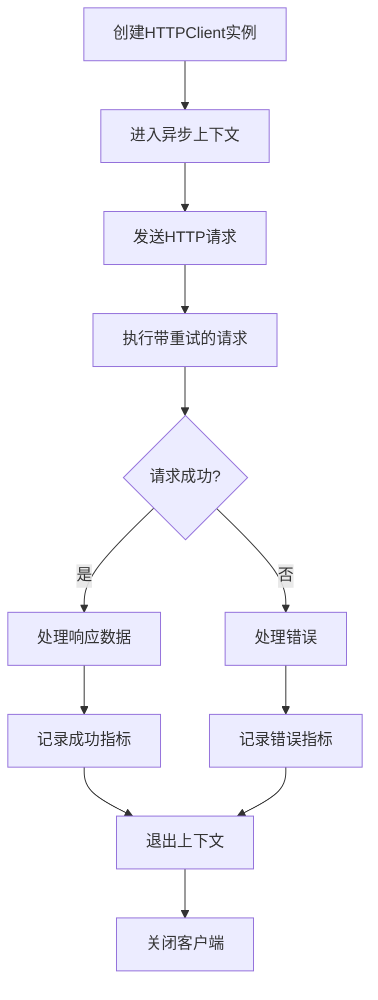
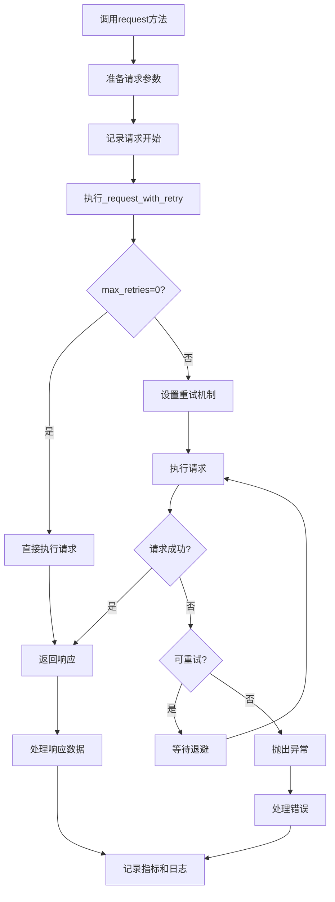
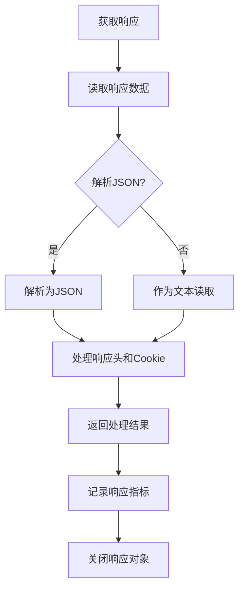

# AioTest HTTP 客户端模块文档

<!-- markdownlint-disable MD024 -->

## 目录

- [概述](#%E6%A6%82%E8%BF%B0)
- [核心功能](#%E6%A0%B8%E5%BF%83%E5%8A%9F%E8%83%BD)
- [连接池配置](#%E8%BF%9E%E6%8E%A5%E6%B1%A0%E9%85%8D%E7%BD%AE)
- [核心类：HTTPClient](#%E6%A0%B8%E5%BF%83%E7%B1%BBhttpclient)
- [响应上下文管理器：ResponseContextManager](#%E5%93%8D%E5%BA%94%E4%B8%8A%E4%B8%8B%E6%96%87%E7%AE%A1%E7%90%86%E5%99%A8responsecontextmanager)
- [调用逻辑流程](#%E8%B0%83%E7%94%A8%E9%80%BB%E8%BE%91%E6%B5%81%E7%A8%8B)
- [流程图](#%E6%B5%81%E7%A8%8B%E5%9B%BE)
- [配置参数](#%E9%85%8D%E7%BD%AE%E5%8F%82%E6%95%B0)
- [使用示例](#%E4%BD%BF%E7%94%A8%E7%A4%BA%E4%BE%8B)
- [性能优化建议](#%E6%80%A7%E8%83%BD%E4%BC%98%E5%8C%96%E5%BB%BA%E8%AE%AE)
- [故障排查](#%E6%95%85%E9%9A%9C%E6%8E%92%E6%9F%A5)
- [断言结果与状态码关系](#%E6%96%AD%E8%A8%80%E7%BB%93%E6%9E%9C%E4%B8%8E%E7%8A%B6%E6%80%81%E7%A0%81%E5%85%B3%E7%B3%BB)
- [总结](#%E6%80%BB%E7%BB%93)

______________________________________________________________________

## 概述

`clients.py` 是 AioTest 负载测试项目的 HTTP 客户端模块，负责提供异步 HTTP 请求功能，支持连接池管理、自动重试、请求/响应拦截、敏感信息过滤等特性。该模块封装了基于 aiohttp 的异步 HTTP 客户端，为负载测试提供高效、可靠的 HTTP 请求能力。

## 核心功能

- ✅ **异步 HTTP 请求** - 支持 GET/POST/PUT/DELETE 等 HTTP 方法
- ✅ **连接池管理** - 优化高并发场景下的性能
- ✅ **自动重试机制** - 处理网络波动或临时故障
- ✅ **请求/响应拦截** - 支持自定义逻辑扩展
- ✅ **敏感信息过滤** - 避免日志泄露敏感数据
- ✅ **统一错误处理** - 简化异常管理
- ✅ **性能指标收集** - 记录请求性能数据，包括断言结果标签
- ✅ **结构化日志记录** - 详细的请求和响应日志
- ✅ **断言结果独立判断** - 支持通过 `assertion_result` 标签独立于 HTTP 状态码判断请求的成功与失败

## 连接池配置

### `CONNECTOR_SETTINGS` 配置字典

**作用**：定义默认的连接池配置参数

**配置项**：

| 配置项 | 类型 | 默认值 | 说明 |
| ------- | ------ | ------- | ------ |
| `limit` | `int` | `100` | 默认最大连接数 |
| `limit_per_host` | `int` | `20` | 默认每个主机最大连接数 |
| `force_close` | `bool` | `False` | 默认是否强制关闭空闲连接 |
| `enable_cleanup_closed` | `bool` | `True` | 默认是否清理已关闭的连接 |

### `configure_connector` 函数

**作用**：动态配置连接池参数

**参数**：

- `limit`：最大连接数
- `limit_per_host`：每个主机最大连接数
- `force_close`：是否强制关闭空闲连接
- `enable_cleanup_closed`：是否清理已关闭的连接

## 核心类HTTPClient

### 初始化方法

```python

def __init__(
    self,
    base_url: str = "",
    default_headers: Optional[Dict[str, str]] = None,
    timeout: int = 30,
    max_retries: int = 3,
    verify_ssl: bool = True,
)

```

**作用**：初始化 HTTP 客户端实例，配置连接参数

**参数说明**：

- `base_url`：基础 URL，所有请求将基于此 URL 构建
- `default_headers`：默认请求头
- `timeout`：请求超时时间（秒）
- `max_retries`：最大重试次数
- `verify_ssl`：是否验证 SSL 证书

### 方法说明

| 方法名 | 作用 | 参数 | 返回值 | 调用时机 |
| ------- | ------ | ------ | ------- | --------- |
| `__aenter__()` | 异步上下文管理器入口 | 无 | `HTTPClient` | 使用 `async with` 时 |
| `__aexit__(exc_type, exc_val, exc_tb)` | 异步上下文管理器出口 | 异常相关参数 | `None` | 使用 `async with` 时 |
| `close()` | 手动关闭 HTTP 客户端 | 无 | `None` | 需要手动关闭时 |
| `request(method, endpoint, name=None, **kwargs)` | 发送 HTTP 请求 | `method: str`, `endpoint: str`, `name: Optional[str]`, `**kwargs` | `ResponseContextManager` | 需要发送 HTTP 请求时 |
| `get(endpoint, params=None, **kwargs)` | 发送 GET 请求 | `endpoint: str`, `params: Optional[Dict[str, Any]]`, `**kwargs` | `ResponseContextManager` | 需要发送 GET 请求时 |
| `post(endpoint, data=None, **kwargs)` | 发送 POST 请求 | `endpoint: str`, `data: Optional[Union[Dict[str, Any], str]]`, `**kwargs` | `ResponseContextManager` | 需要发送 POST 请求时 |
| `put(endpoint, data=None, **kwargs)` | 发送 PUT 请求 | `endpoint: str`, `data: Optional[Union[Dict[str, Any], str]]`, `**kwargs` | `ResponseContextManager` | 需要发送 PUT 请求时 |
| `delete(endpoint, **kwargs)` | 发送 DELETE 请求 | `endpoint: str`, `**kwargs` | `ResponseContextManager` | 需要发送 DELETE 请求时 |
| `_request_with_retry(method, endpoint, **kwargs)` | 带重试的实际请求执行 | `method: str`, `endpoint: str`, `**kwargs` | `aiohttp.ClientResponse` | 内部调用 |
| `_normalize_endpoint(endpoint)` | 标准化 API 端点 | `endpoint: str` | `str` | 内部调用 |
| `_record_request_metrics(request_id, method, endpoint, status_code, duration, response_size, error, assertion_result)` | 记录请求指标，包括断言结果 | 多个指标参数，包括 assertion_result | `None` | 请求完成后 |
| `_log_request(log, status)` | 记录请求日志 | `log: RequestMetrics`, `status: str` | `None` | 请求开始/完成/失败时 |
| `_sanitize_headers(headers)` | 清理敏感信息的请求头 | `headers: Dict[str, str]` | `Dict[str, str]` | 内部调用 |
| `_sanitize_body(body)` | 清理敏感信息的请求体 | `body: Any` | `Any` | 内部调用 |

## 响应上下文管理器ResponseContextManager

### 初始化方法

```python

def __init__(
    self,
    request_coroutine,
    log: RequestMetrics,
    start_time: float,
    metrics_callback: Callable,
    log_request: Callable,
)

```

**作用**：初始化响应上下文管理器，处理响应数据和错误

**参数说明**：

- `request_coroutine`：请求协程
- `log`：请求指标对象
- `start_time`：请求开始时间
- `metrics_callback`：指标回调函数
- `log_request`：日志回调函数

### 方法说明

| 方法名 | 作用 | 参数 | 返回值 | 调用时机 |
| ------- | ------ | ------ | ------- | --------- |
| `__aenter__()` | 进入异步上下文，执行请求并处理响应 | 无 | `self` | 使用 `async with` 时 |
| `__aexit__(exc_type, exc_val, exc_tb)` | 退出异步上下文，处理断言结果 | 异常相关参数 | `bool` | 使用 `async with` 时 |
| `status` (property) | 获取响应状态码 | 无 | `int` | 需要获取状态码时 |
| `text()` | 获取响应文本 | 无 | `str` | 需要获取文本响应时 |
| `json()` | 获取响应 JSON | 无 | `dict` | 需要获取 JSON 响应时 |
| `_process_response(response)` | 处理响应数据 | `response: aiohttp.ClientResponse` | `Dict[str, Any]` | 内部调用 |
| `_safe_get_headers(response)` | 安全获取响应头 | `response` | `Dict[str, str]` | 内部调用 |
| `_safe_get_cookies(response)` | 安全获取响应 Cookie | `response` | `Dict[str, Any]` | 内部调用 |
| `_handle_error(exc_type, exc_val, exc_tb)` | 处理请求错误 | 异常相关参数 | `None` | 请求失败时 |
| `_estimate_size(data)` | 估算数据大小 | `data: Any` | `int` | 内部调用 |

## 调用逻辑流程

### 客户端初始化流程

1. **创建客户端** → 实例化 `HTTPClient`，配置连接参数
1. **进入上下文** → 调用 `__aenter__()` 初始化连接池和会话
1. **发送请求** → 调用 `request()` 方法发送 HTTP 请求
1. **执行请求** → 内部调用 `_request_with_retry()` 执行带重试的请求
1. **处理响应** → 使用 `ResponseContextManager` 处理响应
1. **记录指标** → 调用 `_record_request_metrics()` 记录性能指标
1. **退出上下文** → 调用 `__aexit__()` 关闭会话和连接池

### 请求执行流程

1. **准备请求** → 构建请求参数，添加默认头
1. **记录开始** → 记录请求开始时间和日志
1. **执行请求** → 调用 `_request_with_retry()` 执行请求
1. **处理响应** → 读取响应数据，解析为 JSON 或文本
1. **计算指标** → 计算响应时间、响应大小等指标
1. **记录完成** → 记录请求完成日志和指标
1. **处理错误** → 如果发生错误，记录错误信息和指标

### 重试机制流程

1. **检查重试设置** → 如果 `max_retries` 为 0，直接执行请求
1. **设置重试条件** → 配置重试异常类型和退避策略
1. **执行请求** → 尝试执行请求
1. **捕获异常** → 捕获可重试的异常
1. **判断是否重试** → 根据异常类型和重试次数决定是否重试
1. **等待退避** → 按照指数退避策略等待
1. **重新尝试** → 重新执行请求，直到成功或达到最大重试次数

## 流程图

### 客户端使用流程



### 请求执行流程



### 响应处理流程



## 配置参数

| 配置项 | 类型 | 默认值 | 说明 | 适用场景 |
| ------- | ------ | ------- | ------ | --------- |
| `base_url` | `str` | `""` | 基础 URL，所有请求将基于此 URL 构建 | 统一 API 基础地址 |
| `default_headers` | `Dict[str, str]` | `{}` | 默认请求头 | 设置全局请求头 |
| `timeout` | `int` | `30` | 请求超时时间（秒） | 根据网络状况调整 |
| `max_retries` | `int` | `3` | 最大重试次数 | 网络不稳定时增加 |
| `verify_ssl` | `bool` | `True` | 是否验证 SSL 证书 | 测试环境可设置为 False |
| `limit` | `int` | `100` | 最大连接数 | 高并发场景下调整 |
| `limit_per_host` | `int` | `20` | 每个主机最大连接数 | 针对特定主机的连接限制 |

## 使用示例

### 基本使用示例

```python

from aiotest import HTTPClient

async def basic_example():
    """基本使用示例"""
    async with HTTPClient(base_url="https://api.example.com") as client:
        # 发送 GET 请求
        async with client.get("/users") as response:
            print(f"GET /users: {response.status}")
            data = await response.json()
            print(f"Response data: {data}")

        # 发送 POST 请求
        payload = {"name": "Test User", "email": "test@example.com"}
        async with client.post("/users", json=payload) as response:
            print(f"POST /users: {response.status}")

# 执行示例

await basic_example()
```

### 带参数和重试的请求

```python

from aiotest import HTTPClient

async def advanced_example():
    """带参数和重试的请求示例"""
    # 配置连接池
    from aiotest import configure_connector
    configure_connector(limit=200, limit_per_host=50)

    async with HTTPClient(
        base_url="https://api.example.com",
        timeout=10,
        max_retries=5,
        verify_ssl=False
    ) as client:
        # 带查询参数的 GET 请求
        params = {"page": 1, "limit": 10}
        async with client.get("/users", params=params) as response:
            print(f"GET /users with params: {response.status}")

        # 带自定义头的请求
        headers = {"Authorization": "Bearer token123"}
        async with client.get("/protected", headers=headers) as response:
            print(f"GET /protected: {response.status}")

# 执行示例

await advanced_example()
```

### 错误处理示例

```python

from aiotest import HTTPClient

async def error_handling_example():
    """错误处理示例"""
    async with HTTPClient(base_url="https://api.example.com") as client:
        try:
            # 发送到不存在的端点
            async with client.get("/non-existent-endpoint") as response:
                print(f"Status: {response.status}")
        except Exception as e:
            print(f"Error occurred: {e}")

# 执行示例

await error_handling_example()
```

### 与 HttpUser 配合使用

```python

from aiotest import HttpUser
import asyncio

class ApiUser(HttpUser):
    """API测试用户类"""
    host = "https://api.example.com"
    wait_time = 1.0

    async def test_get_users(self):
        """获取用户列表"""
        async with self.client.get("/users") as response:
            print(f"GET /users: {response.status}")

    async def test_create_user(self):
        """创建用户"""
        data = {"name": "Test User", "email": "test@example.com"}
        async with self.client.post("/users", json=data) as response:
            print(f"POST /users: {response.status}")

# 创建并使用 HttpUser

async def user_example():
    async with ApiUser() as user:
        # 发送单个请求
        async with user.client.get("/health") as response:
            print(f"Health check: {response.status}")

        # 启动用户任务
        user.start_tasks()

        # 运行一段时间
        await asyncio.sleep(10)

# 执行示例

await user_example()
```

## 性能优化建议

1. **连接池配置**：

   - 根据测试规模调整 `limit` 和 `limit_per_host` 参数
   - 高并发场景下适当增加连接数，但避免过度配置导致系统资源耗尽

1. **超时设置**：

   - 根据网络状况和 API 响应时间设置合理的超时值
   - 避免超时设置过长导致请求阻塞

1. **重试策略**：

   - 根据 API 特性调整 `max_retries` 参数
   - 对于不稳定的网络环境，适当增加重试次数

1. **请求批处理**：

   - 避免短时间内发送大量小请求
   - 考虑使用批量 API 减少请求次数

1. **响应处理**：

   - 对于大型响应，考虑使用流式处理
   - 避免一次性加载大型响应到内存

1. **日志优化**：

   - 在高并发场景下，适当降低日志级别
   - 避免记录敏感信息和大型响应数据

1. **资源管理**：

   - 使用 `async with` 上下文管理器确保资源正确释放
   - 避免创建过多客户端实例

## 故障排查

### 常见问题

| 问题 | 可能原因 | 解决方案 |
| ------ | --------- | --------- |
| 请求超时 | 网络延迟或 API 响应慢 | 增加超时时间或检查网络连接 |
| SSL 验证失败 | SSL 证书无效或未配置 | 设置 `verify_ssl=False` 或配置正确的证书 |
| 连接池耗尽 | 并发请求过多 | 增加连接池大小或降低并发度 |
| 重试次数过多 | 网络不稳定或 API 故障 | 检查网络连接或 API 状态 |
| 敏感信息泄露 | 日志中包含敏感数据 | 确保 `_sanitize_headers` 和 `_sanitize_body` 正常工作 |
| 内存占用高 | 大型响应或过多并发 | 优化响应处理或降低并发度 |

### 日志分析

- 请求开始：`request_start {method} {endpoint}`
- 请求完成：`request_complete {method} {endpoint}`
- 请求失败：`request_failed {method} {endpoint}`
- 响应处理失败：`Failed to process response data: {error}`
- 会话关闭超时：`Session close timed out`
- 指标记录失败：`Failed to record request metrics: {error}`

## 断言结果与状态码关系

### 断言结果标签

AioTest 支持通过 `assertion_result` 标签来独立于 HTTP 状态码判断请求的成功与失败。这意味着：

- **断言成功**：即使 HTTP 状态码是 400 或 500，只要断言通过，`assertion_result` 会被设置为 "pass"
- **断言失败**：即使 HTTP 状态码是 200，只要断言失败，`assertion_result` 会被设置为 "fail"
- **请求错误**：当发生超时、连接错误等请求阶段错误时，`assertion_result` 会被设置为 "fail"

### 错误处理流程

`ResponseContextManager` 的错误处理分为两个阶段：

1. **请求阶段错误**（在 `__aenter__` 方法中）：

   - 当执行请求时发生异常（如超时、连接错误等）
   - 异常会被捕获，`assertion_result` 标签被设置为 "fail"
   - 错误信息会被记录到 `ERROR_COUNTER` 指标中
   - 异常会被重新抛出，让测试用例捕获

1. **断言阶段错误**（在 `__aexit__` 方法中）：

   - 当断言失败时
   - `assertion_result` 标签被设置为 "fail"
   - 错误信息会被记录到 `ERROR_COUNTER` 指标中

### 错误处理优化

为了避免错误指标重复记录，`_handle_error` 方法添加了重复错误处理检查：

- **重复错误处理检查**：当 `_handle_error` 方法被调用时，会检查是否已经处理过错误
- **错误处理标记**：如果已经处理过错误，会直接返回，避免重复记录错误指标
- **适用场景**：当 `__aenter__` 中抛出的异常被传递到 `__aexit__` 时，确保错误只被处理一次

这样可以确保 `ERROR_COUNTER` 指标的准确性，避免因错误处理逻辑导致的重复计数问题。

### 错误类型处理

| 错误类型 | 处理阶段 | `assertion_result` | 错误记录 |
| --------- | --------- | ------------------- | ---------- |
| 超时错误 | `__aenter__` | "fail" | 记录到 ERROR_COUNTER |
| 连接错误 | `__aenter__` | "fail" | 记录到 ERROR_COUNTER |
| HTTP 4xx/5xx | `__aexit__` | 取决于断言 | 记录到 ERROR_COUNTER（如果断言失败） |
| 断言失败 | `__aexit__` | "fail" | 记录到 ERROR_COUNTER |

### 使用方式

在使用 `ResponseContextManager` 时，断言的结果会自动记录到 `assertion_result` 标签中：

```python
# 断言成功，即使状态码是 400

async with self.client.get("/status/400") as resp:
    assert True  # 断言成功，assertion_result = "pass"

# 断言失败，即使状态码是 200

async with self.client.get("/status/200") as resp:
    assert False  # 断言失败，assertion_result = "fail"

```

### Prometheus 查询示例

使用 `assertion_result` 标签可以更准确地统计请求的成功与失败：

- **统计所有失败的请求**：

  ```promql

  sum(aiotest_http_requests_total{assertion_result="fail"})
  ```

- **统计所有成功的请求**：

  ```promql

  sum(aiotest_http_requests_total{assertion_result="pass"})
  ```

- **断言失败但 HTTP 成功的请求**：

  ```promql

  sum(aiotest_http_requests_total{assertion_result="fail", status_code=~"2[0-9]{2}"})
  ```

- **断言成功但 HTTP 失败的请求**：

  ```promql

  sum(aiotest_http_requests_total{assertion_result="pass", status_code=~"[45][0-9]{2}"})
  ```

### 验证断言结构与状态码关系的测试用例

- **`test_assertion_fail_with_200_status`**：测试断言失败但 HTTP 状态码为 200 的情况
- **`test_assertion_pass_with_500_status`**：测试断言成功但 HTTP 状态码为 500 的情况
- **`test_timeout_error_metrics`**：测试超时错误时的指标记录
- **`test_connection_error_metrics`**：测试连接错误时的指标记录
- **`test_http_4xx_error_metrics`**：测试 HTTP 4xx 错误时的指标记录
- **`test_http_5xx_error_metrics`**：测试 HTTP 5xx 错误时的指标记录
- **`test_error_message_includes_response_data`**：测试错误消息包含响应数据
- **`test_assertion_pass_with_http_error`**：测试断言成功但 HTTP 错误时的指标记录
- **`test_various_status_codes_metrics`**：测试各种 HTTP 状态码的指标记录

这些测试用例确保了 `assertion_result` 标签能够正确反映断言的结果，而不是 HTTP 状态码，同时原始的 HTTP 状态码也会被正确保留。

## 总结

`clients.py` 模块是 AioTest 负载测试项目的重要组件，提供了功能强大、性能优化的 HTTP 客户端实现。通过封装 aiohttp 库，它提供了以下核心特性：

- **异步请求能力**：利用 Python 的 asyncio 实现高效的异步 HTTP 请求
- **连接池管理**：优化连接复用，提高性能
- **智能重试机制**：处理网络波动和临时故障
- **安全的数据处理**：自动过滤敏感信息，保护数据安全
- **全面的指标收集**：记录请求性能数据，包括断言结果标签，支持监控和分析
- **统一的错误处理**：简化异常管理，提高代码健壮性
- **断言结果与状态码独立判断**：支持通过 `assertion_result` 标签独立于 HTTP 状态码判断请求的成功与失败

该模块的设计考虑了高并发场景下的性能和可靠性，通过合理的配置和使用，可以有效地模拟真实用户的 HTTP 请求行为，为负载测试提供准确、可靠的测试数据。

无论是简单的 API 测试还是复杂的负载测试场景，`clients.py` 模块都能提供稳定、高效的 HTTP 客户端支持，帮助用户构建更加真实和有效的测试场景。
