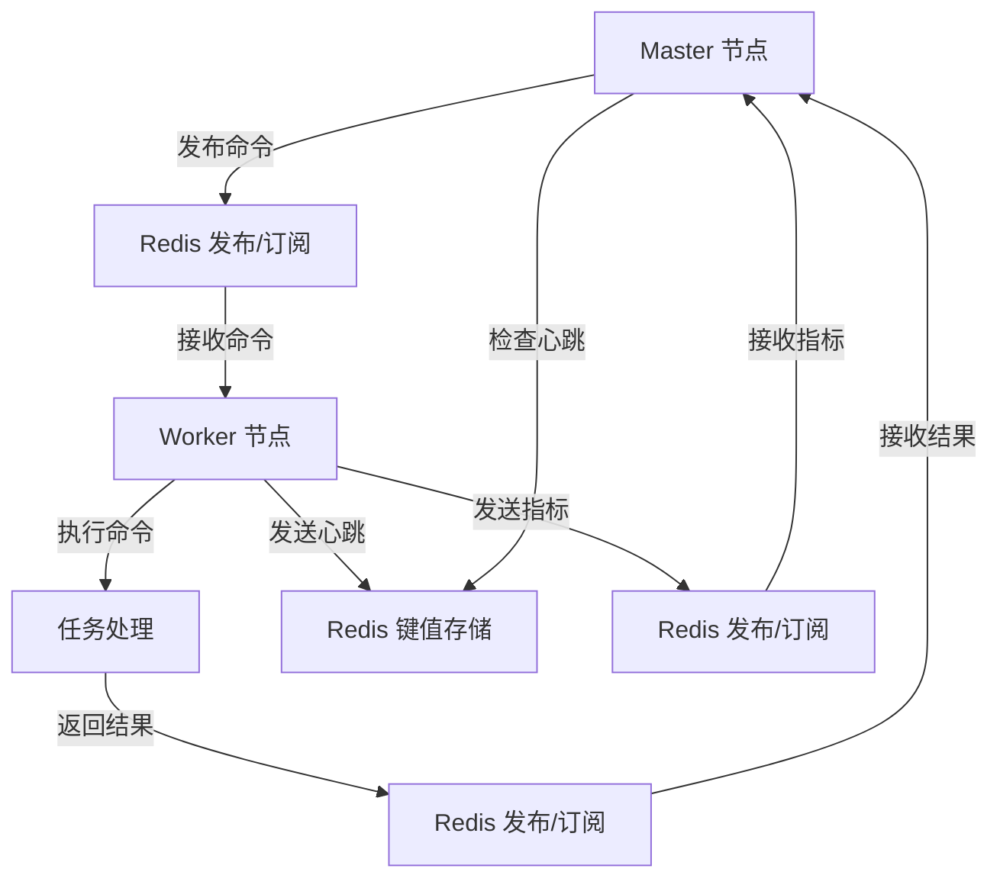
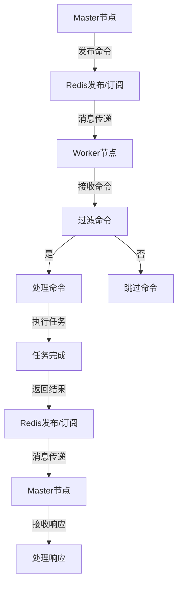
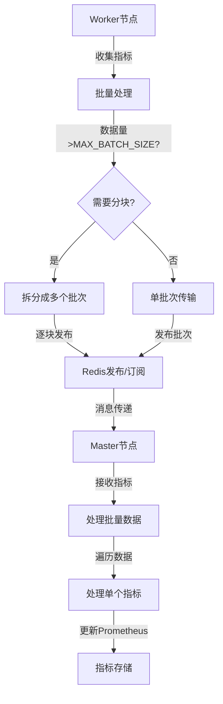
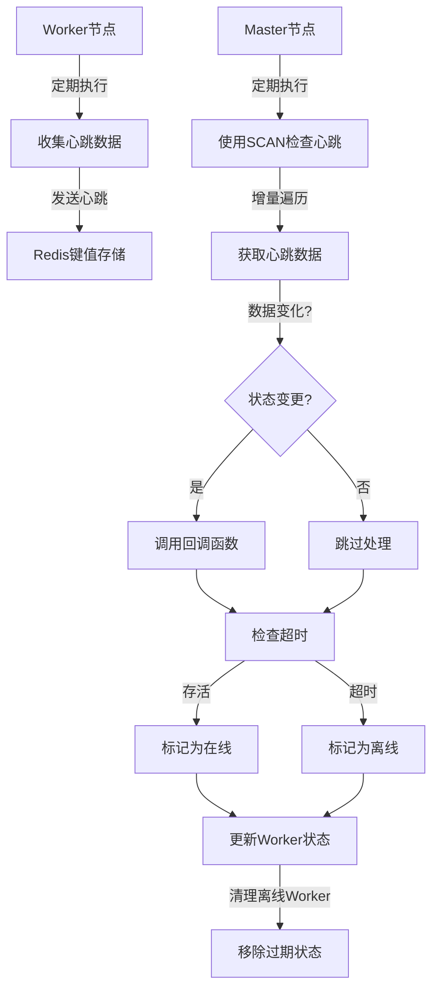

# AioTest 分布式协调模块文档

<!-- markdownlint-disable MD024 -->

## 目录

- [概述](#%E6%A6%82%E8%BF%B0)
- [核心功能](#%E6%A0%B8%E5%BF%83%E5%8A%9F%E8%83%BD)
- [辅助类](#%E8%BE%85%E5%8A%A9%E7%B1%BB)
- [核心类：DistributedCoordinator](#%E6%A0%B8%E5%BF%83%E7%B1%BBdistributedcoordinator)
- [调用逻辑流程](#%E8%B0%83%E7%94%A8%E9%80%BB%E8%BE%91%E6%B5%81%E7%A8%8B)
- [流程图](#%E6%B5%81%E7%A8%8B%E5%9B%BE)
- [配置参数](#%E9%85%8D%E7%BD%AE%E5%8F%82%E6%95%B0)
- [使用示例](#%E4%BD%BF%E7%94%A8%E7%A4%BA%E4%BE%8B)
- [性能优化建议](#%E6%80%A7%E8%83%BD%E4%BC%98%E5%8C%96%E5%BB%BA%E8%AE%AE)
- [故障排查](#%E6%95%85%E9%9A%9C%E6%8E%92%E6%9F%A5)
- [总结](#%E6%80%BB%E7%BB%93)

______________________________________________________________________

## 概述

`distributed_coordinator.py` 是 AioTest 负载测试项目的核心分布式协调模块，负责实现 Master 节点与 Worker 节点之间的通信和协调。该模块基于 Redis 的发布/订阅机制和键值存储，提供了可靠的跨节点通信能力。

## 核心功能

- ✅ **Redis 连接管理** - 支持连接重试和指数退避策略
- ✅ **分布式锁机制** - 基于 Redis 的分布式锁，支持超时和重试
- ✅ **消息发布/订阅系统** - 统一的消息传递机制
- ✅ **数据传输** - 支持命令、指标和心跳数据的传输
- ✅ **心跳监控** - Worker 节点健康状态监控
- ✅ **批量数据传输** - 提高高并发场景下的性能

## 辅助类

### `RedisConnection` 类

**作用**：管理 Redis 连接池，提供单例模式的 Redis 客户端，支持连接重试机制和指数退避策略

**初始化参数**：

| 参数名 | 类型 | 默认值 | 说明 |
| ----- | ---- | ----- | ---- |
| `max_retries` | `int` | 3 | 最大重试次数 |
| `retry_interval` | `float` | 1.0 | 初始重试间隔（秒），后续使用指数退避 |

**方法说明**：

| 方法名 | 作用 | 参数 | 返回值 | 调用时机 |
| ----- | ---- | ---- | ----- | ----- --|
| `get_client(path, port, password)` | 获取 Redis 连接实例，支持自动重试 | `path: str`, `port: int`, `password: str` | `Redis` | 初始化协调器时 |
| `close()` | 关闭 Redis 连接 | 无 | `None` | 系统退出时 |

**重试机制说明**：

- 连接失败时自动重试，最多重试 `max_retries` 次
- 使用指数退避策略：第1次重试等待1秒，第2次等待2秒，第3次等待4秒
- 每次连接前使用 `ping()` 测试连接是否真正可用
- 重试次数通过 `REDIS_CONNECTION_RETRIES` Prometheus 指标记录

### `DistributedLock` 类

**作用**：提供基于 Redis 的分布式锁机制，支持超时和重试

**方法说明**：

| 方法名 | 作用 | 参数 | 返回值 | 调用时机 |
| ----- | ---- | ---- | ----- | ----- --|
| `__init__(redis, lock_key, timeout, wait_timeout, retry_interval)` | 初始化分布式锁 | `redis: Redis`, `lock_key: str`, `timeout: float`, `wait_timeout: float`, `retry_interval: float` | 无 | 创建锁实例时 |
| `acquire()` | 获取分布式锁 | 无 | `bool` | 需要获取锁时 |
| `release()` | 释放分布式锁 | 无 | `bool` | 需要释放锁时 |
| `__aenter__()` | 进入上下文管理器 | 无 | `self` | 使用 `async with` 时 |
| `__aexit__(exc_type, exc_val, exc_tb)` | 退出上下文管理器 | 异常相关参数 | `None` | 使用 `async with` 时 |
| `with_lock(redis, lock_key, timeout, wait_timeout)` | 锁的快捷使用方式 | `redis: Redis`, `lock_key: str`, `timeout: float`, `wait_timeout: float` | `_LockContext` | 需要获取锁时 |

## 核心类DistributedCoordinator

### 初始化方法

```python
def __init__(self, redis: Redis, role: str = "master", node_id: str = None)
```

**作用**：初始化分布式协调器，配置节点角色和通信频道

**参数说明**：

- `redis`：Redis 客户端实例，用于发布/订阅消息
- `role`：节点角色，可选值为 "master" 或 "worker"
- `node_id`：节点 ID，可选，默认自动生成

### 方法说明

| 方法名 | 作用 | 参数 | 返回值 | 调用时机 |
| ----- | ---- | ---- | ----- | ----- --|
| `publish(channel_type, data, worker_id, **kwargs)` | 统一的数据发布方法 | `channel_type: str`, `data: dict`, `worker_id: str`, `**kwargs` | `None` | 发布命令、批量指标或心跳数据时 |
| `check_worker_heartbeat(worker_id)` | 检查特定 Worker 的心跳状态 | `worker_id: str` | `bool` | Master 节点检查 Worker 存活状态时 |
| `listen_heartbeats(callback)` | 监听 Worker 心跳数据变化 | `callback: callable` | `None` | Master 节点监控 Worker 状态时 |
| `listen_request_metrics(callback)` | 监听 Worker 上报的请求数据 | `callback: callable` | `None` | Master 节点接收 Worker 指标数据时 |
| `listen_commands(command_handler)` | 统一的命令监听器 | `command_handler: callable` | `None` | 接收和处理命令时 |

## 调用逻辑流程

### 初始化流程

1. **创建 Redis 连接** → 调用 `RedisConnection.get_client()`
1. **初始化协调器** → 创建 `DistributedCoordinator` 实例
1. **启动监听器** → 调用 `listen_commands()`、`listen_heartbeats()` 等方法
1. **开始通信** → 调用 `publish()` 方法发送消息

### 命令发布和处理流程

1. **Master 节点发布命令** → 调用 `publish("command", data, worker_id, command=command)`
1. **Worker 节点接收命令** → `listen_commands()` 监听到命令
1. **Worker 节点处理命令** → 调用命令处理函数
1. **Worker 节点响应** → 调用 `publish("command", data, command=response_command)`
1. **Master 节点接收响应** → `listen_commands()` 监听到响应

### 指标数据传输流程

1. **Worker 节点收集指标** → 收集请求指标数据
1. **Worker 节点发布指标** → 调用 `publish("request_metrics", batch_data, worker_id=worker_id)`
1. **Master 节点接收指标** → `listen_request_metrics()` 监听到指标数据
1. **Master 节点处理指标** → 调用指标处理回调函数

### 心跳监控流程

1. **Worker 节点发送心跳** → 定期调用 `publish("heartbeat", heartbeat_data)`
1. **Master 节点检查心跳** → `listen_heartbeats()` 定期检查 Worker 心跳
1. **Master 节点更新状态** → 根据心跳数据更新 Worker 状态
1. **Master 节点处理超时** → 对超时的 Worker 节点进行处理

## 流程图

### 整体架构流程



### 命令处理流程



### 指标数据传输流程



### 心跳监控流程



## 配置参数

| 配置项 | 类型 | 默认值 | 说明 | 适用场景 |
| ----- | ---- | ----- | ---- | ----- --|
| `HEARTBEAT_INTERVAL` | `float` | 1.0 | 心跳监控时间间隔（秒） | 调整监控精度和系统开销 |
| `HEARTBEAT_LIVENESS` | `int` | 3 | 心跳存活检查次数 | 调整容错能力 |
| `MAX_BATCH_SIZE` | `int` | 1000 | 最大批量传输大小 | 控制单次传输数据量，防止消息过大 |

## 使用示例

### 初始化和启动

```python
# 初始化 Redis 连接（使用默认参数：3次重试，1秒初始间隔）
redis_connection = RedisConnection()
redis_client = await redis_connection.get_client("localhost", 6379, "password")

# 或者自定义重试参数（5次重试，2秒初始间隔）
redis_connection = RedisConnection(max_retries=5, retry_interval=2.0)
redis_client = await redis_connection.get_client("localhost", 6379, "password")

# 初始化分布式协调器（Master 节点）
coordinator = DistributedCoordinator(redis_client, role="master", node_id="master_01")

# 定义命令处理函数
async def handle_command(data, worker_id, command):
    print(f"Received command: {command}, data: {data}, from: {worker_id}")
    # 处理命令逻辑
    if command == "startup_completed":
        print(f"Worker {worker_id} has completed startup")

# 启动命令监听器
command_listener_task = asyncio.create_task(coordinator.listen_commands(handle_command))

# 启动心跳监听器
async def handle_heartbeat(heartbeat_data, worker_id):
    print(f"Received heartbeat from {worker_id}: {heartbeat_data}")

heartbeat_listener_task = asyncio.create_task(coordinator.listen_heartbeats(handle_heartbeat))

# 启动指标监听器
async def handle_metrics(metrics_data, worker_id):
    print(f"Received metrics from {worker_id}: {metrics_data}")

metrics_listener_task = asyncio.create_task(coordinator.listen_request_metrics(handle_metrics))
```

### 发布命令

```python
# 发布启动命令给所有 Worker
await coordinator.publish("command", {"user_count": 10, "rate": 10}, command="startup")

# 发布停止命令给特定 Worker
await coordinator.publish("command", {"reason": "maintenance"}, worker_id="worker_01", command="stop")

# 发布退出命令给所有 Worker
await coordinator.publish("command", {}, command="quit")
```

### 发送心跳

```python
# Worker 节点发送心跳
heartbeat_data = {
    "cpu_percent": 45.0,
    "active_users": 10,
    "status": "running"
}
await coordinator.publish("heartbeat", heartbeat_data)
```

### 发布指标数据

```python
# Worker 节点发布批量指标数据（推荐使用批量传输以提高性能）
batch_data = [
    {
        "request_id": "req_123",
        "method": "POST",
        "endpoint": "/api/login",
        "status_code": 200,
        "duration": 0.15,
        "response_size": 1024
    },
    {
        "request_id": "req_124",
        "method": "GET",
        "endpoint": "/api/users",
        "status_code": 200,
        "duration": 0.08,
        "response_size": 2048
    }
]
await coordinator.publish("request_metrics", batch_data, worker_id="worker_01")
```

### 检查 Worker 心跳

```python
# Master 节点检查特定 Worker 的心跳状态
is_alive = await coordinator.check_worker_heartbeat("worker_01")
print(f"Worker 01 is {'alive' if is_alive else 'dead'}")
```

### 使用分布式锁

```python
# 使用分布式锁
lock = DistributedLock(redis_client, "resource_name", timeout=10)

async with await lock:
    if lock.locked:
        # 临界区代码
        print("Acquired lock, executing critical section")
        # 执行需要同步的操作
        await asyncio.sleep(2)
        print("Critical section completed")

# 使用快捷方式
async with await DistributedLock.with_lock(redis_client, "resource_name") as lock:
    if lock.locked:
        # 临界区代码
        print("Acquired lock using shortcut")
```

## 性能优化建议

1. **批量数据传输**：对于高并发场景，使用 `request_metrics` 频道进行批量数据传输，减少网络开销。系统会自动将大数据集拆分成多个小批次（每批最多 `MAX_BATCH_SIZE` 条），避免单条消息过大导致的性能问题。
1. **心跳监控优化**：使用 `SCAN` 命令替代 `KEYS` 命令检查 Worker 心跳，避免阻塞 Redis 服务器。`SCAN` 采用增量迭代方式，每次处理固定数量的 key，适合生产环境使用。
1. **心跳间隔调整**：根据网络状况和系统负载调整 `HEARTBEAT_INTERVAL`，平衡监控精度和系统开销
1. **消息处理优化**：在命令处理器中使用异步处理，避免阻塞事件循环
1. **错误处理**：实现适当的错误处理和重试机制，提高系统可靠性
1. **连接管理**：使用 `RedisConnection` 类管理连接池，避免频繁创建和关闭连接
1. **批量大小调优**：根据实际网络环境和 Redis 性能调整 `MAX_BATCH_SIZE`，在高延迟网络中可适当减小该值

## 故障排查

### 常见问题

| 问题 | 可能原因 | 解决方案 |
| ---- | ----- --| ----- --|
| 命令发布失败 | Redis 连接异常 | 检查 Redis 服务状态和连接参数 |
| 命令接收不到 | 频道订阅错误或网络问题 | 检查频道配置和网络连接 |
| 心跳检测失败 | Worker 节点异常或网络问题 | 检查 Worker 节点状态和网络连接 |
| 指标数据丢失 | 批量传输失败或缓冲区满 | 增加缓冲区大小，检查网络连接 |
| 分布式锁获取失败 | 锁竞争或超时 | 调整锁超时时间和重试间隔 |

### 日志分析

- Redis连接重试：`Redis connection failed (attempt X/Y): {error}. Retrying in Zs...`
- Redis连接成功：`Redis connection established: {host}:{port}`
- Redis连接最终失败：`Redis connection failed after {max_retries} attempts: {error}`
- 命令处理错误：`Error processing command message: {error}`
- 心跳监听器错误：`Heartbeat listener error: {error}`
- 指标监听器错误：`Redis request metrics listener failed: {error}`
- 命令监听器错误：`Command listener error: {error}`
- 锁获取失败：`Failed to acquire lock: {error}`
- 消息解析错误：`Failed to parse command message: {message}`

## 总结

`distributed_coordinator.py` 模块是 AioTest 项目的核心组件，提供了可靠的分布式协调功能。通过基于 Redis 的发布/订阅机制和键值存储，它实现了 Master 节点与 Worker 节点之间的高效通信和协调。

该模块的设计考虑了可扩展性和可靠性，通过统一的消息发布/订阅系统、批量数据传输和心跳监控机制，确保了分布式负载测试系统的稳定运行。

通过合理配置参数和使用最佳实践，用户可以根据具体场景调整分布式协调器的行为，平衡系统性能和可靠性，为负载测试提供最佳的分布式协调方案。
