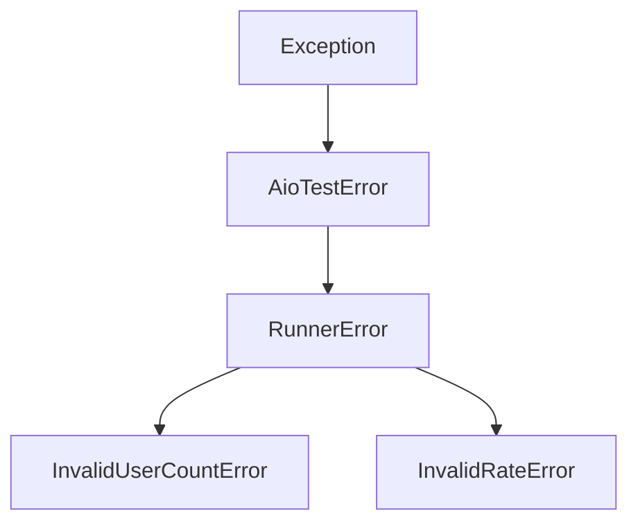
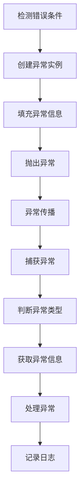
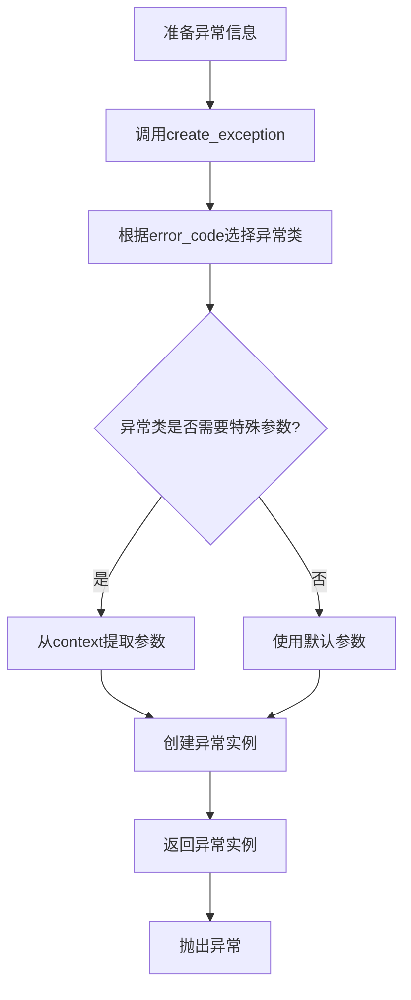

# AioTest 异常模块文档

## 目录

- [AioTest 异常模块文档](#aiotest-异常模块文档)
  - [目录](#目录)
  - [概述](#概述)
  - [核心功能](#核心功能)
  - [基础异常类：AioTestError](#基础异常类aiotesterror)
  - [运行器异常类：RunnerError](#运行器异常类runnererror)
  - [具体异常类](#具体异常类)
    - [`InvalidUserCountError`](#invalidusercounterror)
    - [`InvalidRateError`](#invalidrateerror)
  - [异常工厂函数](#异常工厂函数)
    - [`create_exception()` 函数](#create_exception-函数)
  - [调用逻辑流程](#调用逻辑流程)
    - [异常抛出流程](#异常抛出流程)
    - [异常捕获和处理流程](#异常捕获和处理流程)
    - [使用异常工厂函数流程](#使用异常工厂函数流程)
  - [流程图](#流程图)
    - [异常层次结构](#异常层次结构)
    - [异常抛出和捕获流程](#异常抛出和捕获流程)
    - [异常工厂函数流程](#异常工厂函数流程)
  - [配置参数](#配置参数)
  - [使用示例](#使用示例)
    - [基本异常使用](#基本异常使用)
    - [使用具体异常类](#使用具体异常类)
    - [使用异常工厂函数](#使用异常工厂函数)
    - [异常层次结构使用](#异常层次结构使用)
  - [性能优化建议](#性能优化建议)
  - [故障排查](#故障排查)
    - [常见问题](#常见问题)
    - [日志分析](#日志分析)
  - [总结](#总结)

---

## 概述

`exception.py` 是 AioTest 负载测试项目的核心异常模块，负责定义框架中使用的自定义异常类型，提供清晰的错误分类和详细的错误信息。该模块实现了一个层次化的异常体系，支持错误代码、错误信息和上下文信息的传递，为整个系统提供了统一的错误处理机制。

## 核心功能

- ✅ **层次化异常体系** - 便于错误分类和处理
- ✅ **错误信息传递** - 支持错误代码、错误信息和上下文信息
- ✅ **异常工厂函数** - 根据错误码创建对应的异常实例
- ✅ **错误信息格式化** - 便于日志记录和调试
- ✅ **类型安全** - 使用类型注解提高代码可读性

## 基础异常类：AioTestError

**作用**：AioTest 框架的基础异常类，所有自定义异常都继承自此类

**设计原则**：
- 提供通用的异常属性和方法
- 支持错误代码、错误信息和上下文信息的传递
- 标准化的错误信息格式化

**初始化方法**：
```python
def __init__(self, message: str, error_code: str = None, context: dict = None)
```

**参数说明**：
| 参数名 | 类型 | 默认值 | 说明 |
|-------|------|-------|------|
| `message` | `str` | 无 | 错误信息 |
| `error_code` | `str` | `None` | 错误代码，用于程序化处理 |
| `context` | `dict` | `None` | 错误上下文信息，包含相关的状态数据 |

**属性说明**：
| 属性名 | 类型 | 说明 |
|-------|------|------|
| `message` | `str` | 错误信息 |
| `error_code` | `str` | 错误代码，默认为类名 |
| `context` | `dict` | 错误上下文信息 |

**方法说明**：
| 方法名 | 作用 | 参数 | 返回值 | 调用时机 |
|-------|------|------|-------|---------|
| `__str__()` | 格式化错误信息 | 无 | `str` | 异常被转换为字符串时 |

## 运行器异常类：RunnerError

**作用**：运行器异常，用于测试运行过程中的错误

**继承关系**：继承自 `AioTestError`

**设计原则**：
- 作为运行器相关异常的基类
- 提供统一的错误分类

**初始化方法**：
```python
def __init__(self, message: str, error_code: str = None, context: dict = None)
```

## 具体异常类

### `InvalidUserCountError`
**作用**：无效用户数量异常，用于用户数量参数验证

**继承关系**：继承自 `RunnerError`

**初始化方法**：
```python
def __init__(self, message: str, user_count: int = None)
```

**参数说明**：
| 参数名 | 类型 | 默认值 | 说明 |
|-------|------|-------|------|
| `message` | `str` | 无 | 错误信息 |
| `user_count` | `int` | `None` | 无效的用户数量值 |

**属性说明**：
| 属性名 | 类型 | 说明 |
|-------|------|------|
| `user_count` | `int` | 无效的用户数量值 |

### `InvalidRateError`
**作用**：无效速率异常，用于速率参数验证

**继承关系**：继承自 `RunnerError`

**初始化方法**：
```python
def __init__(self, message: str, rate: float = None)
```

**参数说明**：
| 参数名 | 类型 | 默认值 | 说明 |
|-------|------|-------|------|
| `message` | `str` | 无 | 错误信息 |
| `rate` | `float` | `None` | 无效的速率值 |

**属性说明**：
| 属性名 | 类型 | 说明 |
|-------|------|------|
| `rate` | `float` | 无效的速率值 |

## 异常工厂函数

### `create_exception()` 函数
**作用**：根据错误码创建对应的异常实例

**参数**：
| 参数名 | 类型 | 默认值 | 说明 |
|-------|------|-------|------|
| `error_code` | `str` | 无 | 错误代码 |
| `message` | `str` | 无 | 错误信息 |
| `context` | `dict` | `None` | 错误上下文信息 |

**返回值**：
- `AioTestError`：对应的异常实例

**异常**：
- `ValueError`：如果错误码无效

## 调用逻辑流程

### 异常抛出流程

1. **检测错误条件** → 发现参数无效或运行时错误
2. **创建异常实例** → 根据错误类型选择合适的异常类
3. **填充异常信息** → 设置错误信息、错误代码和上下文
4. **抛出异常** → 使用 `raise` 语句抛出异常
5. **异常传播** → 异常向上传播，直到被捕获

### 异常捕获和处理流程

1. **捕获异常** → 使用 `try-except` 语句捕获异常
2. **判断异常类型** → 根据异常类型执行不同的处理逻辑
3. **获取异常信息** → 从异常对象中获取错误信息、错误代码和上下文
4. **处理异常** → 执行相应的错误处理逻辑
5. **记录日志** → 记录异常信息，便于调试和监控

### 使用异常工厂函数流程

1. **准备异常信息** → 确定错误代码、错误信息和上下文
2. **调用工厂函数** → 调用 `create_exception` 函数
3. **工厂函数处理** → 根据错误码选择对应的异常类
4. **创建异常实例** → 为特定异常类传递相应的参数
5. **返回异常实例** → 返回创建的异常实例
6. **抛出异常** → 使用返回的异常实例抛出异常

## 流程图

### 异常层次结构



### 异常抛出和捕获流程



### 异常工厂函数流程



## 配置参数

| 配置项 | 类型 | 默认值 | 说明 | 适用场景 |
|-------|------|-------|------|---------|
| `message` | `str` | 无 | 错误信息 | 所有异常 |
| `error_code` | `str` | 类名 | 错误代码 | AioTestError |
| `context` | `dict` | `{}` | 错误上下文 | AioTestError |
| `user_count` | `int` | `None` | 无效的用户数量 | InvalidUserCountError |
| `rate` | `float` | `None` | 无效的速率值 | InvalidRateError |

## 使用示例

### 基本异常使用

```python
from aiotest import RunnerError

# 抛出运行器异常
def start_test(user_count):
    if user_count <= 0:
        raise RunnerError(f"Invalid user count: {user_count}")
    print(f"Starting test with {user_count} users")

# 捕获和处理异常
try:
    start_test(-5)
except RunnerError as e:
    print(f"Error: {e}")
    print(f"Error code: {e.error_code}")
    print(f"Context: {e.context}")
```

### 使用具体异常类

```python
from aiotest import InvalidUserCountError, InvalidRateError

# 验证用户数量
def validate_user_count(user_count):
    if not isinstance(user_count, int) or user_count <= 0:
        raise InvalidUserCountError(
            f"User count must be a positive integer, got: {user_count}",
            user_count=user_count
        )
    return True

# 验证速率
def validate_rate(rate, user_count):
    if rate < 0 or rate > user_count:
        raise InvalidRateError(
            f"Rate must be between 0 and {user_count}, got: {rate}",
            rate=rate
        )
    return True

# 使用验证函数
try:
    validate_user_count(10)
    validate_rate(5, 10)
    print("Validation passed")
except InvalidUserCountError as e:
    print(f"Invalid user count: {e}")
    print(f"User count: {e.user_count}")
except InvalidRateError as e:
    print(f"Invalid rate: {e}")
    print(f"Rate: {e.rate}")
```

### 使用异常工厂函数

```python
from aiotest.exception import create_exception

# 使用异常工厂函数创建异常
def process_request(data):
    if 'user_count' not in data:
        error = create_exception(
            "INVALID_USER_COUNT",
            "Missing user_count parameter",
            {"request_data": data}
        )
        raise error
    
    user_count = data['user_count']
    if user_count <= 0:
        error = create_exception(
            "INVALID_USER_COUNT",
            f"Invalid user count: {user_count}",
            {"user_count": user_count, "request_data": data}
        )
        raise error
    
    return f"Processing request with {user_count} users"

# 测试异常工厂函数
try:
    result = process_request({"user_count": 10})
    print(result)
except Exception as e:
    print(f"Error: {e}")
    if hasattr(e, 'error_code'):
        print(f"Error code: {e.error_code}")
    if hasattr(e, 'context'):
        print(f"Context: {e.context}")
```

### 异常层次结构使用

```python
from aiotest.exception import AioTestError
from aiotest import RunnerError, InvalidUserCountError

# 捕获不同层次的异常
try:
    raise InvalidUserCountError("Invalid user count", user_count=-5)
except InvalidUserCountError as e:
    print(f"InvalidUserCountError: {e}")
except RunnerError as e:
    print(f"RunnerError: {e}")
except AioTestError as e:
    print(f"AioTestError: {e}")
except Exception as e:
    print(f"General Exception: {e}")

# 检查异常类型
try:
    raise InvalidUserCountError("Invalid user count", user_count=-5)
except Exception as e:
    print(f"Caught exception: {e}")
    print(f"Is AioTestError: {isinstance(e, AioTestError)}")
    print(f"Is RunnerError: {isinstance(e, RunnerError)}")
    print(f"Is InvalidUserCountError: {isinstance(e, InvalidUserCountError)}")
```

## 性能优化建议

1. **异常使用原则**：
   - 只在异常情况下使用异常，不要用异常控制正常流程
   - 异常应该用于表示真正的错误情况，而不是预期的控制流
   - 避免在性能关键路径上抛出和捕获异常

2. **异常设计**：
   - 保持异常层次结构清晰，避免过深的继承层次
   - 为不同类型的错误定义专门的异常类，便于精确捕获
   - 在异常中包含足够的上下文信息，便于调试

3. **异常处理**：
   - 捕获异常时要具体，避免使用过于宽泛的异常类型
   - 捕获异常后要适当处理，不要静默忽略
   - 记录异常信息时要包含足够的上下文，便于定位问题

4. **异常工厂函数使用**：
   - 当需要根据错误码动态创建异常时，使用 `create_exception` 函数
   - 传递足够的上下文信息，便于后续处理
   - 注意错误码的大小写，确保与 `EXCEPTION_MAP` 中的键匹配

## 故障排查

### 常见问题

| 问题 | 可能原因 | 解决方案 |
|------|---------|---------|
| 异常未被捕获 | 异常类型不匹配或捕获范围过窄 | 检查异常类型，确保捕获正确的异常 |
| 异常信息不完整 | 未提供足够的上下文信息 | 在创建异常时添加详细的上下文信息 |
| 错误码无效 | 使用了未在 `EXCEPTION_MAP` 中定义的错误码 | 检查错误码是否正确，或使用标准错误码 |
| 异常层次混乱 | 异常继承关系不清晰 | 保持异常层次结构清晰，避免循环依赖 |
| 性能问题 | 在性能关键路径上抛出异常 | 避免在循环或高频操作中抛出异常 |

### 日志分析

- 异常抛出：`raise RunnerError("Startup timeout: only {completed_count}/{expected_count} workers completed")`
- 异常捕获：`except InvalidUserCountError as e:`
- 错误信息：`[INVALID_USER_COUNT] User count must be a positive integer, current value: -5`

## 总结

`exception.py` 模块是 AioTest 负载测试项目的核心组件，提供了完善的异常处理机制。通过 `AioTestError` 作为基础异常类，`RunnerError` 作为运行器相关异常的基类，以及 `InvalidUserCountError` 和 `InvalidRateError` 作为具体的异常类型，它构建了一个层次清晰的异常体系。

该模块还提供了 `create_exception` 工厂函数，支持根据错误码动态创建对应的异常实例，为系统提供了统一的异常创建机制。这种设计使得错误处理更加标准化和规范化，便于错误的分类、捕获和处理。

在实际使用中，合理地使用异常可以提高代码的可读性和可维护性，便于定位和解决问题。通过捕获特定类型的异常，可以针对不同的错误情况执行相应的处理逻辑，提高系统的健壮性和可靠性。

`exception.py` 模块虽然简单，但它是整个系统错误处理的基础，为 AioTest 负载测试框架提供了统一、规范的异常处理机制。