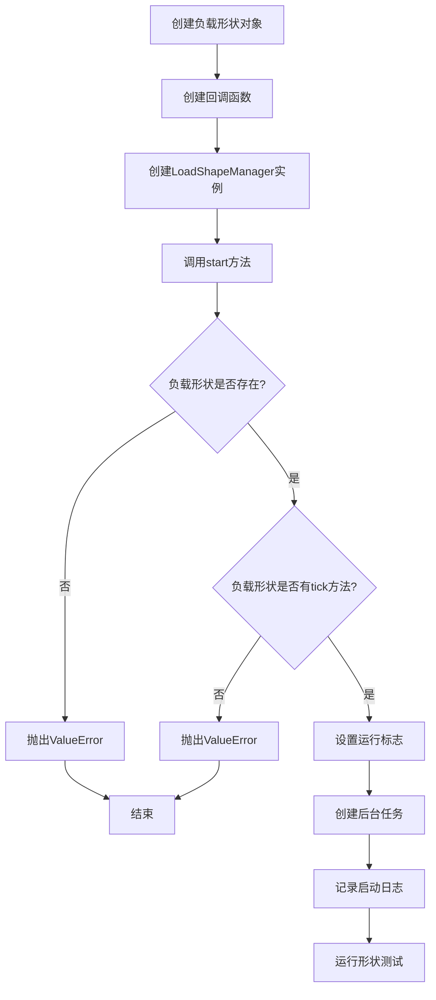
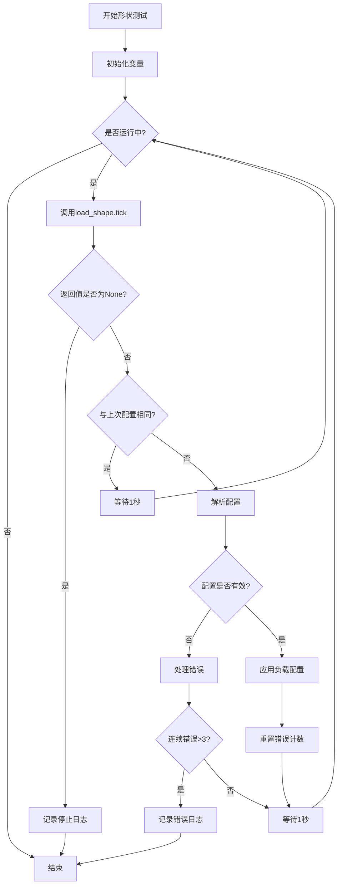
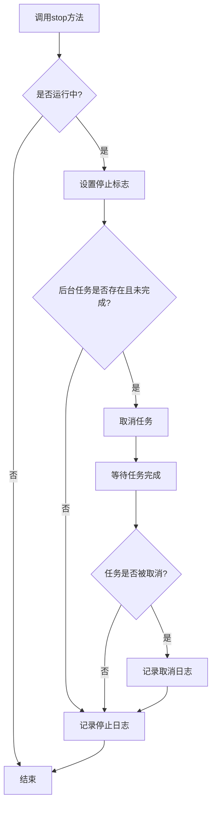
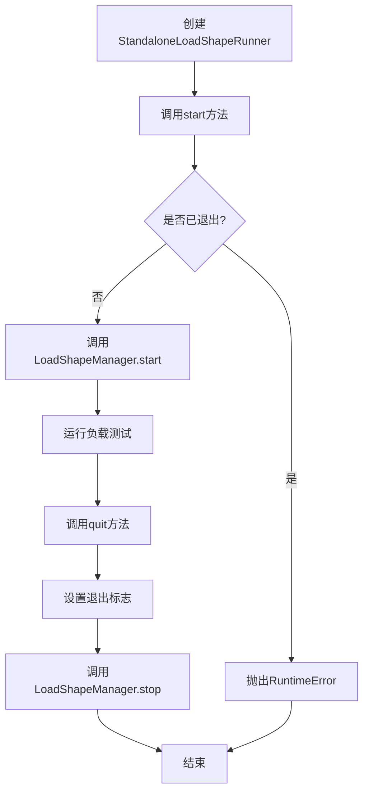

# AioTest 负载形状管理器模块文档

## 目录

- [概述](#概述)
- [核心功能](#核心功能)
- [核心类：LoadShapeManager](#核心类-loadshapemanager)
- [独立运行器类：StandaloneLoadShapeRunner](#独立运行器类-standaloneloadshaperunner)
- [调用逻辑流程](#调用逻辑流程)
- [流程图](#流程图)
- [配置参数](#配置参数)
- [使用示例](#使用示例)
- [性能优化建议](#性能优化建议)
- [故障排查](#故障排查)
- [总结](#总结)

---

## 概述

`load_shape_manager.py` 是 AioTest 负载测试项目的核心负载形状管理模块，负责管理负载测试的形状变化逻辑。该模块提供了负载形状的动态调整能力，支持根据预设的负载形状配置，自动调整用户数量和请求速率，实现更加真实的负载测试场景。

## 核心功能

- ✅ **负载形状动态管理** - 自动调整用户数量和请求速率
- ✅ **定期配置更新** - 定期获取并应用新的负载配置
- ✅ **错误处理** - 完善的错误处理和连续错误限制
- ✅ **独立运行** - 不依赖 BaseRunner 的独立运行能力
- ✅ **异步支持** - 支持异步操作和任务管理
- ✅ **日志记录** - 完善的日志记录和状态管理

## 核心类：LoadShapeManager

**作用**：负载形状管理器，负责管理负载测试的形状变化逻辑

### 初始化方法
```python
def __init__(self, load_shape: Any, apply_load_callback: Callable[[int, float], Awaitable[Any]])
```
**作用**：初始化负载形状管理器实例，配置负载形状对象和应用负载的回调函数

**参数说明**：
- `load_shape`：负载形状对象，需要实现 `tick()` 方法，返回 (user_count, rate) 元组或 None
- `apply_load_callback`：应用负载的回调函数，接收 (user_count, rate) 参数

### 方法说明

| 方法名 | 作用 | 参数 | 返回值 | 调用时机 |
|-------|------|------|-------|---------|
| `start()` | 启动负载形状管理 | 无 | `None` | 需要开始负载测试时 |
| `stop()` | 停止负载形状管理 | 无 | `None` | 需要停止负载测试时 |
| `_run_shape_test()` | 形状测试主逻辑 | 无 | `None` | 内部调用 |
| `_handle_error(error, consecutive_errors)` | 处理错误并返回更新后的连续错误计数 | `error: Exception`, `consecutive_errors: int` | `int` | 内部调用 |
| `is_running` (property) | 检查是否正在运行 | 无 | `bool` | 需要监控状态时 |
| `task` (property) | 获取后台任务 | 无 | `Optional[asyncio.Task]` | 需要访问后台任务时 |

## 独立运行器类：StandaloneLoadShapeRunner

**作用**：独立的负载形状运行器，用于不需要继承 BaseRunner 的场景

### 初始化方法
```python
def __init__(self, load_shape: Any, apply_load_callback: Callable[[int, float], Awaitable[Any]])
```
**作用**：初始化独立负载形状运行器，包装 LoadShapeManager 并添加退出状态管理

**参数说明**：
- `load_shape`：负载形状对象，需要实现 `tick()` 方法
- `apply_load_callback`：应用负载的回调函数，接收 (user_count, rate) 参数

### 方法说明

| 方法名 | 作用 | 参数 | 返回值 | 调用时机 |
|-------|------|------|-------|---------|
| `start()` | 启动形状测试 | 无 | `None` | 需要开始负载测试时 |
| `quit()` | 退出形状测试 | 无 | `None` | 需要退出负载测试时 |
| `is_quit` (property) | 检查是否已退出 | 无 | `bool` | 需要监控退出状态时 |
| `is_running` (property) | 检查是否正在运行 | 无 | `bool` | 需要监控运行状态时 |

## 调用逻辑流程

### 初始化流程

1. **创建负载形状对象** → 实现 `tick()` 方法的负载形状类实例
2. **创建回调函数** → 实现应用负载的回调函数
3. **创建 LoadShapeManager 实例** → 传入负载形状对象和回调函数
4. **启动管理器** → 调用 `start()` 方法
5. **验证负载形状接口** → 检查 `load_shape` 是否有 `tick()` 方法
6. **创建后台任务** → 启动 `_run_shape_test()` 任务

### 负载形状管理流程

1. **获取负载配置** → 调用 `load_shape.tick()` 获取新的负载配置
2. **检查停止条件** → 如果返回 None，停止形状测试
3. **检查配置变化** → 如果与上次配置相同，等待后继续
4. **解析配置** → 提取用户数量和速率
5. **应用负载** → 调用回调函数应用新的负载配置
6. **错误处理** → 处理配置错误和其他异常
7. **连续错误检查** → 如果连续错误超过阈值，停止测试

### 停止流程

1. **调用 stop() 方法** → 停止负载形状管理
2. **设置停止标志** → 将 `_is_running` 设置为 False
3. **取消后台任务** → 取消 `_run_shape_test()` 任务
4. **等待任务完成** → 等待任务正常结束或被取消
5. **记录日志** → 记录停止信息

### 独立运行器流程

1. **创建 StandaloneLoadShapeRunner 实例** → 传入负载形状对象和回调函数
2. **启动运行器** → 调用 `start()` 方法
3. **检查退出状态** → 如果已退出，抛出异常
4. **运行负载测试** → 内部调用 LoadShapeManager 的方法
5. **退出运行器** → 调用 `quit()` 方法
6. **设置退出标志** → 将 `_quit_flag` 设置为 True
7. **停止管理器** → 调用 LoadShapeManager 的 `stop()` 方法

## 流程图

### 初始化和启动流程



### 负载形状管理主流程



### 停止流程



### 独立运行器流程



## 配置参数

| 配置项 | 类型 | 默认值 | 说明 | 适用场景 |
|-------|------|-------|------|---------|
| `load_shape` | `Any` | 无 | 负载形状对象，需要实现 tick() 方法 | 所有场景 |
| `apply_load_callback` | `Callable[[int, float], Awaitable[Any]]` | 无 | 应用负载的回调函数 | 所有场景 |
| `error_threshold` | `int` | `3` | 连续错误阈值，超过则停止测试 | 错误处理 |
| `sleep_interval` | `float` | `1.0` | 配置未变化时的等待间隔（秒） | 性能优化 |

## 使用示例

### 基本使用示例

```python
import asyncio
from aiotest.load_shape_manager import LoadShapeManager
from aiotest import LoadUserShape

class SimpleLoadShape(LoadUserShape):
    """简单的负载形状实现"""
    def tick(self):
        # 逐步增加用户数，然后保持稳定
        if self.duration < 60:
            return (self.duration // 10 + 1, 1.0)  # 每10秒增加1个用户
        else:
            return (6, 1.0)  # 保持6个用户

async def apply_load(user_count, rate):
    """应用负载的回调函数"""
    print(f"Applying load: {user_count} users at {rate}/s")
    # 这里可以调用用户管理器的方法来实际调整用户数量

async def basic_usage():
    """基本使用示例"""
    # 创建负载形状
    load_shape = SimpleLoadShape()
    
    # 创建负载形状管理器
    manager = LoadShapeManager(load_shape, apply_load)
    
    # 启动管理器
    await manager.start()
    
    # 运行一段时间
    await asyncio.sleep(120)
    
    # 停止管理器
    await manager.stop()

# 执行示例
await basic_usage()
```

### 使用独立运行器

```python
import asyncio
from aiotest.load_shape_manager import StandaloneLoadShapeRunner
from aiotest import LoadUserShape

class RampUpLoadShape(LoadUserShape):
    """递增负载形状"""
    def tick(self):
        # 线性增加用户数
        user_count = min(self.duration // 5, 20)  # 最多20个用户
        rate = user_count * 0.5  # 每个用户0.5个请求/秒
        return (user_count, rate)

async def apply_load(user_count, rate):
    """应用负载的回调函数"""
    print(f"Load updated: {user_count} users, {rate}/s")

async def standalone_usage():
    """使用独立运行器示例"""
    # 创建负载形状
    load_shape = RampUpLoadShape()
    
    # 创建独立运行器
    runner = StandaloneLoadShapeRunner(load_shape, apply_load)
    
    # 启动运行器
    await runner.start()
    print(f"Runner started: {runner.is_running}")
    
    # 运行一段时间
    await asyncio.sleep(60)
    
    # 退出运行器
    await runner.quit()
    print(f"Runner quit: {runner.is_quit}")

# 执行示例
await standalone_usage()
```

### 自定义负载形状

```python
import asyncio
import random
from aiotest.load_shape_manager import LoadShapeManager

class RandomLoadShape:
    """随机负载形状"""
    def __init__(self):
        self.duration = 0
    
    def tick(self):
        self.duration += 1
        # 随机生成用户数和速率
        user_count = random.randint(1, 10)
        rate = random.uniform(0.5, 5.0)
        return (user_count, rate)

async def apply_load(user_count, rate):
    """应用负载的回调函数"""
    print(f"Random load: {user_count} users at {rate:.2f}/s")

async def custom_shape_usage():
    """自定义负载形状示例"""
    # 创建自定义负载形状
    load_shape = RandomLoadShape()
    
    # 创建负载形状管理器
    manager = LoadShapeManager(load_shape, apply_load)
    
    # 启动管理器
    await manager.start()
    
    # 运行一段时间
    await asyncio.sleep(30)
    
    # 停止管理器
    await manager.stop()

# 执行示例
await custom_shape_usage()
```

### 与用户管理器集成

```python
import asyncio
from aiotest.load_shape_manager import LoadShapeManager
from aiotest import LoadUserShape
from aiotest.user_manager import UserManager
from aiotest import User

class TestUser(User):
    """测试用户类"""
    weight = 1
    
    async def test_task(self):
        """测试任务"""
        print("Executing test task")
        await asyncio.sleep(1)

class SteadyLoadShape(LoadUserShape):
    """稳定负载形状"""
    def tick(self):
        # 保持稳定的负载
        return (5, 2.0)  # 5个用户，每个用户2个请求/秒

async def apply_load_with_user_manager(user_count, rate):
    """与用户管理器集成的负载应用函数"""
    print(f"Applying load: {user_count} users at {rate}/s")
    # 这里可以调用用户管理器的方法来调整用户数量
    # await user_manager.manage_users(user_count, rate, "start")

async def integration_usage():
    """与用户管理器集成示例"""
    # 创建用户管理器
    user_manager = UserManager([TestUser], {})
    
    # 创建负载形状
    load_shape = SteadyLoadShape()
    
    # 创建负载形状管理器，传入与用户管理器集成的回调
    manager = LoadShapeManager(load_shape, apply_load_with_user_manager)
    
    # 启动管理器
    await manager.start()
    
    # 运行一段时间
    await asyncio.sleep(60)
    
    # 停止管理器
    await manager.stop()
    
    # 停止所有用户
    # await user_manager.stop_all_users()

# 执行示例
await integration_usage()
```

## 性能优化建议

1. **负载形状设计**：
   - 设计合理的负载形状，避免频繁的负载变化
   - 对于长时间运行的测试，考虑使用更平滑的负载变化曲线
   - 避免在短时间内进行大幅的负载调整

2. **回调函数优化**：
   - 保持 `apply_load_callback` 函数的执行时间尽可能短
   - 避免在回调函数中执行阻塞操作
   - 对于复杂的负载应用逻辑，考虑使用异步处理

3. **错误处理**：
   - 实现合理的错误处理逻辑，避免因临时错误导致测试中断
   - 为关键操作添加适当的重试机制
   - 监控连续错误，及时发现和解决问题

4. **资源管理**：
   - 确保在测试结束后正确停止负载形状管理器
   - 避免创建过多的后台任务
   - 合理设置错误阈值，平衡测试稳定性和错误敏感度

5. **日志优化**：
   - 在高频率的负载调整场景中，适当降低日志级别
   - 为关键操作添加详细的日志，便于问题排查
   - 避免在日志中记录敏感信息

## 故障排查

### 常见问题

| 问题 | 可能原因 | 解决方案 |
|------|---------|---------|
| 负载形状管理器启动失败 | 负载形状对象没有 tick() 方法 | 确保负载形状对象实现了 tick() 方法 |
| 负载形状管理器停止工作 | 连续错误超过阈值 | 检查负载形状的 tick() 方法是否正常，或调整错误阈值 |
| 负载配置未生效 | 回调函数执行失败 | 检查回调函数的实现，确保它能正确应用负载配置 |
| 独立运行器无法启动 | 已调用过 quit() 方法 | 确保只在需要时调用 quit()，或创建新的运行器实例 |
| 后台任务未正确停止 | 任务被卡住 | 确保回调函数不会阻塞，或添加适当的超时处理 |

### 日志分析

- 启动日志：`Load shape manager started`
- 形状更新：`Shape update: {user_count} users at rate {rate}/s`
- 错误日志：`Error in shape test: {error_message}`
- 停止日志：`Load shape manager stopped`
- 取消日志：`Load shape manager has been canceled`

## 总结

`load_shape_manager.py` 模块是 AioTest 负载测试项目的核心组件，提供了灵活、高效的负载形状管理能力。通过 `LoadShapeManager` 类，它能够根据预设的负载形状配置，自动调整用户数量和请求速率，实现更加真实的负载测试场景。

该模块的设计考虑了以下几个关键因素：

1. **灵活性**：支持自定义负载形状，适应不同的测试需求
2. **可靠性**：完善的错误处理机制，确保测试的稳定性
3. **可扩展性**：提供独立运行器，支持不同的使用场景
4. **易用性**：简洁的接口设计，便于集成和使用

`LoadShapeManager` 和 `StandaloneLoadShapeRunner` 两个类各司其职，前者负责核心的负载形状管理逻辑，后者提供了独立运行的能力，为 AioTest 负载测试框架提供了强大的负载控制能力。

通过合理使用负载形状管理器，测试人员可以创建更加真实、有效的负载测试场景，更好地评估系统在不同负载条件下的性能表现。无论是简单的线性负载增长，还是复杂的负载变化模式，`load_shape_manager.py` 模块都能够提供可靠的支持。