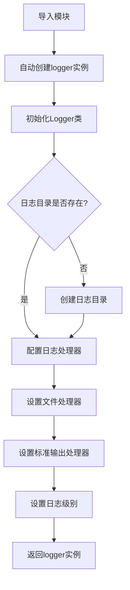
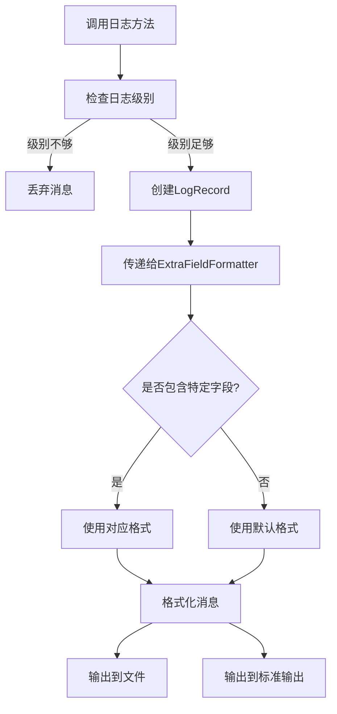
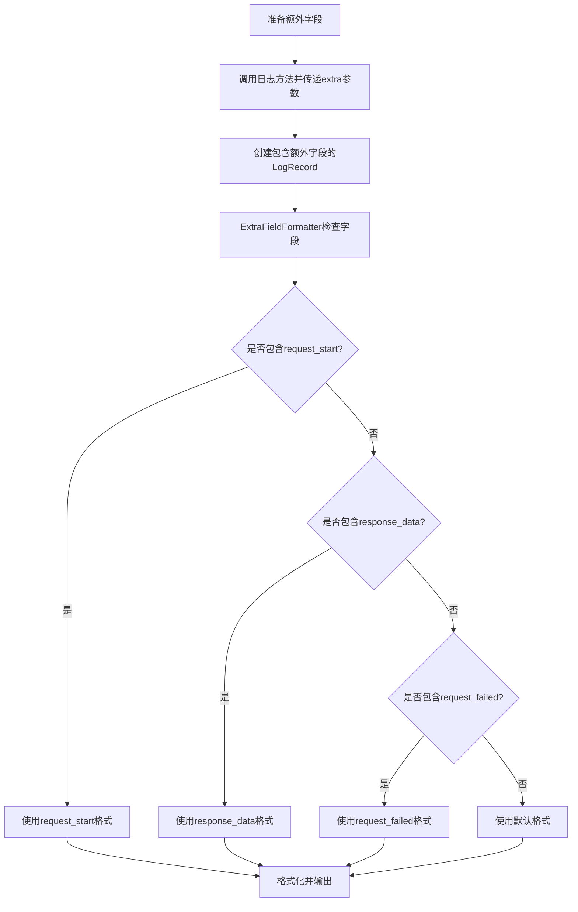

# AioTest 日志模块文档

<!-- markdownlint-disable MD024 -->

## 目录

- [概述](#%E6%A6%82%E8%BF%B0)
- [核心功能](#%E6%A0%B8%E5%BF%83%E5%8A%9F%E8%83%BD)
- [核心类：ExtraFieldFormatter](#%E6%A0%B8%E5%BF%83%E7%B1%BBextrafieldformatter)
- [核心类：Logger](#%E6%A0%B8%E5%BF%83%E7%B1%BBlogger)
- [全局实例](#%E5%85%A8%E5%B1%80%E5%AE%9E%E4%BE%8B)
- [调用逻辑流程](#%E8%B0%83%E7%94%A8%E9%80%BB%E8%BE%91%E6%B5%81%E7%A8%8B)
- [流程图](#%E6%B5%81%E7%A8%8B%E5%9B%BE)
- [配置参数](#%E9%85%8D%E7%BD%AE%E5%8F%82%E6%95%B0)
- [使用示例](#%E4%BD%BF%E7%94%A8%E7%A4%BA%E4%BE%8B)
- [性能优化建议](#%E6%80%A7%E8%83%BD%E4%BC%98%E5%8C%96%E5%BB%BA%E8%AE%AE)
- [故障排查](#%E6%95%85%E9%9A%9C%E6%8E%92%E6%9F%A5)
- [总结](#%E6%80%BB%E7%BB%93)

______________________________________________________________________

## 概述

`logger.py` 是 AioTest 负载测试项目的日志模块，负责提供灵活、高效的日志记录功能，支持动态日志格式、多输出目标、统一的日志级别管理等特性。该模块封装了 Python 标准库的 logging 模块，为负载测试提供结构化、可配置的日志记录能力。

## 核心功能

- ✅ **动态日志格式** - 基于 extra 字段的内容自动切换日志格式
- ✅ **双路日志输出** - 同时输出到文件和标准输出
- ✅ **统一日志级别管理** - 支持动态调整日志级别
- ✅ **防止重复处理器** - 避免重复添加日志处理器
- ✅ **自定义配置** - 支持自定义日志目录和名称
- ✅ **结构化日志** - 便于分析和监控
- ✅ **异常安全** - 异常安全的日志处理

## 核心类ExtraFieldFormatter

**作用**：根据 extra 字段是否存在使用不同格式的日志格式化器

### 初始化方法

```python
def __init__(self, default_fmt, field_fmt_dict)
```

**作用**：初始化日志格式化器，设置默认格式和字段格式字典

**参数说明**：

- `default_fmt`：默认日志格式
- `field_fmt_dict`：字段名与对应格式的字典

### 方法说明

| 方法名 | 作用 | 参数 | 返回值 | 调用时机 |
| ----- | ---- | ---- | ----- | ------- |
| `format(record)` | 格式化日志记录 | `record: logging.LogRecord` | `str` | 记录日志时 |

## 核心类Logger

**作用**：日志记录器类，负责初始化和配置日志

### 初始化方法

```python
def __init__(self, name='aiotest_log', log_dir='logs', log_level='INFO')
```

**作用**：初始化日志记录器，配置日志目录和级别

**参数说明**：

- `name`：日志名称，默认为 'aiotest_log'
- `log_dir`：日志目录路径，默认为 'logs'
- `log_level`：日志等级，默认为 'INFO'

### 方法说明

| 方法名 | 作用 | 参数 | 返回值 | 调用时机 |
| ----- | ---- | ---- | ----- | ------- |
| `_setup_logging()` | 配置日志处理器和格式化器 | 无 | `None` | 初始化时 |
| `setLevel(level)` | 动态设置日志级别 | `level: str` | `None` | 需要调整日志级别时 |
| `set_level(level)` | 动态设置日志级别（setLevel的别名） | `level: str` | `None` | 需要调整日志级别时 |
| `debug(message, *args, **kwargs)` | 记录DEBUG级别日志 | `message: str` | `None` | 需要记录调试信息时 |
| `info(message, *args, **kwargs)` | 记录INFO级别日志 | `message: str` | `None` | 需要记录一般信息时 |
| `warning(message, *args, **kwargs)` | 记录WARNING级别日志 | `message: str` | `None` | 需要记录警告信息时 |
| `error(message, *args, **kwargs)` | 记录ERROR级别日志 | `message: str` | `None` | 需要记录错误信息时 |
| `critical(message, *args, **kwargs)` | 记录CRITICAL级别日志 | `message: str` | `None` | 需要记录严重错误时 |
| `get_logger()` | 获取底层的logging.Logger实例 | 无 | `logging.Logger` | 需要直接操作底层日志器时 |

## 全局实例

### `logger` 全局日志实例

**作用**：提供全局访问的日志记录器实例

**使用方式**：直接导入并使用，如 `from aiotest import logger`

## 调用逻辑流程

### 初始化流程

1. **导入模块** → `from aiotest import logger`
1. **自动初始化** → 模块加载时自动创建 `logger` 实例
1. **创建目录** → 如果日志目录不存在，自动创建
1. **配置处理器** → 设置文件处理器和标准输出处理器
1. **设置级别** → 根据配置设置日志级别

### 日志记录流程

1. **调用日志方法** → 如 `logger.info("Message")`
1. **检查级别** → 检查消息级别是否高于或等于当前设置的级别
1. **格式化消息** → 使用 `ExtraFieldFormatter` 格式化消息
1. **输出日志** → 同时输出到文件和标准输出

### 动态日志格式流程

1. **准备额外字段** → 构造包含额外字段的字典
1. **传递额外字段** → 通过 `extra` 参数传递给日志方法
1. **检查字段** → `ExtraFieldFormatter` 检查记录是否包含特定字段
1. **选择格式** → 根据字段选择对应的格式
1. **格式化输出** → 使用选定的格式格式化并输出日志

## 流程图

### 初始化流程



### 日志记录流程



### 动态日志格式流程



## 配置参数

| 配置项 | 类型 | 默认值 | 说明 | 适用场景 |
| ----- | ---- | ----- | ---- | ------- |
| [name](file://d:\ligeit_github\Aiotest\aiotest\logger.py#L0-L0) | `str` | `'aiotest_log'` | 日志名称，用于命名日志文件 | 自定义日志文件名称 |
| [log_dir](file://d:\ligeit_github\Aiotest\aiotest\logger.py#L0-L0) | `str` | `'logs'` | 日志目录路径 | 自定义日志存储位置 |
| [log_level](file://d:\ligeit_github\Aiotest\aiotest\logger.py#L0-L0) | `str` | `'INFO'` | 日志等级，支持 DEBUG, INFO, WARNING, ERROR, CRITICAL | 控制日志详细程度 |
| [default_fmt](file://d:\ligeit_github\Aiotest\aiotest\logger.py#L0-L0) | `str` | `'%(asctime)s &#124; %(levelname)8s &#124; %(filename)s:%(lineno)d &#124; %(message)s'` | 默认日志格式 | 标准日志输出 |
| `request_start_fmt` | `str` | `'%(asctime)s &#124; %(levelname)8s &#124; %(message)s &#124; %(request_start)s'` | 请求开始时的日志格式 | 记录请求开始信息 |
| `response_data_fmt` | `str` | `'%(asctime)s &#124; %(levelname)8s &#124; %(message)s &#124; %(response_data)s'` | 响应数据的日志格式 | 记录响应数据信息 |
| `request_failed_fmt` | `str` | `'%(asctime)s &#124; %(levelname)8s &#124; %(message)s &#124; %(request_failed)s'` | 请求失败时的日志格式 | 记录请求失败信息 |

## 使用示例

### 基本使用

```python
from aiotest import logger

# 记录不同级别的日志
logger.debug("This is a debug message")
logger.info("This is an info message")
logger.warning("This is a warning message")
logger.error("This is an error message")
logger.critical("This is a critical message")
```

### 使用动态日志格式

```python
from aiotest import logger

# 使用 request_start 字段
logger.info("Request started", extra={"request_start": "GET /api/users"})

# 使用 response_data 字段
logger.info("Response received", extra={"response_data": "{\"status\": 200, \"data\": [...]}"})

# 使用 request_failed 字段
logger.error("Request failed", extra={"request_failed": "404 Not Found"})
```

### 自定义日志配置

```python
from aiotest import Logger

# 创建自定义日志记录器
custom_logger = Logger(
    name='custom_log',
    log_dir='custom_logs',
    log_level='DEBUG'
).get_logger()

# 使用自定义日志记录器
custom_logger.debug("This is a debug message from custom logger")
custom_logger.info("This is an info message from custom logger")
```

### 动态调整日志级别

```python
from aiotest import logger

# 初始级别为 INFO
logger.debug("This message won't be logged")
logger.info("This message will be logged")

# 动态调整到 DEBUG 级别
logger.setLevel('DEBUG')
logger.debug("Now this message will be logged")

# 动态调整到 WARNING 级别
logger.set_level('WARNING')  # 使用别名方法
logger.info("This message won't be logged anymore")
logger.warning("This message will be logged")
```

### 异常处理中的日志记录

```python
from aiotest import logger

try:
    # 一些可能会失败的操作
    result = 1 / 0
except Exception as e:
    # 记录异常信息
    logger.error(f"An error occurred: {str(e)}")
    # 记录详细的异常信息
    logger.exception("Exception details:")
```

## 性能优化建议

1. **日志级别管理**：

   - 在生产环境中，建议使用 INFO 或 WARNING 级别，减少日志输出量
   - 在开发和调试环境中，可以使用 DEBUG 级别获取更详细的信息
   - 避免在性能关键路径上使用大量的 DEBUG 级别日志

1. **日志格式优化**：

   - 避免在日志消息中包含大量的详细数据，特别是在高并发场景下
   - 对于大型数据结构，考虑使用摘要信息而不是完整数据
   - 合理使用动态日志格式，只在需要时包含额外字段

1. **日志输出目标**：

   - 对于长期运行的测试，确保日志文件不会变得过大
   - 考虑使用日志轮转机制（如果需要）
   - 在容器化环境中，合理配置日志输出，避免日志丢失

1. **异常处理**：

   - 使用 `logger.exception()` 记录异常信息，自动包含堆栈跟踪
   - 避免在异常处理中记录过多的重复信息
   - 对关键操作的异常进行适当的日志记录，便于问题排查

1. **性能考虑**：

   - 日志记录是同步操作，可能会影响性能
   - 在高并发场景下，考虑使用异步日志处理
   - 避免在循环中记录大量日志，特别是在性能测试的核心路径中

## 故障排查

### 常见问题

| 问题 | 可能原因 | 解决方案 |
| ---- | ------- | ------- |
| 日志文件未生成 | 日志目录不存在或权限不足 | 确保日志目录存在且有写入权限 |
| 日志级别设置不生效 | 日志级别设置错误或设置时机不当 | 确保在日志记录前设置级别，使用正确的级别名称 |
| 日志输出重复 | 多次初始化日志记录器或处理器 | 避免重复创建日志记录器，检查代码中是否有多次初始化 |
| 动态日志格式不生效 | extra 字段名称错误或格式配置错误 | 确保 extra 字段名称与格式配置匹配 |
| 日志文件过大 | 测试时间过长或日志级别过低 | 适当调整日志级别，考虑使用日志轮转 |

### 日志分析

- **INFO 级别**：记录一般信息，如测试开始、结束、配置变更等
- **WARNING 级别**：记录警告信息，如配置问题、性能问题等
- **ERROR 级别**：记录错误信息，如请求失败、配置错误等
- **CRITICAL 级别**：记录严重错误，如系统崩溃、资源耗尽等
- **DEBUG 级别**：记录详细的调试信息，如变量值、执行路径等

通过分析日志，可以快速定位问题所在，例如：

- 请求失败的原因
- 性能瓶颈的位置
- 配置错误的具体位置
- 系统异常的发生时间和上下文

## 总结

`logger.py` 模块是 AioTest 负载测试项目的重要组件，提供了灵活、高效的日志记录功能。通过 `ExtraFieldFormatter` 类，它支持基于 extra 字段的动态日志格式切换，为不同类型的日志提供不同的格式。通过 `Logger` 类，它提供了统一的日志级别管理和多输出目标支持。

该模块的设计考虑了以下几个关键因素：

1. **灵活性**：支持自定义日志目录、名称和级别
1. **可扩展性**：支持动态日志格式和额外字段
1. **可靠性**：防止重复添加处理器，确保日志系统的稳定性
1. **易用性**：提供简单的接口和全局实例，便于使用
1. **性能**：合理的日志级别管理和格式化逻辑，减少性能开销

通过合理使用 `logger.py` 模块，可以为负载测试提供详细、结构化的日志记录，便于问题排查和性能分析。无论是在开发、测试还是生产环境中，它都能提供可靠的日志记录能力，帮助开发者和测试人员更好地理解系统行为和性能特征。
