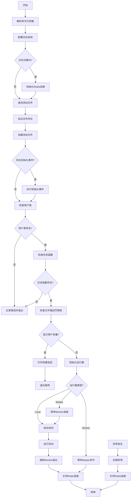
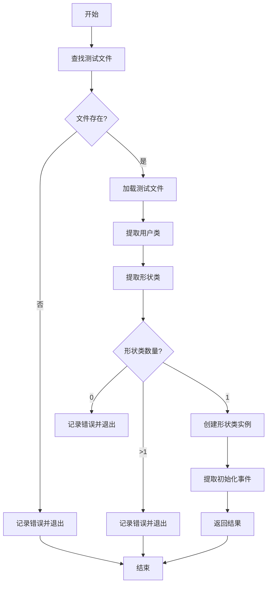

# AioTest 主模块文档

## 目录

- [概述](#概述)
- [核心功能](#核心功能)
- [主入口函数](#主入口函数)
- [调用逻辑流程](#调用逻辑流程)
- [流程图](#流程图)
- [任务函数校验](#任务函数校验)
- [故障排查](#故障排查)
- [总结](#总结)

---

## 概述

`main.py` 是 AioTest 负载测试项目的主入口模块，负责初始化和启动测试流程。该模块是用户与 AioTest 系统交互的主要入口点，支持单机模式和分布式模式的测试配置。

## 核心功能

- ✅ **配置日志系统** - 初始化和配置日志记录
- ✅ **管理 Redis 连接** - 处理分布式模式下的 Redis 连接
- ✅ **运行器管理** - 根据配置启动对应的运行器（本地/主节点/工作节点）
- ✅ **异常处理** - 处理测试运行过程中的异常
- ✅ **资源管理** - 确保资源正确释放

## 主入口函数

### `main()` 函数
**作用**：aiotest主入口函数

**功能**：
- 解析命令行参数
- 配置日志系统
- 初始化Redis（仅在分布式模式下）
- 加载测试文件
- 初始化事件
- 检查文件描述符限制（非Windows系统）
- 显示用户权重（如果需要）
- 使用工厂模式初始化运行器
- 运行测试
- 处理异常
- 确保资源正确释放

**执行流程**：
1. 设置WindowsSelectorEventLoopPolicy（Windows系统）
2. 解析命令行参数
3. 配置日志系统
4. 初始化Redis（分布式模式）
5. 加载测试文件
6. 初始化事件
7. 检查用户类和任务函数
8. 检查文件描述符限制
9. 显示用户权重（如果需要）
10. 初始化运行器
11. 运行测试
12. 处理异常
13. 关闭Redis连接

## 调用逻辑流程

### 主函数执行流程

1. **解析命令行参数** → `parse_options()`
2. **配置日志系统** → `logger.setLevel()`
3. **初始化Redis** → `RedisConnection.get_client()`（分布式模式）
4. **查找测试文件** → `find_aiotestfile()`
5. **验证文件存在** → `validate_file_exists()`
6. **加载测试文件** → `load_aiotestfile()`
7. **初始化事件** → 调用 `init_events()`（如果存在）
8. **检查用户类** → 验证用户类存在
9. **检查任务函数** → 验证用户类包含有效任务函数
10. **检查文件描述符限制** → 调整系统限制（非Windows）
11. **显示用户权重** → 打印权重信息（如果需要）
12. **初始化运行器** → `RunnerFactory.create()`
13. **等待Worker连接** → Master模式下等待Worker就绪
14. **启动测试** → `runner.start()`（非Worker模式）
15. **运行测试** → `runner.run_until_complete()`（非Worker模式）
16. **通知Worker退出** → `runner.quit()`（非Worker模式）
17. **处理异常** → 捕获并处理中断异常
18. **关闭Redis连接** → `redis_connection.close()`

### 运行器初始化流程

1. **本地模式** → 创建 `LocalRunner`
2. **主节点模式** → 创建 `MasterRunner`，等待Worker连接
3. **工作节点模式** → 创建 `WorkerRunner`，等待Master命令

## 流程图

### 主函数执行流程



### 测试文件加载流程



## 任务函数校验

### 任务函数命名规则

在 AioTest 中，任务函数是指用户类中用于执行测试逻辑的异步函数。为了被系统自动识别为任务函数，函数名必须满足以下命名规则之一：

1. **以 `test_` 开头**：例如 `test_get_request`、`test_post_request`
2. **以 `_test` 结尾**：例如 `get_request_test`、`post_request_test`

### 任务函数校验逻辑

在加载测试文件后，系统会自动检查每个用户类的 `jobs` 列表：

```python
# 检查每个用户类的 jobs 列表是否为空
for user_class in user_classes:
    if not hasattr(user_class, 'jobs') or not user_class.jobs:
        handle_error_and_exit(f"No jobs found in User class: {user_class.__name__}. Task functions must start with 'test_' or end with '_test' (e.g., test_get_request, get_request_test)")
```

**校验条件**：
- 用户类必须具有 `jobs` 属性
- `jobs` 列表不能为空

**错误处理**：
- 如果发现用户类的 `jobs` 列表为空，系统会记录错误日志并退出程序
- 错误消息会提示任务函数的命名规则

### 示例

**有效的任务函数**：
```python
class TestUser(HttpUser):
    weight = 1
    
    # 以 test_ 开头的任务函数
    async def test_get_request(self):
        async with self.client.get(endpoint="/get") as resp:
            assert resp.status == 200
    
    async def test_post_request(self):
        async with self.client.post(endpoint="/post", json={}) as resp:
            assert resp.status == 200
```

**无效的任务函数**：
```python
class TestUser(HttpUser):
    weight = 1
    
    # 不符合命名规则的函数，不会被识别为任务函数
    async def get_request(self):
        async with self.client.get(endpoint="/get") as resp:
            assert resp.status == 200
    
    async def post_request(self):
        async with self.client.post(endpoint="/post", json={}) as resp:
            assert resp.status == 200
```

## 故障排查

### 常见问题

| 问题 | 可能原因 | 解决方案 |
|------|---------|---------|
| 测试文件未找到 | 文件路径错误或文件不存在 | 检查文件路径，确保文件存在且扩展名正确 |
| 用户类未找到 | 测试文件中没有定义用户类 | 确保测试文件中定义了继承自 User 或 HttpUser 的类 |
| 任务函数未找到 | 用户类中没有有效的任务函数 | 确保任务函数以 test_ 开头或以 _test 结尾 |
| Redis连接失败 | Redis服务器未运行或配置错误 | 检查Redis服务器状态和配置参数 |
| 工作节点无法连接主节点 | 网络问题或主节点地址错误 | 检查网络连接和主节点地址配置 |
| 启动超时 | 工作节点未就绪或资源不足 | 检查工作节点状态和系统资源 |
| 日志级别设置无效 | 日志级别参数错误 | 确保使用有效的日志级别（DEBUG/INFO/WARNING/ERROR/CRITICAL） |

### 日志分析

- 文件加载：`Loading aiotestfile: {...}`
- 用户类校验：`No User class found in file: {...}`
- 任务函数校验：`No jobs found in User class: {...}. Task functions must start with 'test_' or end with '_test' (e.g., test_get_request, get_request_test)`
- 运行器创建：`Created {runner_type} runner`
- 等待工作节点：`Waiting for workers to be ready, {count} of {expect} connected`
- 测试启动：`Starting test...`
- 测试完成：`Test completed successfully`
- 错误信息：`Error: {...}`

## 总结

`main.py` 模块是 AioTest 负载测试项目的核心入口点，提供了完整的测试流程管理。通过该模块，用户可以方便地启动各种类型的负载测试，包括本地测试和分布式测试。

该模块的设计考虑了灵活性和可扩展性，通过工厂模式创建不同类型的运行器，能够适应不同规模和类型的负载测试需求。同时，它也注重资源管理和错误处理，确保测试过程的稳定性和可靠性。

无论是简单的本地测试还是复杂的分布式测试，`main.py` 模块都能提供高效的测试流程管理，帮助用户快速执行负载测试，收集和分析测试结果。