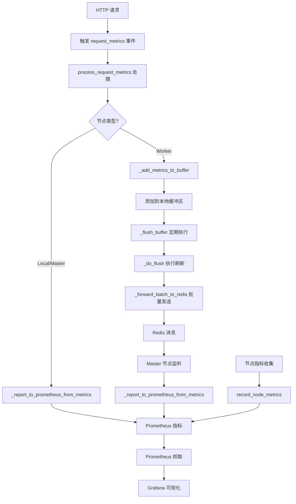
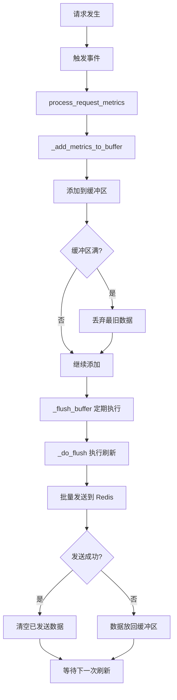
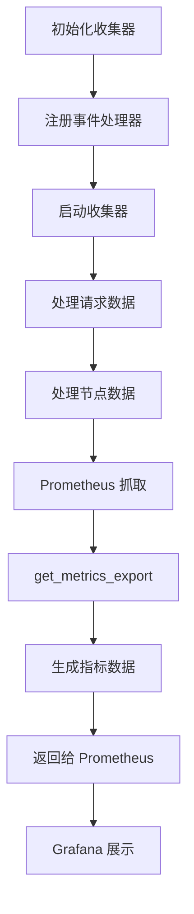

# AioTest 性能指标模块文档

## 目录

- [AioTest 性能指标模块文档](#aiotest-性能指标模块文档)
  - [目录](#目录)
  - [概述](#概述)
  - [核心功能](#核心功能)
  - [数据结构类](#数据结构类)
    - [`RequestMetrics` 数据类](#requestmetrics-数据类)
  - [Prometheus 指标定义](#prometheus-指标定义)
    - [REQUEST\_COUNTER 指标详细说明](#request_counter-指标详细说明)
    - [ERROR\_COUNTER 指标详细说明](#error_counter-指标详细说明)
  - [核心类：MetricsCollector](#核心类metricscollector)
    - [初始化方法](#初始化方法)
    - [方法说明](#方法说明)
  - [全局函数](#全局函数)
  - [调用逻辑流程](#调用逻辑流程)
    - [初始化流程](#初始化流程)
    - [请求处理流程](#请求处理流程)
    - [节点指标处理流程](#节点指标处理流程)
    - [停止流程](#停止流程)
  - [流程图](#流程图)
    - [整体架构流程](#整体架构流程)
    - [Worker 节点数据流程](#worker-节点数据流程)
    - [指标收集与导出流程](#指标收集与导出流程)
  - [配置参数](#配置参数)
  - [machine\_id 说明](#machine_id-说明)
    - [作用](#作用)
    - [获取方式](#获取方式)
    - [使用场景](#使用场景)
    - [Prometheus 查询示例](#prometheus-查询示例)
  - [使用示例](#使用示例)
    - [初始化和启动](#初始化和启动)
    - [记录节点指标](#记录节点指标)
    - [触发请求指标事件](#触发请求指标事件)
    - [停止收集器](#停止收集器)
  - [性能优化建议](#性能优化建议)
  - [故障排查](#故障排查)
    - [常见问题](#常见问题)
    - [日志分析](#日志分析)
  - [总结](#总结)

---

## 概述

`metrics.py` 是 AioTest 负载测试项目的核心指标收集模块，负责收集、处理和上报各种性能指标数据。该模块基于 Prometheus 监控系统，提供了统一的指标管理接口，支持分布式部署场景。

## 核心功能

- ✅ **事件驱动的指标收集** - 基于事件机制的指标收集
- ✅ **统一的指标管理** - 管理请求数据、节点指标数据和用户活动数据
- ✅ **批量数据处理** - 批量上传和本地缓冲
- ✅ **分布式节点支持** - 支持主从架构的指标收集
- ✅ **自动重试和错误处理** - 确保数据可靠传输

## 数据结构类

### `RequestMetrics` 数据类
**作用**：定义单个 HTTP 请求的完整指标数据结构

**字段说明**：
| 字段名 | 类型 | 默认值 | 说明 |
|-------|------|-------|------|
| `request_id` | `str` | 必填 | 请求唯一标识符 |
| `method` | `str` | 必填 | HTTP 方法（GET/POST/PUT/DELETE 等） |
| `endpoint` | `str` | 必填 | 请求端点路径 |
| `status_code` | `int` | 0 | HTTP 状态码 |
| `duration` | `float` | 0.0 | 请求响应时间（秒） |
| `response_size` | `int` | 0 | 响应体大小（字节） |
| `error` | `Optional[Dict[str, Any]]` | None | 错误信息字典（如果有） |
| `extra` | `Optional[Dict[str, Any]]` | None | 额外信息字典 |
| `timestamp` | `float` | `time.time()` | 请求时间戳（自动生成） |
| `assertion_result` | `str` | `"unknown"` | 断言结果（"pass" 或 "fail"） |

## Prometheus 指标定义

| 指标名称 | 类型 | 描述 | 标签 |
|---------|------|------|------|
| `REQUEST_COUNTER` | `Counter` | HTTP 请求总数 | `method`, `endpoint`, `status_code`, `assertion_result` |
| `REQUEST_DURATION` | `Histogram` | HTTP 请求响应时间 | `method`, `endpoint` |
| `RESPONSE_SIZE` | `Histogram` | HTTP 响应体大小 | `method`, `endpoint` |
| `WORKER_CPU_USAGE` | `Gauge` | Worker 节点 CPU 使用率 | `worker_id`, `machine_id` |
| `WORKER_ACTIVE_USERS` | `Gauge` | Worker 节点活跃用户数 | `worker_id` |
| `ERROR_COUNTER` | `Counter` | 错误总数 | `error_type`, `method`, `endpoint`, `status_code`, `error_message` |

### REQUEST_COUNTER 指标详细说明

**指标定义**：
```python
REQUEST_COUNTER = Counter(
    'aiotest_http_requests_total',
    'Total HTTP requests',
    ['method', 'endpoint', 'status_code', 'assertion_result'],
    registry=REGISTRY
)
```

**标签说明**：

| 标签名 | 类型 | 说明 | 示例值 |
|-------|------|------|-------|
| `method` | `str` | HTTP 请求方法 | `"GET"`, `"POST"`, `"PUT"`, `"DELETE"` |
| `endpoint` | `str` | 请求端点路径（已标准化） | `"/api/users/{id}"`, `"/api/login"` |
| `status_code` | `str` | HTTP 状态码（字符串形式） | `"200"`, `"400"`, `"404"`, `"500"` |
| `assertion_result` | `str` | 断言结果（"pass" 或 "fail"） | `"pass"`, `"fail"` |

**assertion_result 标签取值说明**：

| 取值 | 说明 | 触发条件 |
|------|------|---------|
| `"pass"` | 断言成功 | 在 `ResponseContextManager` 上下文中，所有断言都通过，没有抛出异常 |
| `"fail"` | 断言失败 | 在 `ResponseContextManager` 上下文中，断言失败或抛出异常 |
| `"unknown"` | 未知状态 | 默认值，通常不会出现，除非代码逻辑有误 |

**重要特性**：

1. **断言结果与 HTTP 状态码独立**：
   - 即使 HTTP 状态码是 400 或 500，只要断言成功，`assertion_result` 会被设置为 `"pass"`
   - 即使 HTTP 状态码是 200，只要断言失败，`assertion_result` 会被设置为 `"fail"`

2. **原始状态码保留**：
   - `status_code` 标签始终记录原始的 HTTP 状态码，不会因为断言结果而改变

3. **使用场景**：
   - 通过断言结果判断业务逻辑是否成功，而不是仅仅依赖 HTTP 状态码
   - 支持自定义的成功/失败判定逻辑

**Prometheus 查询示例**：

```promql
# 统计所有失败的请求（推荐方式）
sum(aiotest_http_requests_total{assertion_result="fail"})

# 统计所有成功的请求
sum(aiotest_http_requests_total{assertion_result="pass"})

# 统计特定端点的失败请求
sum(aiotest_http_requests_total{assertion_result="fail", endpoint="/api/login"})

# 统计断言失败但 HTTP 成功的请求
sum(aiotest_http_requests_total{assertion_result="fail", status_code=~"2[0-9]{2}"})

# 统计断言成功但 HTTP 失败的请求
sum(aiotest_http_requests_total{assertion_result="pass", status_code=~"[45][0-9]{2}"})

# 计算失败率
sum(aiotest_http_requests_total{assertion_result="fail"}) / sum(aiotest_http_requests_total)
```

### ERROR_COUNTER 指标详细说明

**指标定义**：
```python
ERROR_COUNTER = Counter(
    'aiotest_errors_total',
    'Total errors with detailed information',
    ['error_type', 'method', 'endpoint', 'status_code', 'error_message'],
    registry=REGISTRY
)
```

**标签说明**：

| 标签名 | 类型 | 说明 | 示例值 |
|-------|------|------|-------|
| `error_type` | `str` | 错误类型（异常类名） | `"AssertionError"`, `"TimeoutError"`, `"ConnectionError"`, `"ClientError"` |
| `method` | `str` | HTTP 请求方法 | `"GET"`, `"POST"`, `"PUT"`, `"DELETE"` |
| `endpoint` | `str` | 请求端点路径（已标准化） | `"/api/users/{id}"`, `"/api/login"` |
| `status_code` | `str` | HTTP 状态码（字符串形式） | `"200"`, `"400"`, `"404"`, `"500"` |
| `error_message` | `str` | 错误消息（限制200字符） | `"Connection refused"`, `"Assertion failed: expected 200, got 404"` |

**error_type 标签取值说明**：

| 取值 | 说明 | 触发条件 |
|------|------|---------|
| `"AssertionError"` | 断言失败 | 在 `ResponseContextManager` 上下文中，断言失败或抛出 `AssertionError` |
| `"TimeoutError"` | 请求超时 | 请求超时，抛出 `asyncio.TimeoutError` 或 `aiohttp.ClientTimeoutError` |
| `"ConnectionError"` | 连接错误 | 网络连接失败，抛出 `aiohttp.ClientConnectionError` |
| `"ClientError"` | HTTP 客户端错误 | HTTP 4xx 错误（当被断言为失败时） |
| `"ServerError"` | HTTP 服务器错误 | HTTP 5xx 错误（当被断言为失败时） |
| `"unknown"` | 未知错误 | 其他未明确分类的错误 |

**status_code 标签取值说明**：

| 取值范围 | 说明 | 示例 |
|---------|------|------|
| `"2xx"` | 成功响应 | `"200"`, `"201"`, `"204"` |
| `"3xx"` | 重定向 | `"301"`, `"302"`, `"304"` |
| `"4xx"` | 客户端错误 | `"400"`, `"401"`, `"403"`, `"404"` |
| `"5xx"` | 服务器错误 | `"500"`, `"502"`, `"503"`, `"504"` |
| `"0"` | 请求失败（无状态码） | 连接失败、超时等 |

**error_message 标签取值说明**：

| 内容 | 说明 | 示例 |
|------|------|------|
| 错误描述 | 简短描述错误原因 | `"Connection refused"`, `"Request timeout"` |
| 断言消息 | 断言失败时的消息 | `"Assertion failed: expected 200, got 404"` |
| 响应数据 | 包含接口的响应数据（限制500字符） | `"Connection refused \| Response: {\"error\":\"service unavailable\"}"` |

**重要特性**：

1. **错误消息长度限制**：
   - `error_message` 标签限制为 200 字符，避免过长
   - 如果错误消息超过 200 字符，会被截断

2. **响应数据附加**：
   - 错误消息中会包含接口的响应数据（如果有）
   - 响应数据限制为 500 字符，避免过长

3. **错误分类**：
   - 通过 `error_type` 标签提供详细的错误分类
   - 便于在 Grafana 中按错误类型进行统计和分析

4. **与 REQUEST_COUNTER 的关系**：
   - `ERROR_COUNTER` 记录所有错误（包括断言失败、网络错误、HTTP 错误等）
   - `REQUEST_COUNTER` 记录所有请求（包括成功和失败）
   - 通过 `assertion_result="fail"` 标签可以统计所有失败的请求

**Prometheus 查询示例**：

```promql
# 统计所有错误
sum(aiotest_errors_total)

# 按错误类型统计错误
sum(aiotest_errors_total) by (error_type)

# 统计特定端点的错误
sum(aiotest_errors_total{endpoint="/api/login"})

# 统计特定错误类型的错误
sum(aiotest_errors_total{error_type="AssertionError"})

# 统计超时错误
sum(aiotest_errors_total{error_type="TimeoutError"})

# 统计连接错误
sum(aiotest_errors_total{error_type="ConnectionError"})

# 按端点和错误类型统计错误
sum(aiotest_errors_total) by (endpoint, error_type)

# 统计包含特定错误消息的错误
sum(aiotest_errors_total{error_message=~".*Connection refused.*"})

# 计算错误率
sum(aiotest_errors_total) / sum(aiotest_http_requests_total) * 100
```

## 核心类：MetricsCollector

### 初始化方法
```python
def __init__(self, node_type: str = "local", redis_client=None, node_id: str = "local", coordinator=None, 
             batch_size: int = 100, flush_interval: float = 1.0, buffer_size: int = 10000)
```
**作用**：初始化指标收集器实例，配置节点类型和批量上传参数

**参数说明**：
- `node_type`：节点类型（local/master/worker）
- `redis_client`：Redis 客户端实例
- `node_id`：节点唯一标识符
- `coordinator`：分布式协调器实例
- `batch_size`：批量上传的大小（默认 100）
- `flush_interval`：刷新间隔（秒，默认 1.0）
- `buffer_size`：本地缓冲区大小（默认 10000）

### 方法说明

| 方法名 | 作用 | 参数 | 返回值 | 调用时机 |
|-------|------|------|-------|---------|
| `start()` | 启动指标收集器 | 无 | `None` | 运行器初始化时 |
| `stop()` | 停止指标收集器 | 无 | `None` | 运行器停止时 |
| `record_node_metrics(metrics_data)` | 记录节点指标数据 | `metrics_data: dict` | `None` | 定期调用（Local/Master 节点） |
| `process_request_metrics(**kwargs)` | 处理请求数据 | `**kwargs` | `None` | 事件触发时 |
| `get_metrics_export()` | 获取 Prometheus 格式的指标导出 | 无 | `str` | Prometheus 抓取时 |
| `_register_event_handlers()` | 注册指标事件处理器 | 无 | `None` | 启动时 |
| `_report_to_prometheus_from_metrics(metrics)` | 上报数据到 Prometheus | `metrics: RequestMetrics` | `None` | 本地/主节点处理请求时 |
| `_add_metrics_to_buffer(metrics)` | 将数据添加到本地缓冲区 | `metrics: RequestMetrics` | `None` | Worker 节点处理请求时 |
| `_forward_batch_to_redis(batch)` | 批量转发数据到 Redis | `batch: List[Dict[str, Any]]` | `None` | 定期刷新时 |
| `_flush_buffer()` | 定期刷新缓冲区 | 无 | `None` | Worker 节点启动后 |
| `_do_flush()` | 执行缓冲区刷新 | 无 | `None` | 定期刷新时 |

## 全局函数

| 函数名 | 作用 | 参数 | 返回值 | 调用时机 |
|-------|------|------|-------|---------|
| `get_unified_collector()` | 获取统一的指标收集器实例 | 无 | `MetricsCollector` | 需要使用收集器时 |
| `init_unified_collector(node_type, redis_client, node_id, coordinator, batch_size, flush_interval, buffer_size)` | 初始化统一的指标收集器 | 见方法签名 | `MetricsCollector` | 运行器初始化时 |
| `is_unified_collector_initialized()` | 检查统一指标收集器是否已初始化 | 无 | `bool` | 检查收集器状态时 |

## 调用逻辑流程

### 初始化流程

1. **运行器初始化** → 调用 `init_unified_collector()`
2. **创建收集器实例** → 初始化 `MetricsCollector`
3. **启动收集器** → 调用 `start()` 方法
4. **注册事件处理器** → 调用 `_register_event_handlers()`
5. **启动刷新任务** → Worker 节点创建 `_flush_buffer()` 任务

### 请求处理流程

1. **HTTP 请求发生** → 客户端捕获请求
2. **触发事件** → 触发 `request_metrics` 事件
3. **处理事件** → `process_request_metrics()` 被调用
4. **根据节点类型处理**：
   - **Local/Master 节点** → 调用 `_report_to_prometheus_from_metrics()` 直接上报到 Prometheus
   - **Worker 节点** → 调用 `_add_metrics_to_buffer()` 添加到本地缓冲区
5. **Worker 节点批量处理**：
   - 定期调用 `_flush_buffer()`
   - 调用 `_do_flush()` 执行刷新
   - 调用 `_forward_batch_to_redis()` 批量发送到 Redis
6. **Master 节点接收** → 监听 Redis 消息，处理批量数据

### 节点指标处理流程

1. **定期收集** → 运行器定期收集节点指标
2. **记录指标** → 调用 `record_node_metrics()`
3. **更新 Prometheus** → 更新 `WORKER_CPU_USAGE` 和 `WORKER_ACTIVE_USERS` 指标

### 停止流程

1. **运行器停止** → 调用收集器的 `stop()` 方法
2. **取消刷新任务** → 取消 `_flush_task`
3. **最后一次刷新** → Worker 节点执行 `_do_flush()`
4. **记录停止日志** → 记录收集器停止信息

## 流程图

### 整体架构流程



### Worker 节点数据流程



### 指标收集与导出流程



## 配置参数

| 配置项 | 类型 | 默认值 | 说明 | 适用场景 |
|-------|------|-------|------|---------|
| `metrics_collection_interval` | `float` | 5.0 | 节点指标收集间隔（秒） | 调整监控精度和系统开销 |
| `metrics_batch_size` | `int` | 100 | 批量上传的大小（当数据量不足时，会上传所有可用数据） | 高并发场景下增加批量大小 |
| `metrics_flush_interval` | `float` | 1.0 | 缓冲区刷新间隔（秒） | 平衡实时性和系统开销 |
| `metrics_buffer_size` | `int` | 10000 | 本地缓冲区大小 | 高并发场景下增加缓冲区大小 |

## machine_id 说明

### 作用
`machine_id` 是机器标识符，用于在分布式测试中区分不同机器上的 Worker 节点。在 `WORKER_CPU_USAGE` 指标中，通过 `machine_id` 标签可以查看不同机器的 CPU 使用率情况。

### 获取方式
`machine_id` 通过 `socket.gethostname()` 获取机器的主机名作为标识符，确保每台机器有唯一的标识。

### 使用场景
- **分布式测试**：在多机器部署的分布式测试中，通过 `machine_id` 可以区分不同机器的资源使用情况
- **资源监控**：可以按机器维度分析 CPU 使用率，识别资源瓶颈
- **负载均衡**：根据不同机器的 CPU 使用率调整负载分配

### Prometheus 查询示例

```promql
# 按机器分组查看 CPU 使用率
avg(aiotest_worker_cpu_percent) by (machine_id)

# 查看特定机器的 CPU 使用率
avg(aiotest_worker_cpu_percent{machine_id="DESKTOP-4CCBKPF"}) by (worker_id)

# 查看所有机器的平均 CPU 使用率
avg(aiotest_worker_cpu_percent) by (machine_id)

# 查看 CPU 使用率最高的机器
topk(1, avg(aiotest_worker_cpu_percent) by (machine_id))
```

## 使用示例

### 初始化和启动

```python
# 初始化指标收集器
collector = init_unified_collector(
    node_type="worker",
    redis_client=redis_client,
    node_id="worker_01",
    coordinator=coordinator,
    batch_size=200,  # 增加批量大小
    flush_interval=0.5,  # 提高刷新频率
    buffer_size=20000  # 增加缓冲区大小
)

# 启动指标收集器
await collector.start()
```

### 记录节点指标

```python
# 记录节点指标
metrics_data = {
    "cpu_percent": 45.2,
    "active_users": 10,
    "worker_id": "worker_01",
    "machine_id": "DESKTOP-4CCBKPF"  # 机器标识符，用于区分不同机器
}
await collector.record_node_metrics(metrics_data)
```

### 触发请求指标事件

```python
# 创建请求指标
request_metrics_data = RequestMetrics(
    request_id="req_123",
    method="POST",
    endpoint="/api/login",
    status_code=200,
    duration=0.15,
    response_size=1024
)

# 触发事件
await request_metrics.fire(metrics=request_metrics_data)
```

### 停止收集器

```python
# 停止指标收集器
await collector.stop()
```

## 性能优化建议

1. **批量大小调整**：根据系统负载和网络状况调整 `batch_size`，高并发场景下建议增大
2. **刷新间隔调整**：根据实时性需求调整 `flush_interval`，实时性要求高时减小
3. **缓冲区大小调整**：根据内存资源和并发量调整 `buffer_size`
4. **数据收集频率**：根据监控精度需求调整 `metrics_collection_interval`
5. **错误处理**：确保在网络不稳定时，数据能够正确缓存和重试

## 故障排查

### 常见问题

| 问题 | 可能原因 | 解决方案 |
|------|---------|---------|
| 指标数据丢失 | 缓冲区满或网络故障 | 增加缓冲区大小，检查网络连接 |
| 性能下降 | 批量大小过小或刷新间隔过短 | 调整批量大小和刷新间隔 |
| 内存使用过高 | 缓冲区大小过大 | 适当减小缓冲区大小 |
| 数据延迟 | 刷新间隔过长 | 减小刷新间隔 |

### 日志分析

- 缓冲区满：`Metrics buffer full, dropped oldest metric`
- 刷新错误：`Error flushing metrics buffer: {error}`
- 上报失败：`Failed to forward metrics batch: {error}`
- 节点指标记录失败：`Failed to record node metrics: {error}`

## 总结

`metrics.py` 模块是 AioTest 项目的核心组件，提供了全面的性能指标收集和管理功能。通过事件驱动的架构、批量数据处理和分布式支持，它能够在高并发场景下高效地收集和上报性能指标，为负载测试提供准确的性能数据。

该模块的设计考虑了可扩展性和可靠性，通过本地缓冲区和自动重试机制确保数据不会丢失，同时通过批量处理减少网络开销，提高系统性能。

通过合理配置参数，用户可以根据具体场景调整指标收集和上报的行为，平衡监控精度和系统开销，为负载测试提供最佳的性能监控方案。