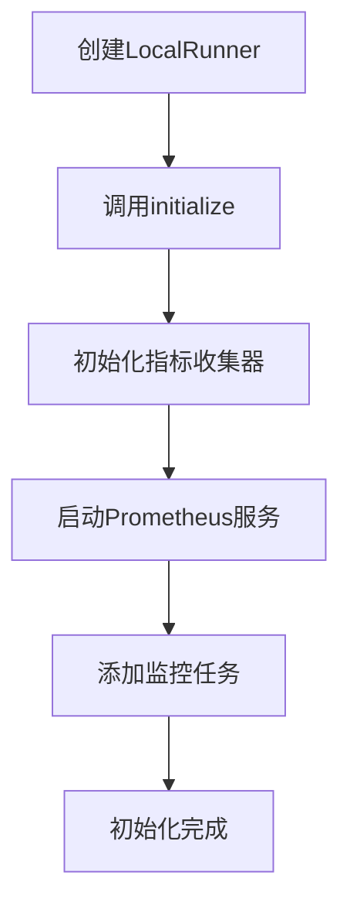
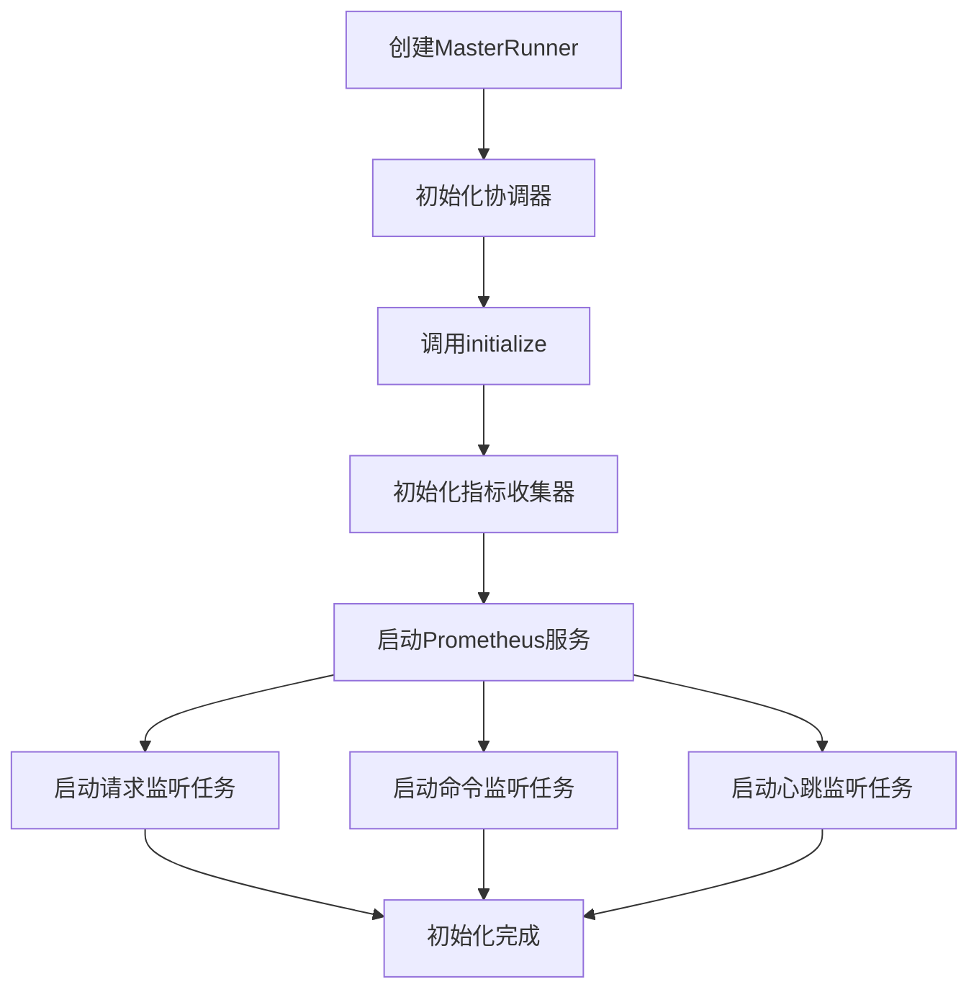
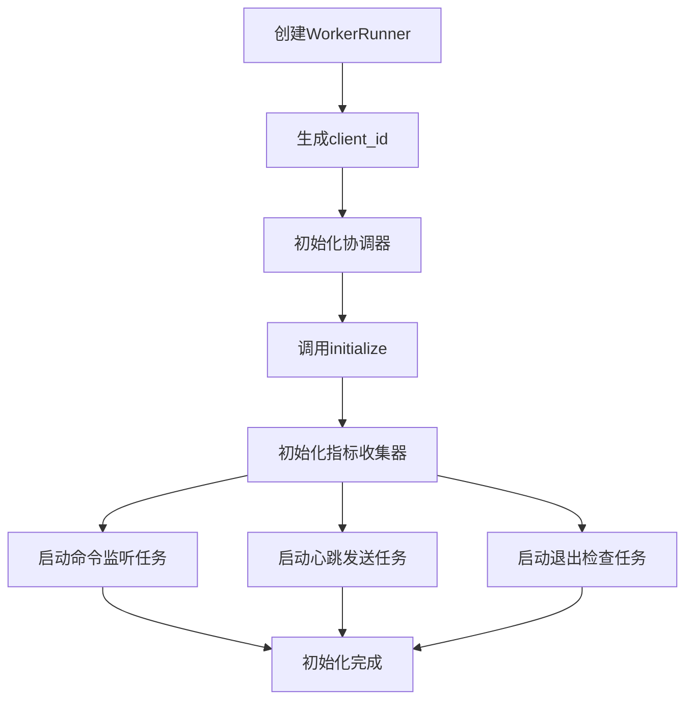
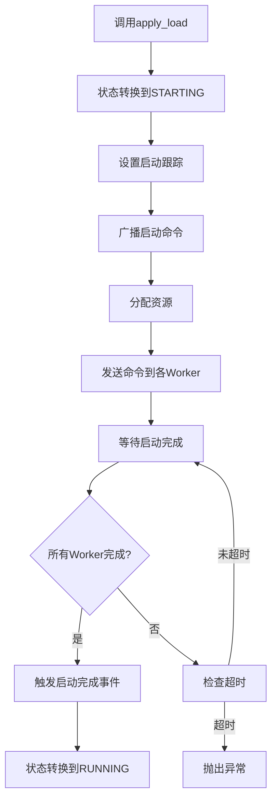
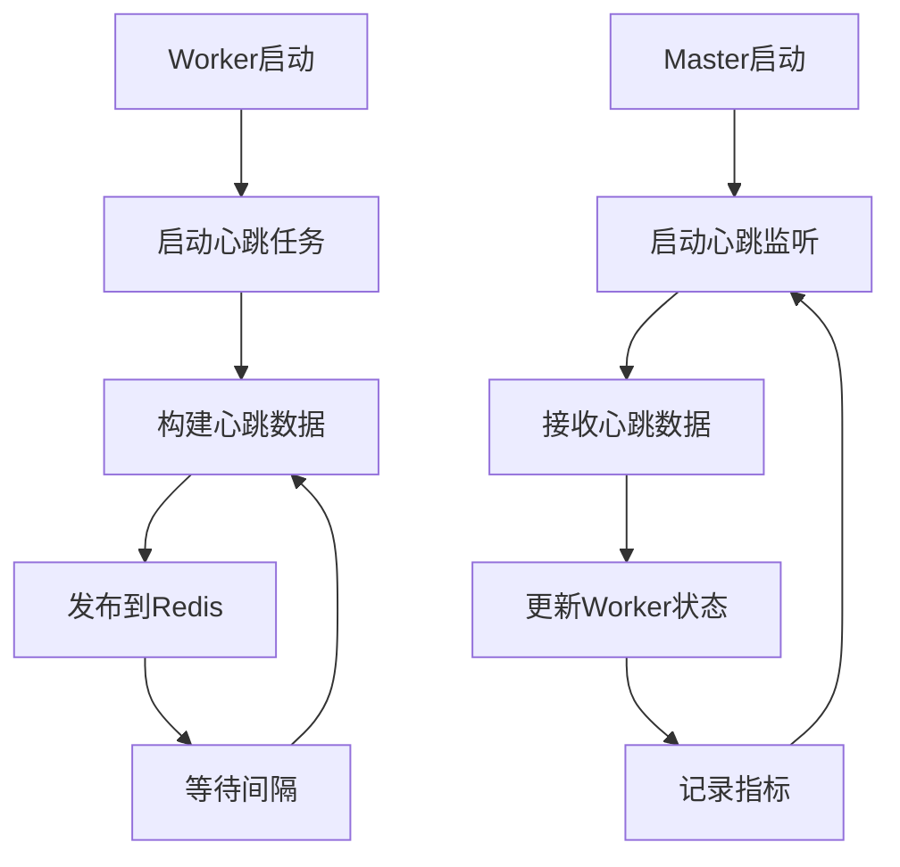
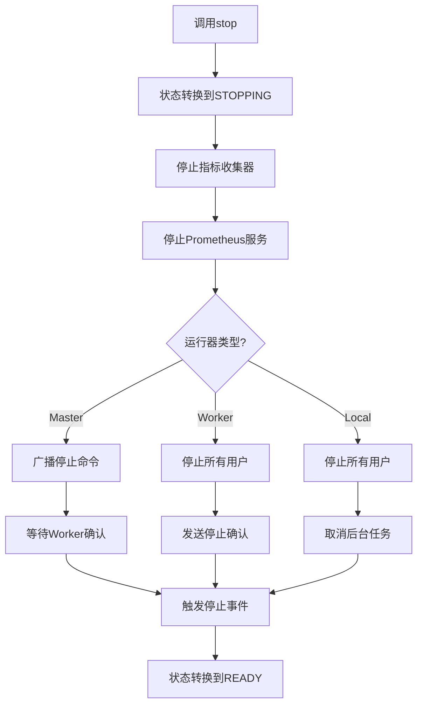

# AioTest 运行器模块文档

<!-- markdownlint-disable MD024 -->

## 目录

- [概述](#%E6%A6%82%E8%BF%B0)
- [核心功能](#%E6%A0%B8%E5%BF%83%E5%8A%9F%E8%83%BD)
- [辅助函数](#%E8%BE%85%E5%8A%A9%E5%87%BD%E6%95%B0)
- [数据类](#%E6%95%B0%E6%8D%AE%E7%B1%BB)
- [运行器类](#%E8%BF%90%E8%A1%8C%E5%99%A8%E7%B1%BB)
- [调用逻辑流程](#%E8%B0%83%E7%94%A8%E9%80%BB%E8%BE%91%E6%B5%81%E7%A8%8B)
- [流程图](#%E6%B5%81%E7%A8%8B%E5%9B%BE)
- [配置参数](#%E9%85%8D%E7%BD%AE%E5%8F%82%E6%95%B0)
- [使用示例](#%E4%BD%BF%E7%94%A8%E7%A4%BA%E4%BE%8B)
- [性能优化建议](#%E6%80%A7%E8%83%BD%E4%BC%98%E5%8C%96%E5%BB%BA%E8%AE%AE)
- [故障排查](#%E6%95%85%E9%9A%9C%E6%8E%92%E6%9F%A5)
- [总结](#%E6%80%BB%E7%BB%93)

______________________________________________________________________

## 概述

`runners.py` 是 AioTest 负载测试项目的核心运行器模块，负责管理测试的生命周期、协调分布式节点、收集指标数据。该模块提供了三种运行器类型：本地运行器（LocalRunner）、主节点运行器（MasterRunner）和工作节点运行器（WorkerRunner），支持单机模式和分布式模式。

## 核心功能

- ✅ **本地负载测试执行** - 单机模式下的负载测试
- ✅ **分布式负载测试协调** - 主从模式下的节点协调
- ✅ **Prometheus 指标服务** - 暴露指标数据
- ✅ **节点状态管理** - 心跳机制和状态监控
- ✅ **负载分配和资源调度** - 智能分配测试负载
- ✅ **测试生命周期管理** - 完整的启动、运行、停止、退出流程

## 辅助函数

### `create_prometheus_app()` 函数

**作用**：创建 Prometheus 指标 HTTP 应用

**参数**：

| 参数名 | 类型 | 默认值 | 说明 |
| ------- | ------ | ------- | ------ |
| `runner` | `Optional[BaseRunner]` | `None` | 运行器实例，用于获取运行状态和指标 |

**返回值**：

- `web.Application`：aiohttp 应用实例

**功能**：

- 创建 aiohttp 应用
- 注册 `/metrics` 端点处理器
- 返回 Prometheus 格式的指标数据
- 可通过 runner 参数获取运行状态和指标

#### `init_metrics_collector()` 函数

**作用**：初始化指标收集器的通用方法

**参数**：

| 参数名 | 类型 | 默认值 | 说明 |
| ------- | ------ | ------- | ------ |
| `node` | `str` | 无 | 节点类型 |
| `redis_client` | `Optional[Redis]` | 无 | Redis 客户端 |
| `node_id` | `str` | 无 | 节点 ID |
| `coordinator` | `Optional[DistributedCoordinator]` | 无 | 分布式协调器 |
| `batch_size` | `int` | `100` | 批量大小 |
| `flush_interval` | `float` | `1.0` | 刷新间隔 (秒) |
| `buffer_size` | `int` | `10000` | 缓冲区大小 |

**返回值**：

- `MetricsCollector`：初始化并启动的指标收集器

#### `start_prometheus_service()` 函数

**作用**：启动 Prometheus HTTP 服务的通用方法

**参数**：

| 参数名 | 类型 | 说明 |
| ------- | ------ | ------ |
| `config` | `Any` | 配置对象，需包含 `prometheus_port` 属性 |

**返回值**：

- `Tuple[web.AppRunner, bool]`：应用运行器和启动状态

## 数据类

### `WorkerNode` 类

**作用**：工作节点信息数据类（纯数据结构）

**设计原则**：

- 不包含心跳逻辑，由 DistributedCoordinator 统一管理
- 只缓存从 Redis 获取的最新状态
- 作为 Master 端的节点状态镜像

**属性说明**：

| 属性名 | 类型 | 说明 |
| ------- | ------ | ------ |
| `node_id` | `str` | 节点唯一标识符 |
| `status` | `RunnerState` | 节点状态 |
| `cpu_usage` | `float` | CPU 使用率 |
| `active_users` | `int` | 活跃用户数 |
| `last_update` | `float` | 最后更新时间 (本地缓存) |

**方法说明**：

| 方法名 | 作用 | 参数 | 返回值 |
| ------- | ------ | ------ | ------- |
| `update_from_heartbeat(heartbeat_data)` | 从心跳数据更新节点状态 | `heartbeat_data: dict` | `None` |
| `is_stale(timeout_seconds)` | 检查节点是否过期 | `timeout_seconds: float` | `bool` |

## 运行器类

### LocalRunner 类

**作用**：本地负载测试运行器（单机模式）

**继承关系**：继承 `BaseRunner`

**功能职责**：

- 本地用户管理和负载执行
- Prometheus HTTP 指标服务启动
- 系统资源监控（CPU、用户数）
- 测试生命周期管理

**初始化方法**：

```python

def __init__(self, user_types: List[Type['User']], load_shape: Any, config: Dict[str, Any])
```

**参数说明**：

| 参数名 | 类型 | 说明 |
| ------- | ------ | ------ |
| `user_types` | `List[Type['User']]` | 用户类列表 |
| `load_shape` | `Any` | 负载形状类 |
| `config` | `Dict[str, Any]` | 配置选项 |

**属性说明**：

| 属性名 | 类型 | 默认值 | 说明 |
| ------- | ------ | ------- | ------ |
| `node` | `str` | `NODE_TYPE_LOCAL` | 节点类型标识 |
| `metrics_collector` | `Optional[MetricsCollector]` | `None` | 指标收集器 |
| `prometheus_server_started` | `bool` | `False` | Prometheus 服务启动状态 |
| `prometheus_runner` | `Optional[web.AppRunner]` | `None` | Prometheus 应用运行器 |
| `metrics_collection_interval` | `float` | `5.0` | 指标收集间隔 (秒) |

**方法说明**：

| 方法名 | 作用 | 参数 | 返回值 | 调用时机 |
| ------- | ------ | ------ | ------- | --------- |
| `initialize()` | 初始化本地运行器 | 无 | `None` | 创建运行器后 |
| `stop()` | 停止本地负载测试 | 无 | `None` | 需要停止测试时 |
| `pause()` | 暂停本地负载测试 | 无 | `None` | 需要暂停测试时 |
| `resume()` | 恢复本地负载测试 | 无 | `None` | 需要恢复测试时 |
| `_collect_node_metrics()` | 收集本地节点指标 | 无 | `None` | 后台任务循环 |

### WorkerRunner 类

**作用**：工作节点运行器（分布式模式）

**继承关系**：继承 `BaseRunner`

**功能职责**：

- 接收主节点命令
- 执行负载测试
- 上报运行状态
- 心跳机制

**初始化方法**：

```python

def __init__(self, user_types: List[Type['User']], load_shape: Any, config: Dict[str, Any], redis_client: Redis)
```

**参数说明**：

| 参数名 | 类型 | 说明 |
| ------- | ------ | ------ |
| `user_types` | `List[Type['User']]` | 用户类列表 |
| `load_shape` | `Any` | 负载形状类 |
| `config` | `Dict[str, Any]` | 配置选项 |
| `redis_client` | `Redis` | Redis 客户端 (必需) |

**属性说明**：

| 属性名 | 类型 | 默认值 | 说明 |
| ------- | ------ | ------- | ------ |
| `node` | `str` | `NODE_TYPE_WORKER` | 节点类型标识 |
| `client_id` | `str` | `uuid4()` | Worker 唯一标识符 |
| `coordinator` | `DistributedCoordinator` | 无 | 分布式协调器 |
| `metrics_collection_interval` | `float` | `5.0` | 指标收集间隔 (秒) |
| `metrics_batch_size` | `int` | `100` | 指标批量大小 |
| `metrics_flush_interval` | `float` | `1.0` | 指标刷新间隔 (秒) |
| `metrics_buffer_size` | `int` | `10000` | 指标缓冲区大小 |

**方法说明**：

| 方法名 | 作用 | 参数 | 返回值 | 调用时机 |
| ------- | ------ | ------ | ------- | --------- |
| `initialize()` | 初始化工作节点 | 无 | `None` | 创建运行器后 |
| `stop()` | 停止工作节点测试 | 无 | `None` | 接收到停止命令时 |
| `pause()` | 暂停工作节点测试 | 无 | `None` | 接收到暂停命令时 |
| `resume()` | 恢复工作节点测试 | 无 | `None` | 接收到恢复命令时 |
| `_collect_worker_metrics()` | 收集 Worker 指标 | 无 | `None` | 后台任务循环 |
| `_send_heartbeat()` | 发送心跳数据 | 无 | `None` | 后台任务循环 |
| `_send_startup_completed()` | 发送启动完成确认 | 无 | `None` | 启动完成后 |
| `_send_stop()` | 发送停止确认 | 无 | `None` | 停止完成后 |
| `_check_quit_status()` | 检查退出状态 | 无 | `None` | 后台任务循环 |
| `_handle_command(data, worker_id, command)` | 处理主节点命令 | `data: dict`, `worker_id: str`, `command: str` | `None` | 接收到命令时 |
| `apply_load(user_count, rate)` | 应用负载配置 | `user_count: int`, `rate: float` | `None` | 接收到启动命令时 |
| `quit()` | 退出工作节点 | 无 | `None` | 接收到退出命令时 |

### MasterRunner 类

**作用**：主节点运行器（分布式协调器）

**继承关系**：不继承 `BaseRunner`（Master 节点不直接运行用户）

**功能职责**：

- 分布式节点管理
- 负载分配策略
- 全局状态协调
- Worker 节点监控

**初始化方法**：

```python

def __init__(self, user_types: List[Type['User']], load_shape: Any, config: Dict[str, Any], redis_client: Redis)
```

**参数说明**：

| 参数名 | 类型 | 说明 |
| ------- | ------ | ------ |
| `user_types` | `List[Type['User']]` | 用户类列表 (用于负载分配计算) |
| `load_shape` | `Any` | 负载形状类 (用于动态负载调整) |
| `config` | `Dict[str, Any]` | 配置选项 |
| `redis_client` | `Redis` | Redis 客户端 (分布式模式必需) |

**属性说明**：

| 属性名 | 类型 | 默认值 | 说明 |
| ------- | ------ | ------- | ------ |
| `node` | `str` | `NODE_TYPE_MASTER` | 节点类型标识 |
| `coordinator` | `DistributedCoordinator` | 无 | 分布式协调器 |
| `workers` | `Dict[str, WorkerNode]` | `{}` | Worker 节点管理字典 |
| `metrics_collector` | `Optional[MetricsCollector]` | `None` | 指标收集器 |
| `cpu_usage` | `int` | `0` | CPU 使用率 |
| `background_tasks` | `List[asyncio.Task]` | `[]` | 后台任务列表 |
| `prometheus_runner` | `Optional[web.AppRunner]` | `None` | Prometheus 应用运行器 |
| `prometheus_server_started` | `bool` | `False` | Prometheus 服务启动状态 |

**方法说明**：

| 方法名 | 作用 | 参数 | 返回值 | 调用时机 |
| ------- | ------ | ------ | ------- | --------- |
| `initialize()` | 初始化主节点 | 无 | `None` | 创建运行器后 |
| `_handle_worker_request_metrics(metrics_data, worker_id)` | 处理 Worker 上报的请求数据 | `metrics_data: dict`, `worker_id: str` | `None` | 接收到指标数据时 |
| `_handle_command(data, worker_id, command)` | 处理 Worker 命令 | `data: dict`, `worker_id: str`, `command: str` | `None` | 接收到命令时 |
| `apply_load(user_count, rate)` | 应用负载配置 | `user_count: int`, `rate: float` | `None` | 负载形状管理器调用 |
| `_wait_for_workers_startup_completion(timeout)` | 等待所有 Worker 启动完成 | `timeout: float` | `None` | 广播启动命令后 |
| `start()` | 启动测试 | 无 | `None` | 需要启动测试时 |
| `run_until_complete()` | 运行测试直到完成 | 无 | `None` | 启动测试后 |
| `stop()` | 停止分布式负载测试 | 无 | `None` | 需要停止测试时 |
| `pause()` | 暂停分布式负载测试 | 无 | `None` | 需要暂停测试时 |
| `resume()` | 恢复分布式负载测试 | 无 | `None` | 需要恢复测试时 |
| `quit()` | 退出主节点 | 无 | `None` | 需要退出时 |
| `_distribute_resources(total_value, total_workers)` | 分配资源给 Worker | `total_value: int`, `total_workers: int` | `List[int]` | 广播启动命令时 |
| `_broadcast_startup(user_count, rate)` | 广播启动命令 | `user_count: int`, `rate: float` | `None` | 应用负载时 |
| `_update_worker_status(heartbeat_data, worker_id)` | 更新 Worker 状态 | `heartbeat_data: dict`, `worker_id: str` | `None` | 接收到心跳时 |
| `get_healthy_workers()` | 获取健康 Worker 列表 | 无 | `List[WorkerNode]` | 需要检查 Worker 状态时 |

## 调用逻辑流程

### 本地运行器初始化流程

1. **创建运行器** → 实例化 `LocalRunner`
1. **调用 initialize** → 初始化指标收集器和 Prometheus 服务
1. **启动指标收集器** → 注册事件处理器
1. **启动 Prometheus 服务** → 暴露 `/metrics` 端点
1. **添加监控任务** → 启动节点指标收集任务
1. **初始化完成** → 运行器准备就绪

### 主节点运行器初始化流程

1. **创建运行器** → 实例化 `MasterRunner`
1. **初始化协调器** → 创建 `DistributedCoordinator`
1. **调用 initialize** → 初始化指标收集器和 Prometheus 服务
1. **启动后台任务** → 启动请求监听、命令监听、心跳监听任务
1. **初始化完成** → 等待 Worker 节点连接

### 工作节点运行器初始化流程

1. **创建运行器** → 实例化 `WorkerRunner`
1. **生成 client_id** → 创建唯一标识符
1. **初始化协调器** → 创建 `DistributedCoordinator`
1. **调用 initialize** → 初始化指标收集器
1. **启动后台任务** → 启动命令监听、心跳发送、退出检查任务
1. **初始化完成** → 等待主节点命令

### 负载应用流程（Master）

1. **接收负载配置** → `apply_load(user_count, rate)`
1. **状态转换** → 从 READY 转换到 STARTING
1. **设置启动跟踪** → 初始化 `_startup_completion_tracker`
1. **广播启动命令** → `_broadcast_startup(user_count, rate)`
1. **分配资源** → `_distribute_resources()` 计算每个 Worker 的负载
1. **发送命令** → 向每个 Worker 发送启动命令
1. **等待启动完成** → `_wait_for_workers_startup_completion()`
1. **触发启动完成事件** → `startup_completed.fire()`
1. **状态转换** → 从 STARTING 转换到 RUNNING

### 负载应用流程（Worker）

1. **接收启动命令** → `_handle_command()` 处理 startup 命令
1. **调用 apply_load** → 继承自 `BaseRunner` 的方法
1. **启动用户** → `user_manager.manage_users()` 启动指定数量的用户
1. **发送启动完成确认** → `_send_startup_completed()`
1. **开始执行测试** → 用户开始执行任务

### 心跳流程

1. **Worker 发送心跳** → `_send_heartbeat()` 定期执行
1. **构建心跳数据** → 包含 CPU、用户数、状态等信息
1. **发布到 Redis** → `coordinator.publish("heartbeat", ...)`
1. **Master 接收心跳** → `_update_worker_status()` 处理
1. **更新 Worker 状态** → 更新 `WorkerNode` 对象
1. **记录指标** → 将心跳数据记录到 Prometheus

### 停止流程

#### 本地运行器停止

1. **调用 stop** → `LocalRunner.stop()`
1. **状态转换** → 转换到 STOPPING
1. **停止指标收集器** → `metrics_collector.stop()`
1. **停止 Prometheus 服务** → `prometheus_runner.cleanup()`
1. **停止所有用户** → `user_manager.manage_users(action="stop")`
1. **取消后台任务** → `task_manager.cancel_all_tasks()`
1. **触发停止事件** → `test_stop.fire()`
1. **状态转换** → 转换到 READY

#### 主节点停止

1. **调用 stop** → `MasterRunner.stop()`
1. **状态转换** → 转换到 STOPPING
1. **停止指标收集器** → `metrics_collector.stop()`
1. **停止 Prometheus 服务** → `prometheus_runner.cleanup()`
1. **广播停止命令** → `coordinator.publish("command", ..., command="stop")`
1. **等待 Worker 确认** → 通过 `_handle_command` 接收 stop 确认
1. **触发停止事件** → `test_stop.fire()`
1. **状态转换** → 转换到 READY

#### 工作节点停止

1. **接收停止命令** → `_handle_command()` 处理 stop 命令
1. **调用 stop** → `WorkerRunner.stop()`
1. **状态转换** → 转换到 STOPPING
1. **停止指标收集器** → `metrics_collector.stop()`
1. **停止所有用户** → `user_manager.stop_all_users()`
1. **发送停止确认** → `_send_stop()`
1. **触发停止事件** → `test_stop.fire()`
1. **状态转换** → 转换到 READY

## 流程图

### 本地运行器初始化流程



### 主节点运行器初始化流程



### 工作节点运行器初始化流程



### 负载应用流程（Master）



### 心跳流程



### 停止流程



## 配置参数

| 配置项 | 类型 | 默认值 | 说明 | 适用场景 |
| ------- | ------ | ------- | ------ | --------- |
| `prometheus_port` | `int` | `8089` | Prometheus 服务端口 | 所有运行器 |
| `metrics_collection_interval` | `float` | `5.0` | 指标收集间隔 (秒) | LocalRunner, WorkerRunner |
| `metrics_batch_size` | `int` | `100` | 指标批量大小 | WorkerRunner |
| `metrics_flush_interval` | `float` | `1.0` | 指标刷新间隔 (秒) | WorkerRunner |
| `metrics_buffer_size` | `int` | `10000` | 指标缓冲区大小 | WorkerRunner |
| `startup_timeout` | `float` | `30.0` | Worker 启动超时时间 (秒) | MasterRunner |
| `heartbeat_interval` | `float` | `5.0` | 心跳发送间隔 (秒) | WorkerRunner |
| `worker_stale_timeout` | `float` | `60.0` | Worker 过期超时时间 (秒) | MasterRunner |

## 使用示例

### 创建本地运行器

```python

import asyncio
from aiotest.runner_factory import RunnerFactory
from aiotest import User

class TestUser(User):
    weight = 1
    wait_time = 1.0

    async def test_task(self):
        print("Executing test task")

async def create_local_runner():
    """创建本地运行器示例"""
    from aiotest import LoadUserShape

    class SimpleLoadShape(LoadUserShape):
        def tick(self):
            return (10, 2.0)  # 10个用户，速率2.0

    # 创建配置
    class Config:
        prometheus_port = 8089
        metrics_collection_interval = 5.0

    config = Config()

    # 创建本地运行器
    runner = await RunnerFactory.create(
        runner_type="local",
        user_types=[TestUser],
        load_shape=SimpleLoadShape(),
        config=config
    )

    print(f"Created runner: {runner.__class__.__name__}")
    print(f"Runner node type: {runner.node}")

    # 启动测试
    await runner.start()

    # 运行测试
    await runner.run_until_complete()

    # 退出运行器
    await runner.quit()

# 执行示例

await create_local_runner()
```

### 创建主节点运行器

```python

import asyncio
from aiotest.runner_factory import RunnerFactory
from aiotest import User
from redis.asyncio import Redis

class TestUser(User):
    weight = 1
    wait_time = 1.0

    async def test_task(self):
        print("Executing test task")

async def create_master_runner():
    """创建主节点运行器示例"""
    from aiotest import LoadUserShape

    class SimpleLoadShape(LoadUserShape):
        def tick(self):
            return (20, 5.0)  # 20个用户，速率5.0

    # 创建配置
    class Config:
        prometheus_port = 8089

    config = Config()

    # 创建 Redis 客户端
    redis_client = Redis(host="localhost", port=6379, db=0)

    # 创建主节点运行器
    runner = await RunnerFactory.create(
        runner_type="master",
        user_types=[TestUser],
        load_shape=SimpleLoadShape(),
        config=config,
        redis_client=redis_client
    )

    print(f"Created runner: {runner.__class__.__name__}")
    print(f"Runner node type: {runner.node}")
    print(f"Master ID: {runner.coordinator.node_id}")

    # 启动测试
    await runner.start()

    # 运行测试
    await runner.run_until_complete()

    # 退出运行器
    await runner.quit()

    # 关闭 Redis 连接
    await redis_client.close()

# 执行示例

await create_master_runner()
```

### 创建工作节点运行器

```python

import asyncio
from aiotest.runner_factory import RunnerFactory
from aiotest import User
from redis.asyncio import Redis

class TestUser(User):
    weight = 1
    wait_time = 1.0

    async def test_task(self):
        print("Executing test task")

async def create_worker_runner():
    """创建工作节点运行器示例"""
    from aiotest import LoadUserShape

    class SimpleLoadShape(LoadUserShape):
        def tick(self):
            return (10, 2.0)  # 10个用户，速率2.0

    # 创建配置
    class Config:
        prometheus_port = 8089
        metrics_collection_interval = 5.0
        metrics_batch_size = 100
        metrics_flush_interval = 1.0
        metrics_buffer_size = 10000

    config = Config()

    # 创建 Redis 客户端
    redis_client = Redis(host="localhost", port=6379, db=0)

    # 创建工作节点运行器
    runner = await RunnerFactory.create(
        runner_type="worker",
        user_types=[TestUser],
        load_shape=SimpleLoadShape(),
        config=config,
        redis_client=redis_client
    )

    print(f"Created runner: {runner.__class__.__name__}")
    print(f"Runner node type: {runner.node}")
    print(f"Worker ID: {runner.client_id}")

    # 启动测试（Worker 会等待 Master 的命令）
    await runner.start()

    # 运行测试
    await runner.run_until_complete()

    # 退出运行器
    await runner.quit()

    # 关闭 Redis 连接
    await redis_client.close()

# 执行示例

await create_worker_runner()
```

### 分布式模式完整示例

```python

import asyncio
from aiotest.runner_factory import RunnerFactory
from aiotest import User
from redis.asyncio import Redis

class TestUser(User):
    weight = 1
    wait_time = 1.0

    async def test_task(self):
        print("Executing test task")

async def run_distributed_test():
    """分布式测试完整示例"""
    from aiotest import LoadUserShape

    class SimpleLoadShape(LoadUserShape):
        def tick(self):
            return (20, 5.0)  # 20个用户，速率5.0

    # 创建配置
    class Config:
        prometheus_port = 8089
        metrics_collection_interval = 5.0
        metrics_batch_size = 100
        metrics_flush_interval = 1.0
        metrics_buffer_size = 10000

    config = Config()

    # 创建 Redis 客户端
    redis_client = Redis(host="localhost", port=6379, db=0)

    # 创建主节点
    master = await RunnerFactory.create(
        runner_type="master",
        user_types=[TestUser],
        load_shape=SimpleLoadShape(),
        config=config,
        redis_client=redis_client
    )

    # 创建两个工作节点
    worker1 = await RunnerFactory.create(
        runner_type="worker",
        user_types=[TestUser],
        load_shape=SimpleLoadShape(),
        config=config,
        redis_client=redis_client
    )

    worker2 = await RunnerFactory.create(
        runner_type="worker",
        user_types=[TestUser],
        load_shape=SimpleLoadShape(),
        config=config,
        redis_client=redis_client
    )

    # 启动所有运行器
    await master.start()
    await worker1.start()
    await worker2.start()

    # 运行测试
    await master.run_until_complete()

    # 退出所有运行器
    await master.quit()
    await worker1.quit()
    await worker2.quit()

    # 关闭 Redis 连接
    await redis_client.close()

# 执行示例

await run_distributed_test()
```

## 性能优化建议

1. **指标收集优化**：

   - 调整 `metrics_collection_interval` 以平衡实时性和性能
   - 使用批量发送减少网络开销
   - 设置合理的缓冲区大小避免内存溢出

1. **心跳优化**：

   - 根据网络状况调整心跳间隔
   - 使用批量心跳减少 Redis 压力

1. **资源分配优化**：

   - 根据 Worker 性能动态调整负载分配
   - 使用权重机制实现不均匀分配

1. **并发控制**：

   - 限制同时启动的用户数量
   - 使用信号量控制并发度

## 故障排查

### 常见问题

| 问题 | 可能原因 | 解决方案 |
| ------ | --------- | --------- |
| Prometheus 服务启动失败 | 端口被占用 | 更换 `prometheus_port` |
| Worker 无法连接 Master | Redis 连接问题 | 检查 Redis 配置 |
| 启动超时 | Worker 未就绪 | 检查 Worker 日志 |
| 指标数据缺失 | 指标收集器未启动 | 检查 `initialize()` 调用 |
| 心跳丢失 | 网络问题 | 检查网络连接和心跳间隔 |

### 日志分析

- 运行器创建：`Created and initialized {runner_type} runner`
- 服务启动：`Prometheus service started, listening on port: {port}`
- Worker 发现：`Discovered and registered new worker: {worker_id}`
- 启动完成：`All {count} workers have completed startup`
- 停止完成：`{RunnerClass} has quit successfully`

## 总结

`runners.py` 模块是 AioTest 负载测试项目的核心组件，提供了完善的运行器管理机制。通过 `LocalRunner`、`MasterRunner` 和 `WorkerRunner` 三个类，它支持单机模式和分布式模式，能够满足不同规模的负载测试需求。

该模块的设计考虑了可扩展性和可维护性，使用组合模式组织代码，通过分布式协调器实现节点间通信，使用指标收集器统一管理监控数据。无论是简单的本地测试还是复杂的分布式测试，`runners.py` 模块都能提供可靠的支持，帮助用户构建高效、稳定的负载测试系统。
