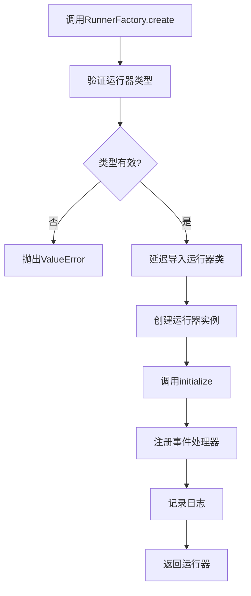
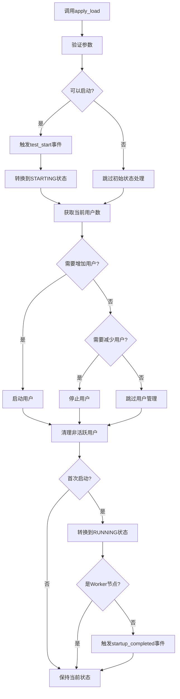
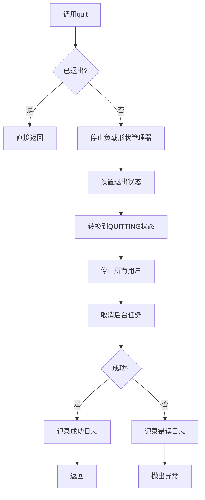

# AioTest 运行器工厂模块文档

## 目录

- [概述](#概述)
- [核心功能](#核心功能)
- [常量定义](#常量定义)
- [参数验证函数](#参数验证函数)
- [事件处理器注册类](#事件处理器注册类)
- [运行器工厂类](#运行器工厂类)
- [基础运行器类](#基础运行器类)
- [事件处理器方法](#事件处理器方法)
- [调用逻辑流程](#调用逻辑流程)
- [流程图](#流程图)
- [配置参数](#配置参数)
- [使用示例](#使用示例)
- [故障排查](#故障排查)
- [总结](#总结)

---

## 概述

`runner_factory.py` 是 AioTest 负载测试项目的运行器工厂模块，负责创建和初始化不同类型的运行器。该模块提供了参数验证、事件处理器注册、运行器工厂和基础运行器实现，为负载测试提供灵活而可靠的运行器管理机制。

## 核心功能

- ✅ **运行器创建** - 支持本地、主节点和工作节点三种运行器类型
- ✅ **参数验证** - 确保负载测试参数的有效性
- ✅ **事件处理器注册** - 统一管理事件处理器
- ✅ **组合式架构** - 基础运行器提供核心组件
- ✅ **延迟初始化** - 避免循环依赖
- ✅ **状态管理** - 完整的运行器状态转换
- ✅ **资源管理** - 自动清理和释放资源

## 常量定义

#### 运行器节点类型常量

| 常量名 | 值 | 说明 |
|-------|------|------|
| `NODE_TYPE_LOCAL` | `"local"` | 本地运行器类型 |
| `NODE_TYPE_MASTER` | `"master"` | 主节点运行器类型 |
| `NODE_TYPE_WORKER` | `"worker"` | 工作节点运行器类型 |

## 参数验证函数

#### `validate_load_params` 函数
**作用**：验证负载测试参数的有效性

**参数**：
- `user_count (int)`：用户数量，必须为正整数
- `rate (float)`：速率，必须大于0且不超过用户数量

**异常**：
- `InvalidUserCountError`：当 user_count 不是正整数时抛出
- `InvalidRateError`：当 rate 不在有效范围内时抛出

**功能**：
- 验证用户数量是否为正整数
- 验证速率是否在有效范围内
- 对过高的速率发出警告

#### `validate_params` 装饰器
**作用**：参数验证装饰器，自动验证用户数量和速率参数

**参数**：
- `func`：被装饰的函数

**返回值**：
- 包装后的函数

**功能**：
- 在函数执行前自动调用 `validate_load_params` 进行参数验证
- 简化参数验证逻辑，避免重复代码

## 事件处理器注册类

#### `EventHandlerRegistry` 类

##### 初始化方法
```python
def __init__(self)
```
**作用**：初始化事件处理器注册中心

**参数说明**：
- 无参数

**属性**：
- `_registered_handlers (set)`：已注册处理器的运行器 ID 集合

##### 方法说明

| 方法名 | 作用 | 参数 | 返回值 | 调用时机 |
|-------|------|------|-------|---------|
| `register_handlers(runner)` | 根据运行器类型注册相应的事件处理器 | `runner: Any` | `None` | 创建运行器时 |

## 运行器工厂类

#### `RunnerFactory` 类

##### 静态方法

| 方法名 | 作用 | 参数 | 返回值 | 调用时机 |
|-------|------|------|-------|---------|
| `create(runner_type, user_types, load_shape, config, redis_client=None)` | 创建指定类型的运行器实例 | `runner_type: str`, `user_types: List[Type['User']]`, `load_shape: Any`, `config: Dict[str, Any]`, `redis_client: Optional[Redis]` | `Any` | 需要创建运行器时 |

**说明**：
- 支持三种运行器类型：local、master、worker
- 使用延迟导入避免循环依赖
- 自动初始化运行器并注册事件处理器

## 基础运行器类

#### `BaseRunner` 类

##### 初始化方法
```python
def __init__(self, user_types: List[Type['User']], load_shape: Any, config: Dict[str, Any])
```
**作用**：初始化基础运行器，配置核心组件

**参数说明**：
- `user_types`：用户类列表
- `load_shape`：负载形状控制类
- `config`：配置选项

**属性**：
- `user_types (List[Type['User']])`：用户类型列表
- `load_shape (Any)`：负载形状控制类
- `config (Dict[str, Any])`：配置选项
- `node (Optional[str])`：节点类型，由子类设置
- `cpu_usage (int)`：CPU 使用率

##### 方法说明

| 方法名 | 作用 | 参数 | 返回值 | 调用时机 |
|-------|------|------|-------|---------|
| `initialize()` | 初始化运行器 | 无 | `None` | 创建运行器后 |
| `start()` | 启动测试 | 无 | `None` | 需要启动测试时 |
| `run_until_complete()` | 运行测试直到完成 | 无 | `None` | 启动测试后 |
| `quit()` | 退出运行器 | 无 | `None` | 需要退出运行器时 |
| `apply_load(user_count, rate)` | 应用负载配置 | `user_count: int`, `rate: float` | `None` | 负载形状管理器调用 |
| `stop()` | 停止负载测试 | 无 | `None` | 需要停止测试时 |
| `_collect_cpu_metrics()` | 收集CPU使用率 | 无 | `None` | 内部调用 |

##### 属性说明

| 属性名 | 类型 | 说明 |
|-------|------|------|
| `user_manager` | `UserManager` | 用户管理器（延迟初始化） |
| `state_manager` | `StateManager` | 状态管理器（延迟初始化） |
| `task_manager` | `TaskManager` | 任务管理器（延迟初始化） |
| `load_shape_manager` | `LoadShapeManager` | 负载形状管理器（延迟初始化） |
| `active_user_count` | `int` | 当前活跃用户数量 |
| `state` | `RunnerState` | 当前状态 |

## 事件处理器方法

#### `on_startup_completed` 函数
**作用**：处理启动完成事件

**参数**：
- `node_type (str)`：节点类型
- `**kwargs (Any)`：其他参数

**功能**：
- 根据节点类型处理启动完成事件
- Master 节点：转换状态并记录汇总信息
- LocalRunner 节点：转换状态并记录用户数量
- Worker 节点：不在此处理，避免死锁

#### `on_worker_request_metrics` 函数
**作用**：处理接收到的工作节点请求指标数据事件

**参数**：
- `node_type (str)`：节点类型
- `**kwargs (Any)`：其他参数

**功能**：
- 只在 Master 节点处理 Worker 请求指标
- 从字典创建 RequestMetrics 对象
- 调用指标收集器处理请求指标

## 调用逻辑流程

### 运行器创建流程

1. **调用工厂方法** → 调用 `RunnerFactory.create()` 方法
2. **验证运行器类型** → 检查运行器类型是否有效
3. **延迟导入** → 根据运行器类型延迟导入相应的运行器类
4. **创建运行器实例** → 实例化相应的运行器类
5. **初始化运行器** → 调用运行器的 `initialize()` 方法
6. **注册事件处理器** → 使用 `EventHandlerRegistry` 注册事件处理器
7. **返回运行器** → 返回初始化完成的运行器实例

### 负载应用流程

1. **调用 apply_load** → 负载形状管理器调用 `apply_load()` 方法
2. **参数验证** → 验证用户数量和速率参数
3. **状态转换** → 如果可以启动，转换到 STARTING 状态
4. **管理用户** → 根据目标用户数量启动或停止用户
5. **清理非活跃用户** → 清理已完成的用户
6. **转换到运行状态** → 首次启动时转换到 RUNNING 状态
7. **触发启动完成事件** → 非 Worker 节点触发全局启动完成事件

### 退出流程

1. **调用 quit** → 调用运行器的 `quit()` 方法
2. **检查退出状态** → 如果已处于退出状态，直接返回
3. **停止负载形状管理器** → 停止负载形状管理器
4. **设置退出状态** → 设置退出状态标记
5. **转换到退出状态** → 转换到 QUITTING 状态
6. **停止所有用户** → 停止所有活跃用户
7. **取消后台任务** → 取消所有后台任务
8. **记录日志** → 记录退出成功日志

## 流程图

### 运行器创建流程



### 负载应用流程



### 退出流程



## 配置参数

| 参数名 | 类型 | 默认值 | 说明 | 适用场景 |
|-------|------|-------|------|---------|
| `runner_type` | `str` | 无 | 运行器类型（local/master/worker） | 创建运行器时必需 |
| `user_types` | `List[Type['User']]` | 无 | 用户类列表 | 创建运行器时必需 |
| `load_shape` | `Any` | 无 | 负载形状控制类 | 创建运行器时必需 |
| `config` | `Dict[str, Any]` | 无 | 配置选项 | 创建运行器时必需 |
| `redis_client` | `Optional[Redis]` | `None` | Redis 客户端 | 分布式模式需要 |
| `user_count` | `int` | 无 | 目标用户数量 | 应用负载时必需 |
| `rate` | `float` | 无 | 速率（用户/秒） | 应用负载时必需 |

## 使用示例

### 创建本地运行器

```python
import asyncio
from aiotest.runner_factory import RunnerFactory
from aiotest import User
from aiotest import LoadUserShape

class TestUser(User):
    weight = 1
    wait_time = 1.0
    
    async def test_task(self):
        print("Executing test task")

class SimpleLoadShape(LoadUserShape):
    def tick(self):
        return (10, 2.0)  # 10个用户，速率2.0

async def create_local_runner():
    """创建本地运行器示例"""
    # 创建本地运行器
    runner = await RunnerFactory.create(
        runner_type="local",
        user_types=[TestUser],
        load_shape=SimpleLoadShape(),
        config={}
    )
    
    print(f"Created runner: {runner.__class__.__name__}")
    print(f"Runner node type: {runner.node}")
    
    # 启动测试
    await runner.start()
    
    # 运行测试
    await runner.run_until_complete()
    
    # 退出运行器
    await runner.quit()

# 执行示例
await create_local_runner()
```

### 创建主节点运行器

```python
import asyncio
from aiotest.runner_factory import RunnerFactory
from aiotest import User
from aiotest import RedisConnection
from aiotest import LoadUserShape

class TestUser(User):
    weight = 1
    wait_time = 1.0
    
    async def test_task(self):
        print("Executing test task")

class SimpleLoadShape(LoadUserShape):
    def tick(self):
        return (20, 5.0)  # 20个用户，速率5.0

async def create_master_runner():
    """创建主节点运行器示例"""
    # 创建 Redis 客户端
    redis_connection = RedisConnection()
    redis_client = await redis_connection.get_client(
        path="localhost", 
        port=6379, 
        password=""
    )
    
    # 创建主节点运行器
    runner = await RunnerFactory.create(
        runner_type="master",
        user_types=[TestUser],
        load_shape=SimpleLoadShape(),
        config={},
        redis_client=redis_client
    )
    
    print(f"Created runner: {runner.__class__.__name__}")
    print(f"Runner node type: {runner.node}")
    
    # 启动测试
    await runner.start()
    
    # 运行测试
    await runner.run_until_complete()
    
    # 退出运行器
    await runner.quit()
    
    # 关闭 Redis 连接
    await redis_client.close()

# 执行示例
await create_master_runner()
```

### 创建工作节点运行器

```python
import asyncio
from aiotest.runner_factory import RunnerFactory
from aiotest import User
from aiotest import RedisConnection
from aiotest import LoadUserShape

class TestUser(User):
    weight = 1
    wait_time = 1.0
    
    async def test_task(self):
        print("Executing test task")

class SimpleLoadShape(LoadUserShape):
    def tick(self):
        return (10, 2.0)  # 10个用户，速率2.0

async def create_worker_runner():
    """创建工作节点运行器示例"""
    # 创建 Redis 客户端
    redis_connection = RedisConnection()
    redis_client = await redis_connection.get_client(
        path="localhost", 
        port=6379, 
        password=""
    )
    
    # 创建工作节点运行器
    runner = await RunnerFactory.create(
        runner_type="worker",
        user_types=[TestUser],
        load_shape=SimpleLoadShape(),
        config={},
        redis_client=redis_client
    )
    
    print(f"Created runner: {runner.__class__.__name__}")
    print(f"Runner node type: {runner.node}")
    
    # 启动测试
    await runner.start()
    
    # 运行测试
    await runner.run_until_complete()
    
    # 退出运行器
    await runner.quit()
    
    # 关闭 Redis 连接
    await redis_client.close()

# 执行示例
await create_worker_runner()
```

### 使用参数验证装饰器

```python
from aiotest.runner_factory import validate_params, InvalidUserCountError, InvalidRateError

@validate_params
async def apply_load_with_validation(user_count: int, rate: float):
    """使用参数验证装饰器的示例"""
    print(f"Applying load: {user_count} users at {rate} users/s")
    # 参数会自动验证，无需手动调用 validate_load_params

async def validation_example():
    """参数验证示例"""
    try:
        # 有效的参数
        await apply_load_with_validation(10, 2.0)
    except (InvalidUserCountError, InvalidRateError) as e:
        print(f"Validation failed: {e}")
    
    try:
        # 无效的参数（用户数为0）
        await apply_load_with_validation(0, 2.0)
    except InvalidUserCountError as e:
        print(f"Expected validation error: {e}")
    
    try:
        # 无效的参数（速率超过用户数）
        await apply_load_with_validation(10, 15.0)
    except InvalidRateError as e:
        print(f"Expected validation error: {e}")

# 执行示例
await validation_example()
```


## 故障排查

### 常见问题

| 问题 | 可能原因 | 解决方案 |
|------|---------|---------|
| 运行器创建失败 | 运行器类型无效 | 检查运行器类型是否为 local/master/worker |
| 参数验证失败 | 用户数量或速率参数无效 | 检查参数是否符合要求 |
| 状态转换失败 | 尝试非法状态转换 | 检查状态转换规则 |
| 事件处理器未注册 | 运行器类型识别错误 | 检查运行器类型和节点类型设置 |
| 退出失败 | 资源清理异常 | 检查用户和任务停止逻辑 |
| CPU 指标收集失败 | psutil 库问题 | 检查 psutil 安装和权限 |

### 日志分析

- 运行器创建：`Created and initialized {runner_type} runner`
- 事件处理器注册：`Event handlers registered for {node_type} runner {runner_id}`
- 运行器退出：`{RunnerClass} has quit successfully`
- 退出错误：`Error during quit: {error}`
- CPU 使用率警告：`{RunnerClass} CPU usage exceeds 90%! (Current: {cpu_usage}%)`
- 高速率警告：`High spawn rate (>100 users/s) may cause performance issues`

## 总结

`runner_factory.py` 模块是 AioTest 负载测试项目的核心组件，提供了完善的运行器创建和管理机制。通过 `RunnerFactory` 类，它能够根据不同的运行器类型创建相应的运行器实例，并通过 `BaseRunner` 类提供组合式架构的核心组件。

该模块的设计考虑了灵活性和可扩展性，使用工厂模式支持多种运行器类型，使用延迟导入和延迟初始化避免循环依赖，使用装饰器简化参数验证，使用事件处理器注册中心统一管理事件处理器。通过合理的设计模式和技术手段，它为负载测试提供了灵活而可靠的运行器管理能力。

无论是本地测试、主节点管理还是工作节点执行，`runner_factory.py` 模块都能提供可靠的支持，帮助用户构建更加灵活和高效的负载测试系统。