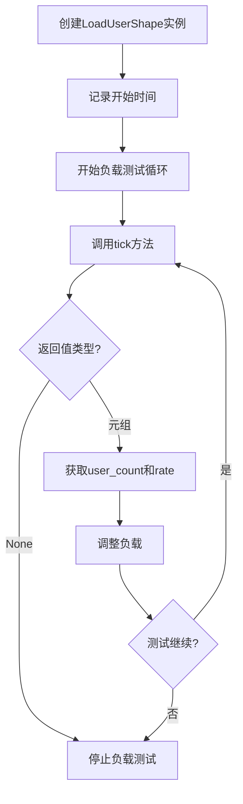
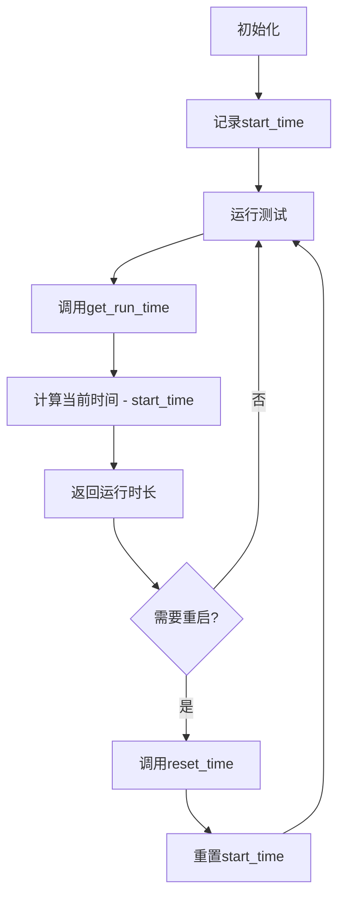

# AioTest 负载形状控制模块文档

<!-- markdownlint-disable MD024 -->

## 目录

- [概述](#%E6%A6%82%E8%BF%B0)
- [核心功能](#%E6%A0%B8%E5%BF%83%E5%8A%9F%E8%83%BD)
- [核心类：LoadUserShape](#%E6%A0%B8%E5%BF%83%E7%B1%BBloadusershape)
- [调用逻辑流程](#%E8%B0%83%E7%94%A8%E9%80%BB%E8%BE%91%E6%B5%81%E7%A8%8B)
- [流程图](#%E6%B5%81%E7%A8%8B%E5%9B%BE)
- [配置参数](#%E9%85%8D%E7%BD%AE%E5%8F%82%E6%95%B0)
- [使用示例](#%E4%BD%BF%E7%94%A8%E7%A4%BA%E4%BE%8B)
- [性能优化建议](#%E6%80%A7%E8%83%BD%E4%BC%98%E5%8C%96%E5%BB%BA%E8%AE%AE)
- [故障排查](#%E6%95%85%E9%9A%9C%E6%8E%92%E6%9F%A5)
- [总结](#%E6%80%BB%E7%BB%93)

______________________________________________________________________

## 概述

`shape.py` 是 AioTest 负载测试项目的负载形状控制模块，负责定义负载测试中用户数量变化的抽象接口。该模块提供了灵活的负载形状控制机制，支持各种负载变化策略，如阶梯式增长、线性增长、波动负载等。

## 核心功能

- ✅ **抽象基类设计** - 定义负载形状控制的标准接口
- ✅ **时间管理** - 提供开始时间和运行时长计算
- ✅ **动态负载调整** - 支持实时调整用户数量和速率
- ✅ **自定义策略** - 允许子类实现各种负载变化策略
- ✅ **测试生命周期控制** - 支持负载测试的启动和停止

## 核心类LoadUserShape

### 初始化方法

```python

def __init__(self)
```

**作用**：初始化负载形状控制器，设置测试开始时间

**参数说明**：

- 无参数

**属性**：

- `start_time (float)`：测试开始时间，用于计算运行时长
- `paused_time (float)`：暂停开始的时间，用于记录负载形状的暂停时间

#### 方法说明

| 方法名 | 作用 | 参数 | 返回值 | 调用时机 |
| ------- | ------ | ------ | ------- | --------- |
| `reset_time()` | 重置开始时间 | 无 | `None` | 测试重启时 |
| `get_run_time()` | 获取运行时长 | 无 | `float` | 需要了解测试运行时间时 |
| `tick()` | 获取当前时刻的负载控制参数 | 无 | `Optional[Tuple[int, float]]` | 定期调用以调整负载 |

## 调用逻辑流程

### 初始化流程

1. **创建形状控制器** → 实例化 `LoadUserShape` 子类
1. **设置开始时间** → 记录测试开始时间
1. **开始负载测试** → 启动负载测试循环

### 负载控制流程

1. **定期调用 tick** → 在负载测试循环中定期调用 `tick()` 方法
1. **获取负载参数** → `tick()` 方法返回当前的目标用户数和速率
1. **调整负载** → 根据返回的参数调整当前用户数量
1. **检查停止条件** → 如果 `tick()` 返回 `None`，则停止负载测试
1. **循环执行** → 继续调用 `tick()` 直到测试结束

### 重启流程

1. **停止测试** → 停止当前的负载测试
1. **重置时间** → 调用 `reset_time()` 重置开始时间
1. **重新开始** → 重新启动负载测试循环

## 流程图

### 负载形状控制流程



### 时间管理流程



## 配置参数

| 参数名 | 类型 | 默认值 | 说明 | 适用场景 |
| ------- | ------ | ------- | ------ | --------- |
| `start_time` | `float` | 当前时间 | 测试开始时间 | 内部使用，计算运行时长 |
| `paused_time` | `float` | 0.0 | 暂停开始的时间 | 内部使用，记录负载形状的暂停时间 |

## 使用示例

### 基本使用示例

```python

from aiotest import LoadUserShape

class ConstantLoadShape(LoadUserShape):
    """恒定负载形状示例"""

    def tick(self):
        """返回恒定的负载参数"""
        return (100, 5.0)  # 目标用户数100，速率5.0用户/秒

# 创建形状控制器

shape = ConstantLoadShape()

# 获取运行时间

print(f"运行时间: {shape.get_run_time():.2f}秒")

# 获取负载参数

result = shape.tick()
if result:
    user_count, rate = result
    print(f"目标用户数: {user_count}, 速率: {rate}用户/秒")
else:
    print("负载测试结束")

```

### 阶梯式负载形状

```python

from aiotest import LoadUserShape

class StepLoadShape(LoadUserShape):
    """阶梯式负载形状示例"""

    def __init__(self, steps):
        super().__init__()
        self.steps = steps  # [(时间, 用户数, 速率), ...]
        self.current_step = 0

    def tick(self):
        """根据时间返回阶梯式负载参数"""
        run_time = self.get_run_time()

        # 查找当前应该执行的步骤
        for i, (time_threshold, user_count, rate) in enumerate(self.steps):
            if run_time < time_threshold:
                return (user_count, rate)

        # 所有步骤完成，停止测试
        return None

# 创建阶梯式负载控制器

shape = StepLoadShape([
    (60, 50, 2.0),   # 0-60秒：50用户，速率2.0
    (120, 100, 5.0),  # 60-120秒：100用户，速率5.0
    (180, 150, 10.0), # 120-180秒：150用户，速率10.0
])

# 在负载测试循环中使用

while True:
    result = shape.tick()
    if result is None:
        print("负载测试完成")
        break

    user_count, rate = result
    print(f"当前负载: {user_count}用户, {rate}用户/秒")
    # 这里调用负载管理器调整用户数量

```

### 线性增长负载形状

```python

from aiotest import LoadUserShape

class LinearRampShape(LoadUserShape):
    """线性增长负载形状示例"""

    def __init__(self, initial_users, final_users, duration, ramp_rate):
        super().__init__()
        self.initial_users = initial_users
        self.final_users = final_users
        self.duration = duration  # 增长持续时间（秒）
        self.ramp_rate = ramp_rate  # 调整速率（用户/秒）

    def tick(self):
        """根据时间线性增长负载"""
        run_time = self.get_run_time()

        if run_time >= self.duration:
            # 增长完成，返回最终用户数
            return (self.final_users, self.ramp_rate)

        # 计算当前应该达到的用户数
        progress = run_time / self.duration
        current_users = int(self.initial_users +
                         (self.final_users - self.initial_users) * progress)

        return (current_users, self.ramp_rate)

# 创建线性增长负载控制器

shape = LinearRampShape(
    initial_users=10,
    final_users=100,
    duration=300,  # 5分钟内从10增长到100
    ramp_rate=5.0
)

# 在负载测试循环中使用

while True:
    result = shape.tick()
    if result is None:
        print("负载测试完成")
        break

    user_count, rate = result
    print(f"运行时间: {shape.get_run_time():.1f}秒, 当前负载: {user_count}用户")

```

### 波动负载形状

```python

from aiotest import LoadUserShape
import math

class WaveLoadShape(LoadUserShape):
    """波动负载形状示例"""

    def __init__(self, base_users, amplitude, period, rate):
        super().__init__()
        self.base_users = base_users
        self.amplitude = amplitude  # 波动幅度
        self.period = period  # 波动周期（秒）
        self.rate = rate  # 调整速率

    def tick(self):
        """根据时间生成波动负载"""
        run_time = self.get_run_time()

        # 使用正弦函数生成波动
        wave = math.sin(2 * math.pi * run_time / self.period)
        current_users = int(self.base_users + self.amplitude * wave)

        # 确保用户数不为负
        current_users = max(current_users, 0)

        return (current_users, self.rate)

# 创建波动负载控制器

shape = WaveLoadShape(
    base_users=50,    # 基准用户数
    amplitude=30,      # 波动幅度（±30用户）
    period=120,       # 120秒一个周期
    rate=3.0         # 调整速率
)

# 在负载测试循环中使用

while True:
    result = shape.tick()
    if result is None:
        print("负载测试完成")
        break

    user_count, rate = result
    print(f"当前负载: {user_count}用户")

```

## 性能优化建议

1. **时间计算优化**：

   - 使用 `default_timer()` 提供高精度时间计算
   - 避免在 `tick()` 方法中进行复杂的时间计算

1. **负载调整频率**：

   - 根据测试需求合理设置 `tick()` 方法的调用频率
   - 避免过于频繁的负载调整导致系统不稳定

1. **状态管理**：

   - 在子类中合理管理状态变量
   - 避免在 `tick()` 方法中进行耗时的状态计算

1. **错误处理**：

   - 在 `tick()` 方法中实现适当的错误处理
   - 确保异常情况下能够安全地停止测试

1. **资源清理**：

   - 如果子类使用了额外资源，确保在测试结束时正确清理

## 故障排查

### 常见问题

| 问题 | 可能原因 | 解决方案 |
| ------ | --------- | --------- |
| 负载不变化 | `tick()` 方法返回固定值 | 检查负载形状逻辑是否正确实现 |
| 测试不停止 | `tick()` 方法从不返回 `None` | 确保在适当条件下返回 `None` |
| 时间计算错误 | 未正确使用 `get_run_time()` | 检查时间计算逻辑 |
| 负载调整过快 | `rate` 参数设置过大 | 减小 `rate` 参数值 |
| 负载调整过慢 | `rate` 参数设置过小 | 增大 `rate` 参数值 |

### 日志分析

- 负载参数获取：`获取负载参数: user_count={user_count}, rate={rate}`
- 测试停止：`负载测试完成`
- 时间重置：`重置开始时间`
- 运行时间：`运行时间: {run_time:.2f}秒`

## 总结

`shape.py` 模块是 AioTest 负载测试项目的核心组件，提供了灵活的负载形状控制机制。通过抽象基类 `LoadUserShape`，它允许用户定义各种负载变化策略，从而模拟真实的负载模式。

该模块的设计考虑了灵活性和可扩展性，通过抽象方法 `tick()` 让子类可以根据具体需求实现不同的负载变化逻辑。无论是恒定负载、阶梯式增长、线性增长还是波动负载，都可以通过实现相应的子类来实现。

通过合理使用负载形状控制器，用户可以创建更加真实和多样化的负载测试场景，从而更准确地评估系统在不同负载条件下的性能表现。该模块为负载测试提供了强大的控制能力，是 AioTest 项目的重要组成部分。
