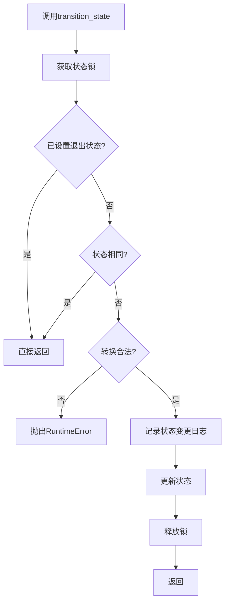
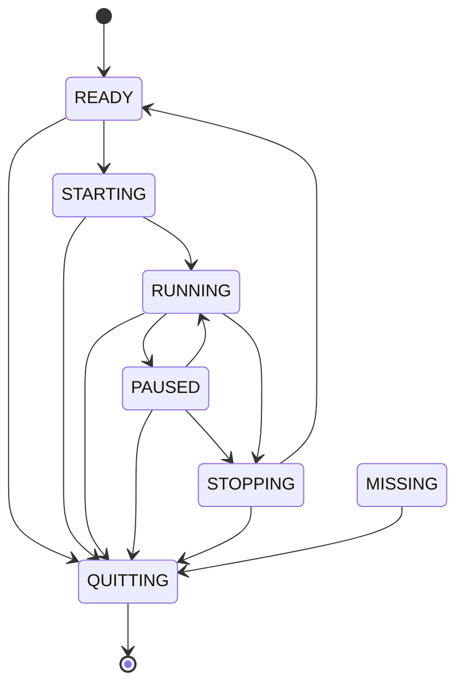
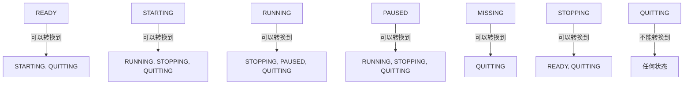

# AioTest 状态管理器模块文档

## 目录

- [AioTest 状态管理器模块文档](#aiotest-状态管理器模块文档)
  - [目录](#目录)
  - [概述](#概述)
  - [核心功能](#核心功能)
  - [状态枚举：RunnerState](#状态枚举runnerstate)
      - [枚举值说明](#枚举值说明)
      - [方法说明](#方法说明)
  - [核心类：StateManager](#核心类statemanager)
      - [初始化方法](#初始化方法)
      - [方法说明](#方法说明-1)
  - [调用逻辑流程](#调用逻辑流程)
    - [状态转换流程](#状态转换流程)
    - [典型状态转换流程](#典型状态转换流程)
      - [正常启动流程](#正常启动流程)
      - [紧急停止流程](#紧急停止流程)
      - [节点丢失流程（仅用于工作节点）](#节点丢失流程仅用于工作节点)
  - [流程图](#流程图)
    - [状态转换流程](#状态转换流程-1)
    - [状态机完整流程](#状态机完整流程)
    - [合法状态转换规则](#合法状态转换规则)
  - [配置参数](#配置参数)
  - [使用示例](#使用示例)
    - [基本使用示例](#基本使用示例)
    - [完整状态转换流程](#完整状态转换流程)
    - [非法状态转换处理](#非法状态转换处理)
    - [退出状态管理](#退出状态管理)
  - [性能优化建议](#性能优化建议)
  - [故障排查](#故障排查)
    - [常见问题](#常见问题)
    - [日志分析](#日志分析)
  - [总结](#总结)

---

## 概述

`state_manager.py` 是 AioTest 负载测试项目的状态管理模块，负责定义运行器状态和实现状态机功能。该模块提供了安全的状态转换机制，支持多种运行器状态，并确保只有合法的状态转换才能执行，为负载测试提供可靠的状态管理支持。

## 核心功能

- ✅ **状态枚举定义** - 提供运行器状态的标准枚举
- ✅ **安全状态转换** - 确保只有合法的状态转换才能执行
- ✅ **状态验证** - 支持状态转换规则验证
- ✅ **状态查询** - 提供多种便捷的状态查询方法
- ✅ **退出状态管理** - 支持标记和检查退出状态
- ✅ **并发安全** - 使用异步锁保证线程安全

## 状态枚举：RunnerState

#### 枚举值说明

| 枚举值 | 值 | 说明 |
|-------|------|------|
| `READY` | `"ready"` | 就绪/已停止状态 |
| `STARTING` | `"starting"` | 启动中 |
| `RUNNING` | `"running"` | 运行中 |
| `PAUSED` | `"paused"` | 暂停中 |
| `MISSING` | `"missing"` | 丢失（仅用于工作节点） |
| `STOPPING` | `"stopping"` | 停止中 |
| `QUITTING` | `"quitting"` | 退出中 |

#### 方法说明

| 方法名 | 作用 | 参数 | 返回值 |
|-------|------|------|-------|
| `__str__()` | 返回状态的字符串表示 | 无 | `str` |

## 核心类：StateManager

#### 初始化方法
```python
def __init__(self)
```
**作用**：初始化状态管理器，设置初始状态和锁

**参数说明**：
- 无参数

**属性**：
- `state (RunnerState)`：当前运行器状态
- `_state_lock (asyncio.Lock)`：状态锁，保证线程安全
- `is_quit (bool)`：退出状态标记

#### 方法说明

| 方法名 | 作用 | 参数 | 返回值 | 调用时机 |
|-------|------|------|-------|---------|
| `transition_state(new_state)` | 实现状态机的安全转换 | `new_state: RunnerState` | `None` | 需要转换状态时 |
| `set_quit_state()` | 设置退出状态 | 无 | `None` | 需要标记退出时 |
| `is_in_quit_state()` | 检查是否处于退出状态 | 无 | `bool` | 需要检查退出状态时 |
| `get_current_state()` | 获取当前状态 | 无 | `RunnerState` | 需要了解当前状态时 |
| `can_start()` | 检查是否可以启动 | 无 | `bool` | 需要检查启动条件时 |
| `is_running()` | 检查是否正在运行 | 无 | `bool` | 需要检查运行状态时 |
| `can_stop()` | 检查是否可以停止 | 无 | `bool` | 需要检查停止条件时 |
| `can_pause()` | 检查是否可以暂停 | 无 | `bool` | 需要检查暂停条件时 |
| `can_resume()` | 检查是否可以恢复 | 无 | `bool` | 需要检查恢复条件时 |

## 调用逻辑流程

### 状态转换流程

1. **调用转换方法** → 调用 `transition_state(new_state)` 方法
2. **获取状态锁** → 使用 `async with self._state_lock` 获取锁
3. **检查退出状态** → 如果已设置退出状态，直接返回
4. **检查状态相同** → 如果目标状态与当前状态相同，直接返回
5. **验证转换合法性** → 检查状态转换是否在合法转换规则中
6. **记录日志** → 记录状态变更日志
7. **更新状态** → 更新当前状态为新状态
8. **释放锁** → 自动释放状态锁

### 典型状态转换流程

#### 正常启动流程
1. **READY** → **STARTING** → **RUNNING**
2. **RUNNING** → **STOPPING** → **READY**

#### 紧急停止流程
1. **READY** → **QUITTING**
2. **STARTING** → **QUITTING**
3. **RUNNING** → **QUITTING**
4. **STOPPING** → **QUITTING**

#### 节点丢失流程（仅用于工作节点）
1. **MISSING** → **QUITTING**

## 流程图

### 状态转换流程



### 状态机完整流程



### 合法状态转换规则



## 配置参数

| 参数名 | 类型 | 默认值 | 说明 | 适用场景 |
|-------|------|-------|------|---------|
| `state` | `RunnerState` | `RunnerState.READY` | 当前运行器状态 | 内部使用，表示当前状态 |
| `is_quit` | `bool` | `False` | 退出状态标记 | 用于标记是否需要退出 |

## 使用示例

### 基本使用示例

```python
import asyncio
from aiotest.state_manager import StateManager, RunnerState

async def basic_example():
    """基本使用示例"""
    # 创建状态管理器
    manager = StateManager()
    
    # 检查初始状态
    print(f"Initial state: {manager.get_current_state()}")
    print(f"Can start: {manager.can_start()}")
    print(f"Is running: {manager.is_running()}")
    
    # 尝试启动
    await manager.transition_state(RunnerState.STARTING)
    print(f"After STARTING: {manager.get_current_state()}")
    
    await manager.transition_state(RunnerState.RUNNING)
    print(f"After RUNNING: {manager.get_current_state()}")
    print(f"Is running: {manager.is_running()}")
    print(f"Can stop: {manager.can_stop()}")

# 执行示例
await basic_example()
```

### 完整状态转换流程

```python
import asyncio
from aiotest.state_manager import StateManager, RunnerState

async def full_transition_example():
    """完整状态转换流程示例"""
    manager = StateManager()
    
    print("=== 正常启动流程 ===")
    print(f"Initial: {manager.get_current_state()}")
    
    # READY -> STARTING
    await manager.transition_state(RunnerState.STARTING)
    print(f"Starting: {manager.get_current_state()}")
    
    # STARTING -> RUNNING
    await manager.transition_state(RunnerState.RUNNING)
    print(f"Running: {manager.get_current_state()}")
    
    # RUNNING -> STOPPING
    await manager.transition_state(RunnerState.STOPPING)
    print(f"Stopping: {manager.get_current_state()}")
    
    # STOPPING -> READY
    await manager.transition_state(RunnerState.READY)
    print(f"Ready: {manager.get_current_state()}")
    
    print("\n=== 紧急停止流程 ===")
    # READY -> QUITTING
    await manager.transition_state(RunnerState.QUITTING)
    print(f"Quitting: {manager.get_current_state()}")

# 执行示例
await full_transition_example()
```

### 非法状态转换处理

```python
import asyncio
from aiotest.state_manager import StateManager, RunnerState

async def invalid_transition_example():
    """非法状态转换处理示例"""
    manager = StateManager()
    
    print(f"Initial state: {manager.get_current_state()}")
    
    # 尝试非法转换：READY -> RUNNING（跳过 STARTING）
    try:
        await manager.transition_state(RunnerState.RUNNING)
        print("Transition succeeded (unexpected)")
    except RuntimeError as e:
        print(f"Transition failed as expected: {e}")
    
    # 正确的转换：READY -> STARTING -> RUNNING
    await manager.transition_state(RunnerState.STARTING)
    print(f"After STARTING: {manager.get_current_state()}")
    
    await manager.transition_state(RunnerState.RUNNING)
    print(f"After RUNNING: {manager.get_current_state()}")

# 执行示例
await invalid_transition_example()
```

### 退出状态管理

```python
import asyncio
from aiotest.state_manager import StateManager, RunnerState

async def quit_state_example():
    """退出状态管理示例"""
    manager = StateManager()
    
    print(f"Initial state: {manager.get_current_state()}")
    print(f"Is in quit state: {manager.is_in_quit_state()}")
    
    # 启动运行器
    await manager.transition_state(RunnerState.STARTING)
    await manager.transition_state(RunnerState.RUNNING)
    print(f"Running state: {manager.get_current_state()}")
    
    # 设置退出状态
    manager.set_quit_state()
    print(f"Is in quit state: {manager.is_in_quit_state()}")
    
    # 尝试转换到 STOPPING（会被忽略，因为已设置退出状态）
    await manager.transition_state(RunnerState.STOPPING)
    print(f"State after trying to stop: {manager.get_current_state()}")
    
    # 转换到 QUITTING
    await manager.transition_state(RunnerState.QUITTING)
    print(f"Final state: {manager.get_current_state()}")

# 执行示例
await quit_state_example()
```

## 性能优化建议

1. **状态锁使用**：
   - 状态转换会自动获取和释放锁，无需手动管理
   - 避免在持有锁的情况下执行耗时操作

2. **状态查询优化**：
   - 使用 `can_start()`、`is_running()`、`can_stop()` 等便捷方法
   - 避免直接比较状态值

3. **退出状态管理**：
   - 及时设置退出状态，避免不必要的状态转换
   - 在退出前检查 `is_in_quit_state()` 状态

4. **错误处理**：
   - 捕获 `RuntimeError` 异常处理非法状态转换
   - 在状态转换失败时进行适当的错误处理

5. **日志监控**：
   - 状态转换会自动记录日志，便于监控和调试
   - 关注状态转换日志，及时发现异常情况

## 故障排查

### 常见问题

| 问题 | 可能原因 | 解决方案 |
|------|---------|---------|
| 状态转换失败 | 尝试非法状态转换 | 检查状态转换规则，确保转换合法 |
| 状态不变化 | 已设置退出状态 | 检查 `is_in_quit_state()` 状态 |
| 转换被忽略 | 目标状态与当前状态相同 | 检查当前状态后再转换 |
| 并发状态转换 | 多个协程同时尝试转换状态 | 使用状态锁保证线程安全 |
| 退出状态未生效 | 未调用 `set_quit_state()` | 在需要退出时调用 `set_quit_state()` |

### 日志分析

- 状态变更：`State changed: {old_state} -> {new_state}`
- 非法转换：`Invalid state transition: {old_state} -> {new_state}`

## 总结

`state_manager.py` 模块是 AioTest 负载测试项目的核心组件，提供了完善的状态管理机制。通过 `RunnerState` 枚举和 `StateManager` 类，它能够安全地管理运行器的状态转换，确保只有合法的状态转换才能执行。

该模块的设计考虑了安全性和可靠性，使用异步锁保证线程安全，定义了合法状态转换规则防止非法状态转换，提供了多种状态查询方法便于使用。通过合理的状态管理策略，可以确保运行器状态的正确性和一致性，为负载测试提供可靠的状态管理支持。

无论是正常的状态转换流程还是紧急停止场景，`state_manager.py` 模块都能提供可靠的支持，帮助用户构建更加稳定和可靠的负载测试系统。