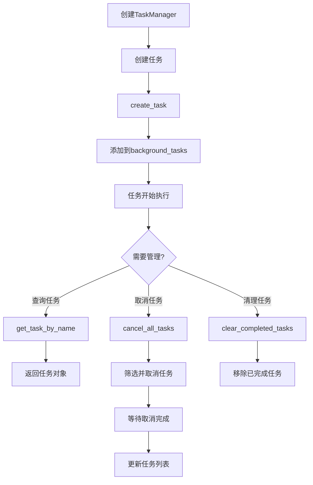
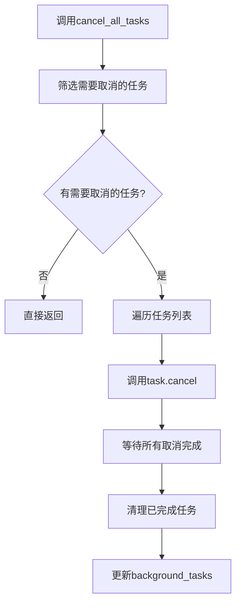
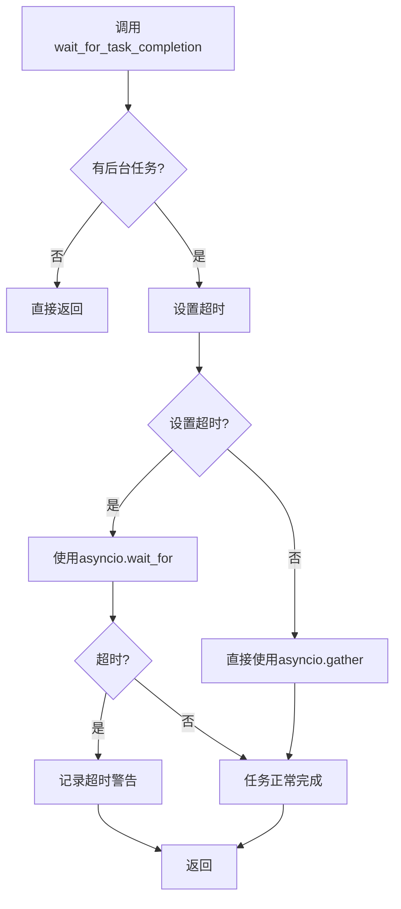

# AioTest 任务管理器模块文档

## 目录

- [概述](#概述)
- [核心功能](#核心功能)
- [核心类：TaskManager](#核心类-taskmanager)
- [调用逻辑流程](#调用逻辑流程)
- [流程图](#流程图)
- [配置参数](#配置参数)
- [使用示例](#使用示例)
- [性能优化建议](#性能优化建议)
- [故障排查](#故障排查)
- [总结](#总结)

---

## 概述

`task_manager.py` 是 AioTest 负载测试项目的任务管理模块，负责后台任务的创建、管理和清理。该模块提供了完整的异步任务管理功能，支持任务的创建、添加、取消、查询和等待等操作，为负载测试提供可靠的后台任务管理支持。

## 核心功能

- ✅ **任务创建与管理** - 支持单个和批量任务操作
- ✅ **任务状态监控** - 实时查询任务状态和数量
- ✅ **任务命名** - 按名称管理和查询任务
- ✅ **任务取消** - 支持单个和批量任务取消
- ✅ **任务清理** - 自动清理已完成的任务
- ✅ **任务等待** - 支持超时控制的任务完成等待

## 核心类：TaskManager

#### 初始化方法
```python
def __init__(self)
```
**作用**：初始化任务管理器，创建任务列表

**参数说明**：
- 无参数

**属性**：
- `background_tasks (List[asyncio.Task])`：后台任务列表

#### 方法说明

| 方法名 | 作用 | 参数 | 返回值 | 调用时机 |
|-------|------|------|-------|---------|
| `add_task(task)` | 添加单个后台任务 | `task: asyncio.Task` | `None` | 需要添加任务时 |
| `add_tasks(tasks)` | 批量添加后台任务 | `tasks: List[asyncio.Task]` | `None` | 需要批量添加任务时 |
| `create_task(coro, name=None)` | 创建并添加后台任务 | `coro: Coroutine`, `name: str` | `asyncio.Task` | 需要创建新任务时 |
| `cancel_all_tasks()` | 取消所有后台任务 | 无 | `None` | 需要停止所有任务时 |
| `get_task_by_name(name)` | 根据名称获取任务 | `name: str` | `asyncio.Task` | 需要查询特定任务时 |
| `remove_task(task)` | 移除任务 | `task: asyncio.Task` | `None` | 需要移除任务时 |
| `clear_completed_tasks()` | 清理已完成的任务 | 无 | `None` | 需要清理已完成任务时 |
| `get_active_task_count()` | 获取活跃任务数量 | 无 | `int` | 需要监控任务状态时 |
| `wait_for_task_completion(timeout=None)` | 等待所有任务完成 | `timeout: float` | `None` | 需要等待任务完成时 |
| `stop_task_by_name(name)` | 根据名称停止任务 | `name: str` | `bool` | 需要停止特定任务时 |

## 调用逻辑流程

### 任务创建流程

1. **创建任务管理器** → 实例化 `TaskManager`
2. **创建任务** → 调用 `create_task()` 创建新任务
3. **添加到列表** → 任务自动添加到后台任务列表
4. **执行任务** → 任务开始异步执行
5. **监控状态** → 通过 `get_active_task_count()` 监控任务状态

### 任务取消流程

1. **筛选任务** → 筛选需要取消的任务（排除已完成和当前任务）
2. **取消任务** → 调用每个任务的 `cancel()` 方法
3. **等待完成** → 使用 `asyncio.gather()` 等待所有取消操作完成
4. **清理列表** → 移除已完成的任务

### 任务清理流程

1. **检查状态** → 检查每个任务的完成状态
2. **筛选任务** → 保留未完成的任务
3. **更新列表** → 更新后台任务列表

## 流程图

### 任务管理流程



### 任务取消流程



### 任务等待流程



## 配置参数

| 参数名 | 类型 | 默认值 | 说明 | 适用场景 |
|-------|------|-------|------|---------|
| `name` | `str` | `None` | 任务名称 | 用于标识和查询任务 |
| `timeout` | `float` | `None` | 等待超时时间（秒） | 防止无限等待 |

## 使用示例

### 基本使用示例

```python
import asyncio
from aiotest.task_manager import TaskManager

async def basic_example():
    """基本使用示例"""
    # 创建任务管理器
    manager = TaskManager()
    
    # 创建后台任务
    async def task1():
        await asyncio.sleep(2)
        print("Task 1 completed")
    
    async def task2():
        await asyncio.sleep(3)
        print("Task 2 completed")
    
    # 创建并添加任务
    task1 = manager.create_task(task1(), name="task1")
    task2 = manager.create_task(task2(), name="task2")
    
    # 监控任务状态
    print(f"Active tasks: {manager.get_active_task_count()}")
    
    # 等待所有任务完成
    await manager.wait_for_task_completion()
    
    # 清理已完成任务
    manager.clear_completed_tasks()
    print(f"Active tasks after cleanup: {manager.get_active_task_count()}")

# 执行示例
await basic_example()
```

### 批量任务管理

```python
import asyncio
from aiotest.task_manager import TaskManager

async def batch_example():
    """批量任务管理示例"""
    manager = TaskManager()
    
    # 创建多个任务
    async def worker(worker_id):
        await asyncio.sleep(1)
        print(f"Worker {worker_id} completed")
    
    # 批量创建任务
    tasks = []
    for i in range(5):
        task = asyncio.create_task(worker(i), name=f"worker_{i}")
        tasks.append(task)
    
    # 批量添加任务
    manager.add_tasks(tasks)
    
    print(f"Active tasks: {manager.get_active_task_count()}")
    
    # 等待所有任务完成
    await manager.wait_for_task_completion()
    
    # 清理已完成任务
    manager.clear_completed_tasks()

# 执行示例
await batch_example()
```

### 任务取消和清理

```python
import asyncio
from aiotest.task_manager import TaskManager

async def cancellation_example():
    """任务取消和清理示例"""
    manager = TaskManager()
    
    # 创建长时间运行的任务
    async def long_running_task():
        try:
            for i in range(10):
                await asyncio.sleep(1)
                print(f"Task running: {i}")
        except asyncio.CancelledError:
            print("Task was cancelled")
            raise
    
    # 创建任务
    task1 = manager.create_task(long_running_task(), name="task1")
    task2 = manager.create_task(long_running_task(), name="task2")
    
    # 等待一段时间
    await asyncio.sleep(3)
    
    # 按名称停止特定任务
    success = await manager.stop_task_by_name("task1")
    print(f"Task1 stopped: {success}")
    
    # 等待一段时间
    await asyncio.sleep(2)
    
    # 取消所有剩余任务
    await manager.cancel_all_tasks()
    
    # 清理已完成任务
    manager.clear_completed_tasks()
    print(f"Active tasks: {manager.get_active_task_count()}")

# 执行示例
await cancellation_example()
```

### 任务查询和监控

```python
import asyncio
from aiotest.task_manager import TaskManager

async def monitoring_example():
    """任务查询和监控示例"""
    manager = TaskManager()
    
    # 创建多个任务
    async def task_func(task_id):
        await asyncio.sleep(task_id)
        print(f"Task {task_id} completed")
    
    # 创建不同时长的任务
    for i in range(1, 6):
        manager.create_task(task_func(i), name=f"task_{i}")
    
    # 监控任务状态
    while manager.get_active_task_count() > 0:
        print(f"Active tasks: {manager.get_active_task_count()}")
        
        # 查询特定任务
        task = manager.get_task_by_name("task_3")
        if task:
            print(f"Task 3 status: {'running' if not task.done() else 'completed'}")
        
        await asyncio.sleep(1)
    
    print("All tasks completed")
    manager.clear_completed_tasks()

# 执行示例
await monitoring_example()
```

## 性能优化建议

1. **任务创建优化**：
   - 使用 `create_task()` 方法创建任务，自动添加到管理器
   - 避免手动创建和管理任务

2. **批量操作**：
   - 对于大量任务，使用 `add_tasks()` 批量添加
   - 使用 `cancel_all_tasks()` 一次性取消所有任务

3. **定期清理**：
   - 定期调用 `clear_completed_tasks()` 清理已完成任务
   - 避免任务列表无限增长

4. **任务命名**：
   - 为任务设置有意义的名称，便于查询和管理
   - 使用一致的命名规范

5. **超时控制**：
   - 在 `wait_for_task_completion()` 中设置合理的超时时间
   - 避免无限等待导致程序阻塞

6. **资源管理**：
   - 在任务取消后及时清理相关资源
   - 确保任务在异常情况下能够正确清理

## 故障排查

### 常见问题

| 问题 | 可能原因 | 解决方案 |
|------|---------|---------|
| 任务不执行 | 任务未正确创建或添加 | 检查任务创建和添加逻辑 |
| 任务无法取消 | 任务已完成或不存在 | 检查任务状态后再取消 |
| 任务列表无限增长 | 未定期清理已完成任务 | 定期调用 `clear_completed_tasks()` |
| 等待超时 | 任务执行时间过长 | 增加超时时间或优化任务逻辑 |
| 按名称查询失败 | 任务名称不正确或任务不存在 | 检查任务名称和任务状态 |

### 日志分析

- 任务完成超时：`Task completion timeout after {timeout} seconds`
- 任务创建：任务通过 `create_task()` 方法创建，无特定日志
- 任务取消：任务通过 `cancel()` 方法取消，无特定日志

## 总结

`task_manager.py` 模块是 AioTest 负载测试项目的重要组件，提供了完整的异步任务管理功能。通过 `TaskManager` 类，它能够有效地管理后台任务的创建、执行、监控和清理。

该模块的设计考虑了易用性和可靠性，提供了丰富的任务管理方法，包括单个和批量操作、任务查询、取消和等待等功能。通过合理的任务管理策略，可以确保后台任务的可靠执行和及时清理，为负载测试提供稳定的后台任务支持。

无论是简单的后台任务管理还是复杂的任务调度场景，`task_manager.py` 模块都能提供可靠的支持，帮助用户构建更加稳定和高效的负载测试系统。