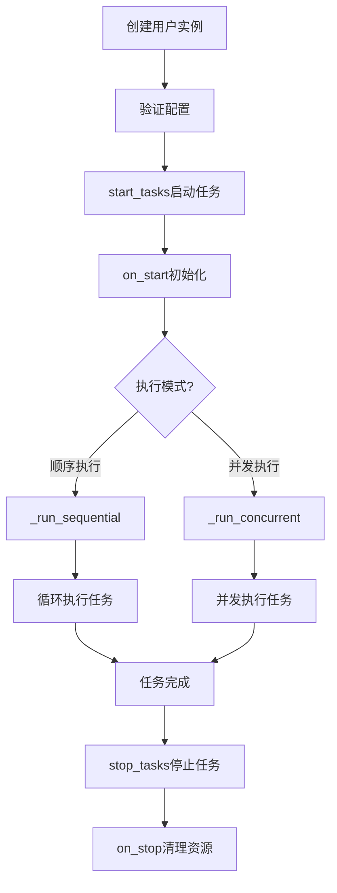
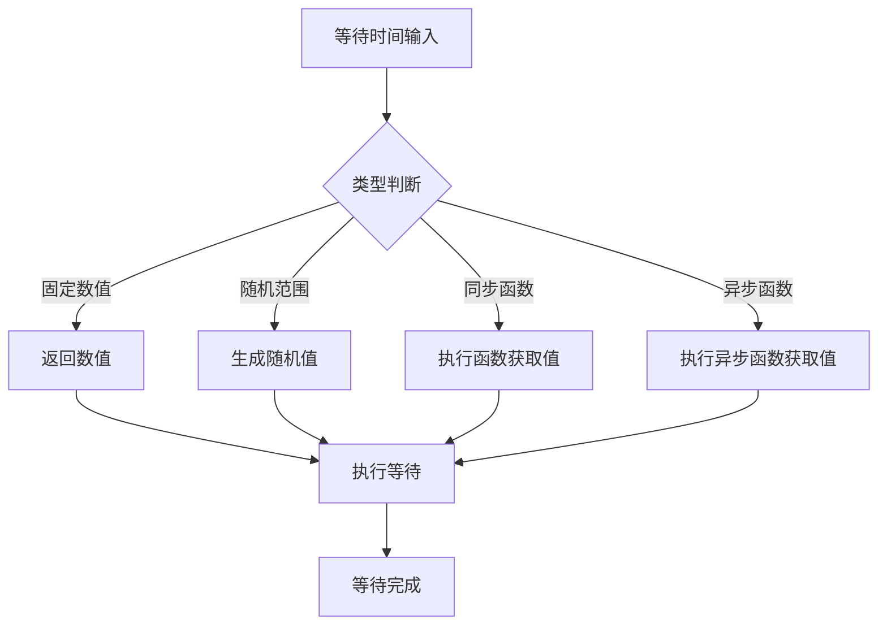
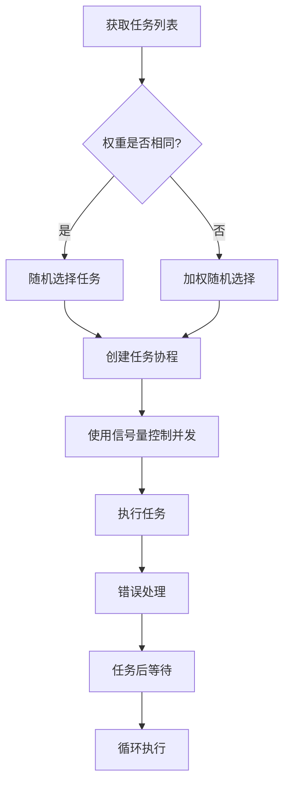
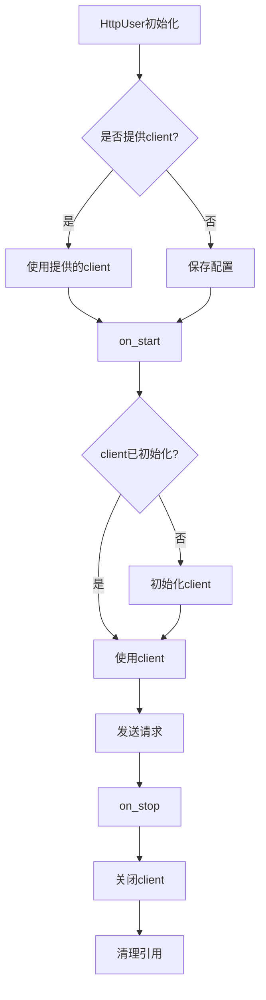

# AioTest 用户管理模块文档

## 目录

- [概述](#概述)
- [核心功能](#核心功能)
- [数据类型和枚举](#数据类型和枚举)
- [辅助类](#辅助类)
- [元类和装饰器](#元类和装饰器)
- [核心类：User](#核心类-user)
- [扩展类：HttpUser](#扩展类-httpuser)
- [调用逻辑流程](#调用逻辑流程)
- [流程图](#流程图)
- [配置参数](#配置参数)
- [使用示例](#使用示例)
- [性能优化建议](#性能优化建议)
- [故障排查](#故障排查)
- [总结](#总结)

---

## 概述

`users.py` 是 AioTest 负载测试项目的核心用户管理模块，负责定义用户行为、任务执行逻辑和 HTTP 客户端管理。该模块提供了灵活的用户行为定义方式，支持顺序和并发执行模式，以及多种等待时间设置。

## 核心功能

- ✅ **灵活的等待时间管理** - 支持固定值、随机范围、自定义函数
- ✅ **自动任务收集** - 自动收集以 `test_` 开头或 `_test` 结尾的协程函数
- ✅ **任务权重分配** - 支持通过装饰器设置任务权重
- ✅ **多执行模式** - 支持顺序和并发执行模式
- ✅ **内置错误处理** - 捕获并处理任务执行中的错误
- ✅ **HTTP 客户端管理** - 内置 HTTP 客户端支持（HttpUser）
- ✅ **异步上下文支持** - 支持异步上下文管理器

## 数据类型和枚举

#### `WaitTimeType` 类型定义
**作用**：定义支持的等待时间类型

**类型说明**：
```python
WaitTimeType = Union[
    float,  # 固定等待时间
    Tuple[float, float],  # 随机范围 (min, max)
    Callable[[], float],  # 同步函数，返回等待时间
    Callable[[], Awaitable[float]],  # 异步函数，返回等待时间
]
```

#### `ExecutionMode` 枚举
**作用**：定义任务执行模式

**枚举值**：
| 枚举值 | 说明 |
|-------|------|
| `SEQUENTIAL` | 顺序执行，任务按顺序逐个执行 |
| `CONCURRENT` | 并发执行，任务并行执行（受限于最大并发数） |

## 辅助类

#### `WaitTimeResolver` 类
**作用**：等待时间解析器，支持多种等待时间类型的解析和执行

**方法说明**：

| 方法名 | 作用 | 参数 | 返回值 | 调用时机 |
|-------|------|------|-------|---------|
| `resolve_wait_time(wait_time)` | 解析等待时间，返回实际等待的秒数 | `wait_time: WaitTimeType` | `float` | 任务执行前后 |
| `wait(wait_time)` | 执行等待操作 | `wait_time: WaitTimeType` | `None` | 任务执行前后 |

## 元类和装饰器

#### `UserMeta` 元类
**作用**：用户元类，用于自动收集任务函数

**功能**：
- 自动收集以 `test_` 开头或 `_test` 结尾的协程函数作为任务
- 支持通过 `@weight` 装饰器设置任务权重
- 将收集的任务存储在 `jobs` 属性中

#### `weight` 装饰器
**作用**：为任务函数设置权重

**参数**：
- `weight_value: int`：权重值，必须为正整数

**示例**：
```python
@weight(3)
async def test_important_task(self):
    pass
```

## 核心类：User

#### 初始化方法
```python
def __init__(self, wait_time: Optional[WaitTimeType] = None, weight: Optional[int] = None,
             max_concurrent_tasks: Optional[int] = None, execution_mode: Optional[ExecutionMode] = None)
```
**作用**：初始化用户实例，配置执行参数

**参数说明**：
- `wait_time`：任务执行间隔时间（支持固定数值、随机范围、同步/异步函数）
- `weight`：用户权重
- `max_concurrent_tasks`：最大并发任务数
- `execution_mode`：任务执行模式（SEQUENTIAL/CONCURRENT）

#### 类属性

| 属性名 | 类型 | 默认值 | 说明 |
|-------|------|-------|------|
| `host` | `Optional[str]` | `None` | 目标主机地址 |
| `wait_time` | `WaitTimeType` | `1.0` | 任务执行间隔时间 |
| `weight` | `int` | `1` | 用户权重 |
| `max_concurrent_tasks` | `Optional[int]` | `None` | 最大并发任务数 |
| `execution_mode` | `ExecutionMode` | `ExecutionMode.SEQUENTIAL` | 任务执行模式 |
| `_pause_event` | `asyncio.Event` | `asyncio.Event()` | 暂停事件，用于控制任务执行 |

#### 方法说明

| 方法名 | 作用 | 参数 | 返回值 | 调用时机 |
|-------|------|------|-------|---------|
| `on_start()` | 用户启动时调用，用于初始化资源 | 无 | `None` | 用户启动时 |
| `on_stop()` | 用户停止时调用，用于清理资源 | 无 | `None` | 用户停止时 |
| `start_tasks()` | 启动用户任务 | 无 | `None` | 运行器启动用户时 |
| `stop_tasks()` | 停止用户任务 | 无 | `None` | 运行器停止用户时 |
| `pause_tasks()` | 暂停用户任务 | 无 | `None` | 运行器暂停用户时 |
| `resume_tasks()` | 恢复用户任务 | 无 | `None` | 运行器恢复用户时 |
| `_run()` | 用户任务主运行循环 | 无 | `None` | 内部调用 |
| `_run_sequential()` | 顺序执行所有任务 | 无 | `None` | 顺序模式下内部调用 |
| `_run_concurrent()` | 并发执行任务 | 无 | `None` | 并发模式下内部调用 |
| `_wait_if_paused()` | 检查并等待暂停状态解除 | 无 | `None` | 任务执行前 |
| `_handle_error(error)` | 处理任务执行中的错误 | `error: Exception` | `None` | 任务执行出错时 |
| `_validate_sequential_weights()` | 验证顺序执行模式下的权重约束 | 无 | `None` | 初始化时 |

## 扩展类：HttpUser

#### 初始化方法
```python
def __init__(self, host: Optional[str] = None, wait_time: Optional[WaitTimeType] = None,
             weight: Optional[int] = None, max_concurrent_tasks: Optional[int] = None,
             execution_mode: Optional[ExecutionMode] = None, client: Optional[HTTPClient] = None,
             default_headers: Optional[Dict[str, str]] = None, timeout: int = 30,
             max_retries: int = 3, verify_ssl: bool = True)
```
**作用**：初始化 HTTP 用户实例，配置 HTTP 客户端参数

**参数说明**：
- 继承 `User` 类的所有参数
- `host`：HTTP 服务地址
- `client`：预配置的 HTTP 客户端实例
- `default_headers`：默认 HTTP 头
- `timeout`：请求超时时间（秒）
- `max_retries`：最大重试次数
- `verify_ssl`：是否验证 SSL 证书

#### 方法说明

| 方法名 | 作用 | 参数 | 返回值 | 调用时机 |
|-------|------|------|-------|---------|
| `client` (property) | 获取 HTTP 客户端实例 | 无 | `HTTPClient` | 需要发送 HTTP 请求时 |
| `_ensure_client_initialized()` | 确保 HTTP 客户端已初始化 | 无 | `None` | 内部调用 |
| `on_start()` | 用户启动时的初始化逻辑 | 无 | `None` | 用户启动时 |
| `on_stop()` | 用户停止时的清理逻辑 | 无 | `None` | 用户停止时 |
| `__aenter__()` | 进入异步上下文管理器 | 无 | `self` | 使用 `async with` 时 |
| `__aexit__(exc_type, exc_val, exc_tb)` | 退出异步上下文管理器 | 异常相关参数 | `None` | 使用 `async with` 时 |

## 调用逻辑流程

### 初始化流程

1. **创建用户实例** → 实例化 `User` 或 `HttpUser`
2. **验证配置** → 验证顺序执行模式下的权重约束
3. **启动用户** → 调用 `start_tasks()` 方法
4. **初始化资源** → 调用 `on_start()` 方法
5. **执行等待** → 执行初始等待时间
6. **选择执行模式** → 根据 `execution_mode` 选择执行方式

### 任务执行流程

#### 顺序执行模式
1. **遍历任务** → 按顺序执行所有任务
2. **执行任务** → 调用任务函数
3. **错误处理** → 捕获并处理任务执行中的错误
4. **任务间等待** → 执行任务间隔等待
5. **循环执行** → 重复执行任务列表

#### 并发执行模式
1. **准备任务** → 分离任务函数和权重
2. **创建信号量** → 控制并发数量
3. **选择任务** → 根据权重随机选择任务
4. **并发执行** → 并行执行选中的任务
5. **任务后等待** → 每个任务执行后等待
6. **循环执行** → 重复选择和执行任务

### 停止流程

1. **停止任务** → 调用 `stop_tasks()` 方法
2. **取消任务** → 取消正在执行的任务
3. **清理资源** → 调用 `on_stop()` 方法
4. **清理引用** → 清理任务引用

### HTTP 客户端管理流程

1. **初始化** → 延迟初始化 HTTP 客户端
2. **连接管理** → 使用上下文管理器管理连接
3. **请求发送** → 通过 `client` 属性发送请求
4. **健康检查** → 可选的客户端健康状态检查
5. **关闭** → 停止时优雅关闭客户端

## 流程图

### 整体执行流程



### 等待时间解析流程



### 任务选择流程（并发模式）



### HTTP 客户端管理流程



## 配置参数

| 配置项 | 类型 | 默认值 | 说明 | 适用场景 |
|-------|------|-------|------|---------|
| `wait_time` | `WaitTimeType` | `1.0` | 任务执行间隔时间 | 根据测试场景调整等待策略 |
| `weight` | `int` | `1` | 用户权重 | 控制用户在总负载中的占比 |
| `max_concurrent_tasks` | `int` | 任务数 | 最大并发任务数 | 控制单个用户的并发度 |
| `execution_mode` | `ExecutionMode` | `SEQUENTIAL` | 任务执行模式 | 选择顺序或并发执行 |
| `host` | `str` | `None` | HTTP服务地址 | HttpUser必需配置 |
| `timeout` | `int` | `30` | HTTP请求超时时间 | 根据网络状况调整 |
| `max_retries` | `int` | `3` | HTTP请求最大重试次数 | 网络不稳定时增加 |
| `verify_ssl` | `bool` | `True` | 是否验证SSL证书 | 测试环境可设置为False |

## 使用示例

### 基本用户定义

```python
from aiotest import User, weight, ExecutionMode

class BasicUser(User):
    """基本用户类示例"""
    wait_time = 2.0  # 固定等待时间
    execution_mode = ExecutionMode.SEQUENTIAL
    
    async def test_login(self):
        """登录测试"""
        print("执行登录测试")
        # 模拟登录操作
        await asyncio.sleep(1)
    
    @weight(2)  # 设置权重为2
    async def test_browse(self):
        """浏览测试"""
        print("执行浏览测试")
        # 模拟浏览操作
        await asyncio.sleep(1)

# 创建用户实例
user = BasicUser()

# 启动用户任务
user.start_tasks()

# 运行一段时间后停止
await asyncio.sleep(10)
await user.stop_tasks()
```

### HTTP 用户定义

```python
from aiotest import HttpUser, ExecutionMode

class ApiUser(HttpUser):
    """API测试用户类"""
    host = "https://api.example.com"
    wait_time = (1.0, 3.0)  # 随机等待时间
    execution_mode = ExecutionMode.CONCURRENT
    max_concurrent_tasks = 3  # 最大并发任务数
    
    async def test_get_users(self):
        """获取用户列表"""
        response = await self.client.get("/users")
        print(f"GET /users: {response.status}")
    
    async def test_create_user(self):
        """创建用户"""
        data = {"name": "Test User", "email": "test@example.com"}
        response = await self.client.post("/users", json=data)
        print(f"POST /users: {response.status}")

# 创建HTTP用户实例
api_user = ApiUser(
    timeout=10,  # 10秒超时
    max_retries=2,  # 最多重试2次
    verify_ssl=False  # 不验证SSL证书
)

# 启动用户任务
api_user.start_tasks()

# 运行一段时间后停止
await asyncio.sleep(15)
await api_user.stop_tasks()
```

### 自定义等待时间函数

```python
from aiotest import User
import random

class CustomWaitUser(User):
    """自定义等待时间的用户类"""
    
    # 自定义同步等待时间函数
    def custom_wait_time():
        # 模拟指数分布的等待时间
        return random.expovariate(1/2)  # 平均等待2秒
    
    # 自定义异步等待时间函数
    async def async_wait_time():
        # 模拟基于系统负载的等待时间
        # 这里简化处理，实际可以根据系统状态动态调整
        await asyncio.sleep(0.1)  # 模拟异步操作
        return random.uniform(1, 5)
    
    # 使用自定义等待时间
    wait_time = custom_wait_time
    
    async def test_task(self):
        """测试任务"""
        print("执行测试任务")
        await asyncio.sleep(1)

# 创建用户实例
user = CustomWaitUser()

# 启动用户任务
user.start_tasks()

# 运行一段时间后停止
await asyncio.sleep(10)
await user.stop_tasks()
```

### 使用异步上下文管理器

```python
from aiotest import HttpUser

async def test_with_context_manager():
    """使用异步上下文管理器测试"""
    async with HttpUser(
        host="https://api.example.com",
        timeout=5,
        max_retries=1
    ) as user:
        # 发送请求
        response = await user.client.get("/health")
        print(f"Health check: {response.status}")
        
        # 启动用户任务
        user.start_tasks()
        
        # 运行一段时间
        await asyncio.sleep(5)
    # 退出上下文时自动调用on_stop()

# 执行测试
await test_with_context_manager()
```

## 性能优化建议

1. **任务权重设置**：在并发模式下，合理设置任务权重可以控制不同任务的执行频率，根据业务重要性分配权重

2. **并发度调整**：根据系统资源和目标负载调整 `max_concurrent_tasks`，避免过度并发导致系统压力过大

3. **等待时间优化**：
   - 固定等待时间：适合稳定的测试场景
   - 随机范围：模拟真实用户行为
   - 自定义函数：根据业务逻辑动态调整

4. **HTTP客户端配置**：
   - 合理设置超时时间，避免请求长时间阻塞
   - 调整重试次数，平衡可靠性和性能
   - 启用连接池，减少连接建立开销

5. **错误处理优化**：
   - 在任务中实现适当的错误处理，避免单个任务失败影响整个用户
   - 对于关键任务，实现重试机制

6. **资源管理**：
   - 确保在 `on_stop()` 中正确清理资源
   - 使用异步上下文管理器管理 HTTP 客户端

## 故障排查

### 常见问题

| 问题 | 可能原因 | 解决方案 |
|------|---------|---------|
| 任务不执行 | 任务函数命名不符合规范 | 确保任务函数以 `test_` 开头或 `_test` 结尾 |
| 顺序执行模式下权重错误 | 任务权重不等于1 | 顺序模式下所有任务权重必须为1 |
| HTTP请求失败 | 客户端未初始化或配置错误 | 检查 `host` 配置和网络连接 |
| 并发任务数异常 | `max_concurrent_tasks` 设置不合理 | 调整为合理的并发数（1-100） |
| 等待时间执行失败 | 等待时间类型错误或返回值无效 | 确保等待时间符合 `WaitTimeType` 定义 |

### 日志分析

- 任务执行错误：`Task execution failed: {error_msg}`
- 断言失败：`Assertion failed in task: {e}`
- HTTP客户端初始化：`Initializing HTTP client for host: {host}`
- HTTP客户端关闭：`Closing HTTP client for host: {host}`
- 客户端健康检查失败：`HTTP client health check failed: {e}`
- 任务已经运行：`{type(self).__name__} user task is already running (state: {self.tasks._state})`

## 总结

`users.py` 模块是 AioTest 项目的核心组件，提供了灵活的用户行为定义和任务执行机制。通过支持多种等待时间设置、自动任务收集、权重分配和并发控制，它能够模拟真实用户的行为模式，为负载测试提供更加真实和多样化的测试场景。

该模块的设计考虑了可扩展性和灵活性，通过元类自动收集任务、装饰器设置权重、多种执行模式选择等特性，使得用户定义变得简单而强大。同时，`HttpUser` 类提供了内置的 HTTP 客户端管理，简化了 API 测试的编写。

通过合理配置参数和优化用户行为，用户可以根据具体测试场景调整负载测试的行为，获得更加准确和有意义的测试结果。无论是简单的基本测试还是复杂的 API 测试，`users.py` 模块都能提供可靠的支持。