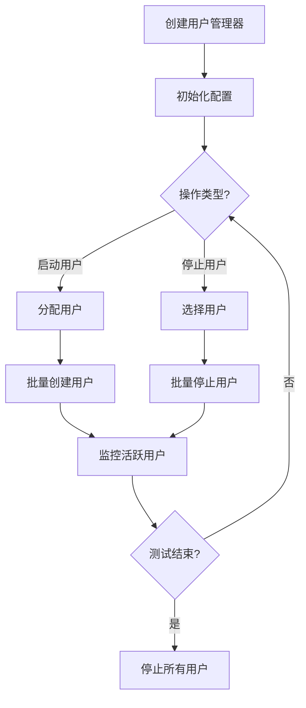
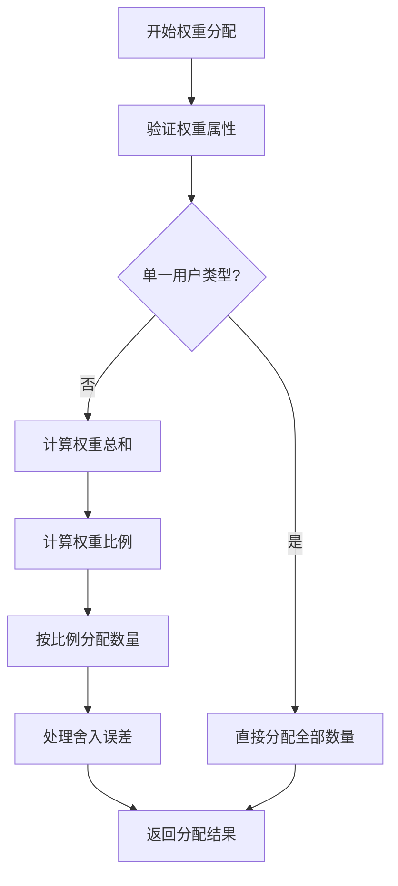
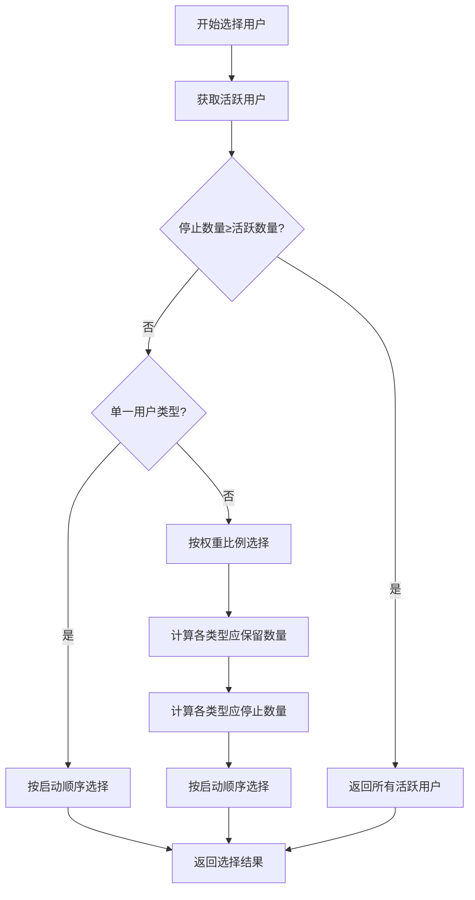

# AioTest 用户管理器模块文档

## 目录

- [概述](#概述)
- [核心功能](#核心功能)
- [核心类：UserManager](#核心类-usermanager)
- [调用逻辑流程](#调用逻辑流程)
- [流程图](#流程图)
- [配置参数](#配置参数)
- [使用示例](#使用示例)
- [性能优化建议](#性能优化建议)
- [故障排查](#故障排查)
- [总结](#总结)

---

## 概述

`user_manager.py` 是 AioTest 负载测试项目的核心用户管理模块，负责用户的创建、启动、停止和权重分配。该模块提供了基于权重的用户分配算法，支持平滑的用户启停，以及用户状态的监控和管理。

## 核心功能

- ✅ **权重分配算法** - 基于用户权重比例分配用户数量
- ✅ **平滑用户管理** - 支持速率控制的用户启停
- ✅ **状态监控** - 实时监控活跃用户数量和状态
- ✅ **按权重停止** - 按权重比例选择要停止的用户
- ✅ **内存管理** - 定期清理非活跃用户
- ✅ **批量操作** - 优化的批量用户创建和停止

## 核心类：UserManager

#### 初始化方法
```python
def __init__(self, user_types: List[Type['User']], config: Dict[str, Any])
```
**作用**：初始化用户管理器实例，配置用户类型和全局配置

**参数说明**：
- `user_types`：用户类型列表，包含要管理的用户类
- `config`：全局配置字典，可包含 host 等配置项

#### 方法说明

| 方法名 | 作用 | 参数 | 返回值 | 调用时机 |
|-------|------|------|-------|---------|
| `distribute_users_by_weight(user_count)` | 基于权重分配用户 | `user_count: int` | `List[Type['User']]` | 创建用户时 |
| `manage_users(user_count, rate, action)` | 管理用户（启动/停止） | `user_count: int`, `rate: float`, `action: str` | `None` | 需要增减用户时 |
| `_start_users(user_count, rate)` | 启动用户 | `user_count: int`, `rate: float` | `None` | 内部调用 |
| `_stop_users(user_count, rate)` | 停止用户 | `user_count: int`, `rate: float` | `None` | 内部调用 |
| `_batch_execute(items, operation, rate)` | 批量操作执行器 | `items: List`, `operation: Callable`, `rate: float` | `None` | 内部调用 |
| `_create_and_start_user(user_class)` | 创建并启动单个用户 | `user_class: Type['User']` | `None` | 内部调用 |
| `_stop_user(user)` | 终止单个用户 | `user: 'User'` | `None` | 内部调用 |
| `_select_users_to_stop(user_count)` | 选择要停止的用户 | `user_count: int` | `List['User']` | 内部调用 |
| `_calculate_weighted_counts(user_types, target_count, current_counts)` | 通用权重分配算法 | `user_types: List[Type['User']]`, `target_count: int`, `current_counts: Optional[Dict[Type['User'], int]]` | `Dict[Type['User'], int]` | 内部调用 |
| `active_user_count` (property) | 获取活跃用户数量 | 无 | `int` | 需要监控时 |
| `cleanup_inactive_users()` | 清理非活跃用户 | 无 | `None` | 定期清理时 |
| `stop_all_users()` | 停止所有用户 | 无 | `None` | 测试结束时 |
| `pause_all_users()` | 暂停所有用户 | 无 | `None` | 需要暂停测试时 |
| `resume_all_users()` | 恢复所有用户 | 无 | `None` | 需要恢复测试时 |

## 调用逻辑流程

### 初始化流程

1. **创建用户管理器** → 实例化 `UserManager`，传入用户类型列表和配置
2. **验证配置** → 验证用户类型的权重属性

### 用户启动流程

1. **分配用户** → 调用 `distribute_users_by_weight` 按权重分配用户
2. **批量创建** → 调用 `_batch_execute` 批量创建用户
3. **启动任务** → 调用用户的 `start_tasks` 方法启动任务
4. **添加到活跃列表** → 将用户添加到 `active_users` 列表

### 用户停止流程

1. **选择用户** → 调用 `_select_users_to_stop` 按权重比例选择要停止的用户
2. **批量停止** → 调用 `_batch_execute` 批量停止用户
3. **停止任务** → 调用用户的 `stop_tasks` 方法停止任务

### 权重分配流程

1. **验证权重** → 验证每个用户类型的权重属性
2. **计算比例** → 计算各用户类型的权重比例
3. **分配数量** → 按比例分配用户数量
4. **处理误差** → 处理舍入误差，确保总数准确

## 流程图

### 整体管理流程



### 权重分配流程



### 用户停止选择流程



**说明**：用户停止选择流程中，`_select_users_to_stop` 方法会直接计算各类型应保留的用户数量，不再调用单独的 `_calculate_keep_counts_by_weight` 方法，而是直接使用 `_calculate_weighted_counts` 方法进行权重分配计算。

## 配置参数

| 参数名 | 类型 | 默认值 | 说明 | 适用场景 |
|-------|------|-------|------|----------|
| `user_types` | `List[Type['User']]` | 无 | 用户类型列表 | 初始化时必需 |
| `config` | `Dict[str, Any]` | `{}` | 全局配置 | 可包含 host 等配置 |
| `user_count` | `int` | 无 | 目标用户数 | 启动/停止时必需 |
| `rate` | `float` | 无 | 操作速率(个/秒) | 控制启动/停止速度 |
| `action` | `str` | 无 | 操作类型('start'或'stop') | 指定操作类型 |

## 使用示例

### 基本使用示例

```python
from aiotest import User, HttpUser
from aiotest.user_manager import UserManager

# 定义用户类
class TestUser1(User):
    weight = 2  # 权重为2
    
    async def test_task(self):
        print("TestUser1 task executed")

class TestUser2(User):
    weight = 3  # 权重为3
    
    async def test_task(self):
        print("TestUser2 task executed")

async def main():
    # 创建用户管理器
    user_types = [TestUser1, TestUser2]
    config = {"host": "http://example.com"}
    manager = UserManager(user_types, config)
    
    # 启动10个用户（按2:3比例分配）
    await manager.manage_users(10, 5, "start")
    print(f"活跃用户数: {manager.active_user_count}")

    # 运行一段时间
    await asyncio.sleep(5)

    # 停止4个用户（按权重比例）
    await manager.manage_users(4, 2, "stop")
    print(f"停止后活跃用户数: {manager.active_user_count}")

    # 清理非活跃用户
    manager.cleanup_inactive_users()
    
    # 停止所有用户
    await manager.stop_all_users()
    print(f"最终活跃用户数: {manager.active_user_count}")

if __name__ == "__main__":
    import asyncio
    asyncio.run(main())
```

### HTTP 用户管理示例

```python
from aiotest import HttpUser
from aiotest.user_manager import UserManager

class ApiUser(HttpUser):
    weight = 1
    host = "https://api.example.com"
    
    async def test_get_users(self):
        response = await self.client.get("/users")
        print(f"GET /users: {response.status}")

class AdminUser(HttpUser):
    weight = 2
    host = "https://api.example.com"
    
    async def test_create_user(self):
        data = {"name": "Test User"}
        response = await self.client.post("/users", json=data)
        print(f"POST /users: {response.status}")

async def main():
    # 创建用户管理器
    user_types = [ApiUser, AdminUser]
    config = {}
    manager = UserManager(user_types, config)
    
    # 启动6个用户（2个ApiUser, 4个AdminUser）
    await manager.manage_users(6, 3, "start")
    
    # 运行测试
    await asyncio.sleep(10)
    
    # 停止所有用户
    await manager.stop_all_users()

if __name__ == "__main__":
    import asyncio
    asyncio.run(main())
```

## 性能优化建议

1. **权重设置**：
   - 根据业务重要性设置合理的用户权重
   - 避免权重值过大导致分配不均

2. **速率控制**：
   - 根据系统性能设置合适的启动/停止速率
   - 启动速率过快可能导致系统负载突增

3. **批量操作**：
   - 利用 `_batch_execute` 的速率控制功能
   - 避免一次性创建/停止大量用户

4. **内存管理**：
   - 定期调用 `cleanup_inactive_users()` 清理非活跃用户
   - 避免内存泄漏

5. **监控**：
   - 使用 `active_user_count` 监控活跃用户数量
   - 确保按权重正确分配用户

## 故障排查

### 常见问题

| 问题 | 可能原因 | 解决方案 |
|------|---------|---------|
| 权重分配不均 | 权重设置不合理 | 调整用户权重比例 |
| 启动失败 | 用户类缺少必要属性 | 确保用户类有正确的权重属性 |
| 停止后仍有活跃用户 | 任务未正确停止 | 检查用户的 `stop_tasks` 方法 |
| 内存占用过高 | 未清理非活跃用户 | 定期调用 `cleanup_inactive_users()` |
| 启动速率过快 | rate 参数设置过大 | 减小 rate 参数值 |

### 日志分析

- 用户创建：`Successfully processed X/X items`
- 操作失败：`Operation failed on item X: {error}`
- 权重验证：`User class {class_name} must have a 'weight' attribute`

## 总结

`user_manager.py` 模块是 AioTest 负载测试项目的核心组件，负责用户的生命周期管理和权重分配。它提供了：

- **灵活的权重分配**：基于用户权重比例分配用户数量
- **平滑的用户管理**：支持速率控制的用户启停
- **实时的状态监控**：提供活跃用户数量和分布的监控
- **高效的批量操作**：优化的批量用户创建和停止
- **健壮的错误处理**：单个用户操作失败不影响整体

该模块通过合理的权重分配和速率控制，确保了负载测试的平稳进行，同时提供了丰富的监控和管理功能，为测试过程提供了可靠的支持。